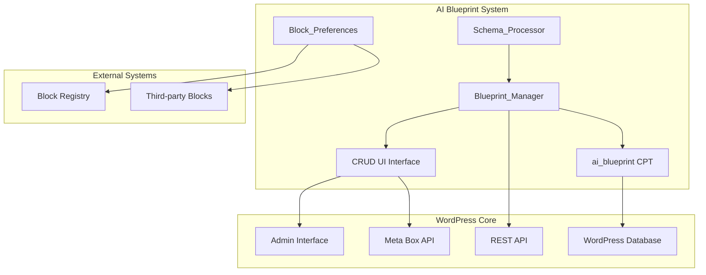
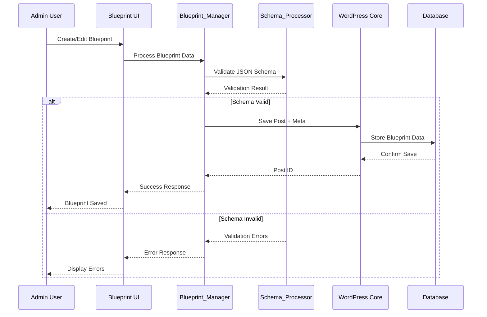

# AI Blueprint Creation Design

## Overview

This design document outlines the implementation of an AI Blueprint Custom Post Type (CPT) system for the AI Page Composer WordPress plugin. The system provides a comprehensive CRUD interface for managing content generation templates with JSON schema support, section-specific configurations, and block preferences management.

## Technology Stack & Dependencies

### Backend Technologies
- **PHP**: 8.0+ with JSON schema validation
- **WordPress**: 6.4+ for enhanced CPT and meta box APIs
- **MySQL**: 5.7+ for JSON column support and meta storage

### Frontend Technologies
- **JavaScript**: ES2020+ with WordPress admin components
- **React**: Via WordPress @wordpress/components for enhanced UI
- **CSS**: Admin interface styling with WordPress design system

### Dependencies
```json
{
  "php-dependencies": {
    "symfony/validator": "^6.4",
    "justinrainbow/json-schema": "^5.2"
  },
  "js-dependencies": {
    "@wordpress/components": "^27.0.0",
    "@wordpress/element": "^5.0.0",
    "@wordpress/api-fetch": "^6.0.0"
  }
}
```

## Architecture

### Component Architecture Overview



### Data Flow Architecture



## Custom Post Type Definition

### ai_blueprint CPT Registration

```php
class Blueprint_Manager {
    
    public function register_post_type() {
        $labels = [
            'name' => __('AI Blueprints', 'ai-page-composer'),
            'singular_name' => __('AI Blueprint', 'ai-page-composer'),
            'menu_name' => __('AI Blueprints', 'ai-page-composer'),
            'add_new' => __('Add New Blueprint', 'ai-page-composer'),
            'add_new_item' => __('Add New AI Blueprint', 'ai-page-composer'),
            'edit_item' => __('Edit AI Blueprint', 'ai-page-composer'),
            'new_item' => __('New AI Blueprint', 'ai-page-composer'),
            'view_item' => __('View AI Blueprint', 'ai-page-composer'),
            'search_items' => __('Search AI Blueprints', 'ai-page-composer'),
            'not_found' => __('No AI blueprints found', 'ai-page-composer'),
            'not_found_in_trash' => __('No AI blueprints found in trash', 'ai-page-composer'),
            'all_items' => __('All AI Blueprints', 'ai-page-composer'),
            'archives' => __('AI Blueprint Archives', 'ai-page-composer'),
            'insert_into_item' => __('Insert into blueprint', 'ai-page-composer'),
            'uploaded_to_this_item' => __('Uploaded to this blueprint', 'ai-page-composer')
        ];
        
        $args = [
            'labels' => $labels,
            'public' => false,
            'publicly_queryable' => false,
            'show_ui' => true,
            'show_in_menu' => 'ai-composer',
            'show_in_admin_bar' => false,
            'show_in_nav_menus' => false,
            'can_export' => true,
            'has_archive' => false,
            'exclude_from_search' => true,
            'capability_type' => 'post',
            'capabilities' => [
                'create_posts' => 'manage_options',
                'edit_posts' => 'manage_options',
                'edit_others_posts' => 'manage_options',
                'delete_posts' => 'manage_options',
                'delete_others_posts' => 'manage_options',
                'read_private_posts' => 'manage_options'
            ],
            'hierarchical' => false,
            'rewrite' => false,
            'query_var' => false,
            'supports' => ['title', 'author'],
            'menu_icon' => 'dashicons-layout',
            'show_in_rest' => true,
            'rest_base' => 'ai-blueprints',
            'rest_controller_class' => 'Blueprint_REST_Controller'
        ];
        
        register_post_type('ai_blueprint', $args);
    }
}
```

### Blueprint JSON Schema Definition

```php
class Schema_Processor {
    
    private $base_schema = [
        '$schema' => 'https://json-schema.org/draft/2020-12/schema',
        'title' => 'AI Blueprint Schema',
        'type' => 'object',
        'required' => ['sections', 'global_settings'],
        'properties' => [
            'sections' => [
                'type' => 'array',
                'minItems' => 1,
                'items' => [
                    '$ref' => '#/definitions/section'
                ]
            ],
            'global_settings' => [
                '$ref' => '#/definitions/global_settings'
            ],
            'metadata' => [
                '$ref' => '#/definitions/metadata'
            ]
        ],
        'definitions' => [
            'section' => [
                'type' => 'object',
                'required' => ['id', 'type', 'heading'],
                'properties' => [
                    'id' => [
                        'type' => 'string',
                        'pattern' => '^[a-z0-9_-]+$',
                        'minLength' => 1,
                        'maxLength' => 50
                    ],
                    'type' => [
                        'type' => 'string',
                        'enum' => [
                            'hero', 'content', 'media_text', 'columns', 
                            'list', 'quote', 'gallery', 'faq', 'cta',
                            'testimonial', 'pricing', 'team', 'custom'
                        ]
                    ],
                    'heading' => [
                        'type' => 'string',
                        'minLength' => 1,
                        'maxLength' => 200
                    ],
                    'heading_level' => [
                        'type' => 'integer',
                        'minimum' => 1,
                        'maximum' => 6,
                        'default' => 2
                    ],
                    'word_target' => [
                        'type' => 'integer',
                        'minimum' => 10,
                        'maximum' => 2000,
                        'default' => 150
                    ],
                    'media_policy' => [
                        'type' => 'string',
                        'enum' => ['required', 'optional', 'none'],
                        'default' => 'optional'
                    ],
                    'internal_links' => [
                        'type' => 'integer',
                        'minimum' => 0,
                        'maximum' => 10,
                        'default' => 2
                    ],
                    'citations_required' => [
                        'type' => 'boolean',
                        'default' => true
                    ],
                    'tone' => [
                        'type' => 'string',
                        'enum' => ['professional', 'casual', 'technical', 'friendly', 'authoritative'],
                        'default' => 'professional'
                    ],
                    'allowed_blocks' => [
                        'type' => 'array',
                        'items' => [
                            'type' => 'string'
                        ],
                        'default' => []
                    ],
                    'block_preferences' => [
                        '$ref' => '#/definitions/block_preferences'
                    ],
                    'custom_prompts' => [
                        'type' => 'object',
                        'properties' => [
                            'system_prompt' => ['type' => 'string'],
                            'user_prompt_template' => ['type' => 'string']
                        ]
                    ]
                ]
            ],
            'block_preferences' => [
                'type' => 'object',
                'properties' => [
                    'preferred_plugin' => [
                        'type' => 'string',
                        'enum' => ['auto', 'core', 'genesis_blocks', 'kadence_blocks', 'stackable', 'ultimate_addons', 'blocksy']
                    ],
                    'primary_block' => [
                        'type' => 'string'
                    ],
                    'fallback_blocks' => [
                        'type' => 'array',
                        'items' => ['type' => 'string']
                    ],
                    'pattern_preference' => [
                        'type' => 'string'
                    ],
                    'custom_attributes' => [
                        'type' => 'object'
                    ]
                ]
            ],
            'global_settings' => [
                'type' => 'object',
                'required' => ['generation_mode'],
                'properties' => [
                    'generation_mode' => [
                        'type' => 'string',
                        'enum' => ['grounded', 'hybrid', 'generative'],
                        'default' => 'hybrid'
                    ],
                    'hybrid_alpha' => [
                        'type' => 'number',
                        'minimum' => 0.0,
                        'maximum' => 1.0,
                        'default' => 0.7
                    ],
                    'mvdb_namespaces' => [
                        'type' => 'array',
                        'items' => [
                            'type' => 'string',
                            'enum' => ['content', 'products', 'docs', 'knowledge']
                        ],
                        'default' => ['content']
                    ],
                    'max_tokens_per_section' => [
                        'type' => 'integer',
                        'minimum' => 100,
                        'maximum' => 5000,
                        'default' => 1000
                    ],
                    'image_generation_enabled' => [
                        'type' => 'boolean',
                        'default' => true
                    ],
                    'seo_optimization' => [
                        'type' => 'boolean',
                        'default' => true
                    ],
                    'accessibility_checks' => [
                        'type' => 'boolean',
                        'default' => true
                    ],
                    'cost_limit_usd' => [
                        'type' => 'number',
                        'minimum' => 0.01,
                        'maximum' => 100.0,
                        'default' => 5.0
                    ]
                ]
            ],
            'metadata' => [
                'type' => 'object',
                'properties' => [
                    'version' => [
                        'type' => 'string',
                        'pattern' => '^\d+\.\d+\.\d+$',
                        'default' => '1.0.0'
                    ],
                    'description' => [
                        'type' => 'string',
                        'maxLength' => 500
                    ],
                    'tags' => [
                        'type' => 'array',
                        'items' => ['type' => 'string'],
                        'maxItems' => 10
                    ],
                    'category' => [
                        'type' => 'string',
                        'enum' => ['landing-page', 'blog-post', 'product-page', 'about-page', 'contact-page', 'custom']
                    ],
                    'estimated_time_minutes' => [
                        'type' => 'integer',
                        'minimum' => 1,
                        'maximum' => 120
                    ],
                    'difficulty_level' => [
                        'type' => 'string',
                        'enum' => ['beginner', 'intermediate', 'advanced']
                    ]
                ]
            ]
        ]
    ];
    
    public function validate_schema($data) {
        $validator = new JsonSchema\Validator();
        $data_object = json_decode(json_encode($data));
        $schema_object = json_decode(json_encode($this->base_schema));
        
        $validator->validate($data_object, $schema_object);
        
        if ($validator->isValid()) {
            return ['valid' => true, 'errors' => []];
        }
        
        $errors = [];
        foreach ($validator->getErrors() as $error) {
            $errors[] = [
                'property' => $error['property'],
                'message' => $error['message'],
                'constraint' => $error['constraint']
            ];
        }
        
        return ['valid' => false, 'errors' => $errors];
    }
}
```

## CRUD Interface Implementation

### Meta Box Registration and Rendering

```php
class Blueprint_Meta_Boxes {
    
    public function add_meta_boxes() {
        add_meta_box(
            'ai_blueprint_schema',
            __('Blueprint Configuration', 'ai-page-composer'),
            [$this, 'render_schema_meta_box'],
            'ai_blueprint',
            'normal',
            'high'
        );
        
        add_meta_box(
            'ai_blueprint_sections',
            __('Content Sections', 'ai-page-composer'),
            [$this, 'render_sections_meta_box'],
            'ai_blueprint',
            'normal',
            'high'
        );
        
        add_meta_box(
            'ai_blueprint_global_settings',
            __('Global Settings', 'ai-page-composer'),
            [$this, 'render_global_settings_meta_box'],
            'ai_blueprint',
            'side',
            'default'
        );
        
        add_meta_box(
            'ai_blueprint_preview',
            __('Blueprint Preview', 'ai-page-composer'),
            [$this, 'render_preview_meta_box'],
            'ai_blueprint',
            'side',
            'default'
        );
    }
    
    public function render_schema_meta_box($post) {
        wp_nonce_field('ai_blueprint_meta_nonce', 'ai_blueprint_meta_nonce_field');
        
        $schema_data = get_post_meta($post->ID, '_ai_blueprint_schema', true);
        $schema_json = $schema_data ? wp_json_encode($schema_data, JSON_PRETTY_PRINT) : '';
        
        ?>
        <div class="ai-blueprint-schema-editor">
            <div class="schema-tabs">
                <ul class="nav-tab-wrapper">
                    <li><a href="#visual-editor" class="nav-tab nav-tab-active">Visual Editor</a></li>
                    <li><a href="#json-editor" class="nav-tab">JSON Editor</a></li>
                    <li><a href="#validation-results" class="nav-tab">Validation</a></li>
                </ul>
            </div>
            
            <div id="visual-editor" class="tab-content active">
                <div id="blueprint-visual-editor" class="blueprint-editor-container">
                    <!-- React component will be mounted here -->
                </div>
            </div>
            
            <div id="json-editor" class="tab-content">
                <label for="blueprint_schema_json">
                    <?php esc_html_e('Blueprint JSON Schema:', 'ai-page-composer'); ?>
                </label>
                <textarea id="blueprint_schema_json" 
                          name="blueprint_schema_json" 
                          rows="20" 
                          class="large-text code"
                          spellcheck="false"><?php echo esc_textarea($schema_json); ?></textarea>
                <p class="description">
                    <?php esc_html_e('Edit the blueprint schema in JSON format. Changes will be validated automatically.', 'ai-page-composer'); ?>
                </p>
            </div>
            
            <div id="validation-results" class="tab-content">
                <div id="schema-validation-results" class="validation-container">
                    <!-- Validation results will be displayed here -->
                </div>
            </div>
        </div>
        
        <input type="hidden" id="blueprint_schema_data" name="blueprint_schema_data" value="">
        <?php
    }
    
    public function render_sections_meta_box($post) {
        $sections_data = get_post_meta($post->ID, '_ai_blueprint_sections', true) ?: [];
        ?>
        <div class="ai-blueprint-sections">
            <div class="sections-header">
                <h4><?php esc_html_e('Content Sections Configuration', 'ai-page-composer'); ?></h4>
                <button type="button" id="add-section" class="button button-secondary">
                    <?php esc_html_e('Add Section', 'ai-page-composer'); ?>
                </button>
            </div>
            
            <div id="sections-container" class="sections-list">
                <?php foreach ($sections_data as $index => $section): ?>
                    <?php $this->render_section_row($section, $index); ?>
                <?php endforeach; ?>
            </div>
            
            <template id="section-row-template">
                <?php $this->render_section_row([], '{{index}}'); ?>
            </template>
        </div>
        <?php
    }
    
    private function render_section_row($section, $index) {
        $detected_plugins = $this->get_detected_block_plugins();
        ?>
        <div class="section-row" data-index="<?php echo esc_attr($index); ?>">
            <div class="section-header">
                <h5 class="section-title">
                    <span class="section-number"><?php echo esc_html($index + 1); ?>.</span>
                    <input type="text" 
                           name="sections[<?php echo esc_attr($index); ?>][heading]" 
                           value="<?php echo esc_attr($section['heading'] ?? ''); ?>"
                           placeholder="<?php esc_attr_e('Section Heading', 'ai-page-composer'); ?>"
                           class="section-heading-input">
                </h5>
                <div class="section-controls">
                    <button type="button" class="button-link move-section-up" title="<?php esc_attr_e('Move Up', 'ai-page-composer'); ?>">↑</button>
                    <button type="button" class="button-link move-section-down" title="<?php esc_attr_e('Move Down', 'ai-page-composer'); ?>">↓</button>
                    <button type="button" class="button-link remove-section" title="<?php esc_attr_e('Remove Section', 'ai-page-composer'); ?>">×</button>
                </div>
            </div>
            
            <div class="section-content">
                <div class="section-row-fields">
                    <div class="field-group">
                        <label><?php esc_html_e('Section Type:', 'ai-page-composer'); ?></label>
                        <select name="sections[<?php echo esc_attr($index); ?>][type]" class="section-type-select">
                            <?php foreach ($this->get_section_types() as $type => $label): ?>
                                <option value="<?php echo esc_attr($type); ?>" 
                                        <?php selected($section['type'] ?? '', $type); ?>>
                                    <?php echo esc_html($label); ?>
                                </option>
                            <?php endforeach; ?>
                        </select>
                    </div>
                    
                    <div class="field-group">
                        <label><?php esc_html_e('Word Target:', 'ai-page-composer'); ?></label>
                        <input type="number" 
                               name="sections[<?php echo esc_attr($index); ?>][word_target]" 
                               value="<?php echo esc_attr($section['word_target'] ?? 150); ?>"
                               min="10" max="2000" step="10"
                               class="small-text">
                    </div>
                    
                    <div class="field-group">
                        <label><?php esc_html_e('Heading Level:', 'ai-page-composer'); ?></label>
                        <select name="sections[<?php echo esc_attr($index); ?>][heading_level]" class="small-text">
                            <?php for ($i = 1; $i <= 6; $i++): ?>
                                <option value="<?php echo $i; ?>" 
                                        <?php selected($section['heading_level'] ?? 2, $i); ?>>
                                    H<?php echo $i; ?>
                                </option>
                            <?php endfor; ?>
                        </select>
                    </div>
                    
                    <div class="field-group">
                        <label><?php esc_html_e('Media Policy:', 'ai-page-composer'); ?></label>
                        <select name="sections[<?php echo esc_attr($index); ?>][media_policy]">
                            <option value="none" <?php selected($section['media_policy'] ?? 'optional', 'none'); ?>>
                                <?php esc_html_e('No Images', 'ai-page-composer'); ?>
                            </option>
                            <option value="optional" <?php selected($section['media_policy'] ?? 'optional', 'optional'); ?>>
                                <?php esc_html_e('Optional', 'ai-page-composer'); ?>
                            </option>
                            <option value="required" <?php selected($section['media_policy'] ?? 'optional', 'required'); ?>>
                                <?php esc_html_e('Required', 'ai-page-composer'); ?>
                            </option>
                        </select>
                    </div>
                </div>
                
                <!-- Block Preferences Section -->
                <div class="block-preferences-section">
                    <h6><?php esc_html_e('Block Preferences', 'ai-page-composer'); ?></h6>
                    
                    <div class="preference-fields">
                        <div class="field-group">
                            <label><?php esc_html_e('Preferred Plugin:', 'ai-page-composer'); ?></label>
                            <select name="sections[<?php echo esc_attr($index); ?>][block_preferences][preferred_plugin]" 
                                    class="preferred-plugin-select">
                                <option value="auto" <?php selected($section['block_preferences']['preferred_plugin'] ?? 'auto', 'auto'); ?>>
                                    <?php esc_html_e('Auto (Best Available)', 'ai-page-composer'); ?>
                                </option>
                                <option value="core" <?php selected($section['block_preferences']['preferred_plugin'] ?? 'auto', 'core'); ?>>
                                    <?php esc_html_e('WordPress Core', 'ai-page-composer'); ?>
                                </option>
                                <?php foreach ($detected_plugins as $key => $plugin): ?>
                                    <?php if ($plugin['active']): ?>
                                        <option value="<?php echo esc_attr($key); ?>" 
                                                <?php selected($section['block_preferences']['preferred_plugin'] ?? 'auto', $key); ?>>
                                            <?php echo esc_html($plugin['name']); ?>
                                            <?php if (!$plugin['active']): ?>
                                                <?php esc_html_e('(Inactive)', 'ai-page-composer'); ?>
                                            <?php endif; ?>
                                        </option>
                                    <?php endif; ?>
                                <?php endforeach; ?>
                            </select>
                        </div>
                        
                        <div class="field-group">
                            <label><?php esc_html_e('Primary Block:', 'ai-page-composer'); ?></label>
                            <input type="text" 
                                   name="sections[<?php echo esc_attr($index); ?>][block_preferences][primary_block]" 
                                   value="<?php echo esc_attr($section['block_preferences']['primary_block'] ?? ''); ?>"
                                   placeholder="e.g., core/cover, kadence/rowlayout"
                                   class="regular-text">
                            <p class="description">
                                <?php esc_html_e('Specific block name to use (overrides plugin preference)', 'ai-page-composer'); ?>
                            </p>
                        </div>
                        
                        <div class="field-group">
                            <label><?php esc_html_e('Fallback Blocks:', 'ai-page-composer'); ?></label>
                            <input type="text" 
                                   name="sections[<?php echo esc_attr($index); ?>][block_preferences][fallback_blocks]" 
                                   value="<?php echo esc_attr(implode(', ', $section['block_preferences']['fallback_blocks'] ?? [])); ?>"
                                   placeholder="core/paragraph, core/media-text"
                                   class="regular-text">
                            <p class="description">
                                <?php esc_html_e('Comma-separated list of fallback blocks', 'ai-page-composer'); ?>
                            </p>
                        </div>
                        
                        <div class="field-group">
                            <label><?php esc_html_e('Pattern Preference:', 'ai-page-composer'); ?></label>
                            <input type="text" 
                                   name="sections[<?php echo esc_attr($index); ?>][block_preferences][pattern_preference]" 
                                   value="<?php echo esc_attr($section['block_preferences']['pattern_preference'] ?? ''); ?>"
                                   placeholder="core/hero-with-image"
                                   class="regular-text">
                            <p class="description">
                                <?php esc_html_e('Preferred block pattern to use for this section', 'ai-page-composer'); ?>
                            </p>
                        </div>
                    </div>
                </div>
                
                <!-- Advanced Section Options -->
                <details class="advanced-section-options">
                    <summary><?php esc_html_e('Advanced Options', 'ai-page-composer'); ?></summary>
                    
                    <div class="advanced-fields">
                        <div class="field-group">
                            <label><?php esc_html_e('Internal Links:', 'ai-page-composer'); ?></label>
                            <input type="number" 
                                   name="sections[<?php echo esc_attr($index); ?>][internal_links]" 
                                   value="<?php echo esc_attr($section['internal_links'] ?? 2); ?>"
                                   min="0" max="10" step="1"
                                   class="small-text">
                        </div>
                        
                        <div class="field-group">
                            <label><?php esc_html_e('Tone:', 'ai-page-composer'); ?></label>
                            <select name="sections[<?php echo esc_attr($index); ?>][tone]">
                                <?php foreach ($this->get_tone_options() as $tone => $label): ?>
                                    <option value="<?php echo esc_attr($tone); ?>" 
                                            <?php selected($section['tone'] ?? 'professional', $tone); ?>>
                                        <?php echo esc_html($label); ?>
                                    </option>
                                <?php endforeach; ?>
                            </select>
                        </div>
                        
                        <div class="field-group checkbox-group">
                            <label>
                                <input type="checkbox" 
                                       name="sections[<?php echo esc_attr($index); ?>][citations_required]" 
                                       value="1" 
                                       <?php checked($section['citations_required'] ?? true); ?>>
                                <?php esc_html_e('Citations Required', 'ai-page-composer'); ?>
                            </label>
                        </div>
                        
                        <div class="field-group">
                            <label><?php esc_html_e('Allowed Blocks:', 'ai-page-composer'); ?></label>
                            <textarea name="sections[<?php echo esc_attr($index); ?>][allowed_blocks]" 
                                      rows="3" 
                                      class="regular-text"
                                      placeholder="core/paragraph&#10;core/heading&#10;core/image"><?php echo esc_textarea(implode("
", $section['allowed_blocks'] ?? [])); ?></textarea>
                            <p class="description">
                                <?php esc_html_e('One block name per line. Leave empty to allow all blocks.', 'ai-page-composer'); ?>
                            </p>
                        </div>
                    </div>
                </details>
            </div>
        </div>
        <?php
    }
    
    public function render_global_settings_meta_box($post) {
        $global_settings = get_post_meta($post->ID, '_ai_blueprint_global_settings', true) ?: [];
        ?>
        <div class="ai-blueprint-global-settings">
            <div class="field-group">
                <label for="generation_mode"><?php esc_html_e('Generation Mode:', 'ai-page-composer'); ?></label>
                <select id="generation_mode" name="global_settings[generation_mode]">
                    <option value="grounded" <?php selected($global_settings['generation_mode'] ?? 'hybrid', 'grounded'); ?>>
                        <?php esc_html_e('Grounded (MVDB Only)', 'ai-page-composer'); ?>
                    </option>
                    <option value="hybrid" <?php selected($global_settings['generation_mode'] ?? 'hybrid', 'hybrid'); ?>>
                        <?php esc_html_e('Hybrid (Balanced)', 'ai-page-composer'); ?>
                    </option>
                    <option value="generative" <?php selected($global_settings['generation_mode'] ?? 'hybrid', 'generative'); ?>>
                        <?php esc_html_e('Generative (AI Only)', 'ai-page-composer'); ?>
                    </option>
                </select>
            </div>
            
            <div class="field-group" id="hybrid-alpha-group" style="<?php echo ($global_settings['generation_mode'] ?? 'hybrid') !== 'hybrid' ? 'display:none;' : ''; ?>">
                <label for="hybrid_alpha"><?php esc_html_e('Hybrid Alpha:', 'ai-page-composer'); ?></label>
                <input type="range" 
                       id="hybrid_alpha" 
                       name="global_settings[hybrid_alpha]" 
                       value="<?php echo esc_attr($global_settings['hybrid_alpha'] ?? 0.7); ?>"
                       min="0.0" max="1.0" step="0.1"
                       class="alpha-slider">
                <span class="alpha-value"><?php echo esc_html($global_settings['hybrid_alpha'] ?? 0.7); ?></span>
                <p class="description">
                    <?php esc_html_e('0.0 = More creative, 1.0 = More grounded', 'ai-page-composer'); ?>
                </p>
            </div>
            
            <div class="field-group">
                <label><?php esc_html_e('MVDB Namespaces:', 'ai-page-composer'); ?></label>
                <?php 
                $selected_namespaces = $global_settings['mvdb_namespaces'] ?? ['content'];
                $available_namespaces = ['content', 'products', 'docs', 'knowledge'];
                ?>
                <?php foreach ($available_namespaces as $namespace): ?>
                    <label class="checkbox-label">
                        <input type="checkbox" 
                               name="global_settings[mvdb_namespaces][]" 
                               value="<?php echo esc_attr($namespace); ?>"
                               <?php checked(in_array($namespace, $selected_namespaces)); ?>>
                        <?php echo esc_html(ucfirst($namespace)); ?>
                    </label>
                <?php endforeach; ?>
            </div>
            
            <div class="field-group">
                <label for="max_tokens_per_section"><?php esc_html_e('Max Tokens per Section:', 'ai-page-composer'); ?></label>
                <input type="number" 
                       id="max_tokens_per_section" 
                       name="global_settings[max_tokens_per_section]" 
                       value="<?php echo esc_attr($global_settings['max_tokens_per_section'] ?? 1000); ?>"
                       min="100" max="5000" step="100"
                       class="small-text">
            </div>
            
            <div class="field-group">
                <label for="cost_limit_usd"><?php esc_html_e('Cost Limit (USD):', 'ai-page-composer'); ?></label>
                <input type="number" 
                       id="cost_limit_usd" 
                       name="global_settings[cost_limit_usd]" 
                       value="<?php echo esc_attr($global_settings['cost_limit_usd'] ?? 5.0); ?>"
                       min="0.01" max="100.0" step="0.01"
                       class="small-text">
            </div>
            
            <div class="field-group checkbox-group">
                <label>
                    <input type="checkbox" 
                           name="global_settings[image_generation_enabled]" 
                           value="1" 
                           <?php checked($global_settings['image_generation_enabled'] ?? true); ?>>
                    <?php esc_html_e('Enable Image Generation', 'ai-page-composer'); ?>
                </label>
            </div>
            
            <div class="field-group checkbox-group">
                <label>
                    <input type="checkbox" 
                           name="global_settings[seo_optimization]" 
                           value="1" 
                           <?php checked($global_settings['seo_optimization'] ?? true); ?>>
                    <?php esc_html_e('SEO Optimization', 'ai-page-composer'); ?>
                </label>
            </div>
            
            <div class="field-group checkbox-group">
                <label>
                    <input type="checkbox" 
                           name="global_settings[accessibility_checks]" 
                           value="1" 
                           <?php checked($global_settings['accessibility_checks'] ?? true); ?>>
                    <?php esc_html_e('Accessibility Checks', 'ai-page-composer'); ?>
                </label>
            </div>
        </div>
        <?php
    }
    
    public function render_preview_meta_box($post) {
        ?>
        <div class="ai-blueprint-preview">
            <div class="preview-actions">
                <button type="button" id="preview-blueprint" class="button button-secondary">
                    <?php esc_html_e('Preview Blueprint', 'ai-page-composer'); ?>
                </button>
                <button type="button" id="test-generation" class="button button-secondary">
                    <?php esc_html_e('Test Generation', 'ai-page-composer'); ?>
                </button>
            </div>
            
            <div id="blueprint-preview-container" class="preview-container">
                <div class="preview-placeholder">
                    <?php esc_html_e('Click "Preview Blueprint" to see how this blueprint will structure content.', 'ai-page-composer'); ?>
                </div>
            </div>
            
            <div id="generation-test-results" class="test-results" style="display:none;">
                <!-- Test generation results will be displayed here -->
            </div>
        </div>
        <?php
    }
}
```

## JavaScript Interface Components

### Blueprint Visual Editor (React)

```javascript
import { useState, useEffect } from '@wordpress/element';
import { 
    Button, 
    Card, 
    CardBody, 
    SelectControl, 
    TextControl, 
    RangeControl,
    ToggleControl,
    Notice
} from '@wordpress/components';

const BlueprintVisualEditor = ({ initialData, onDataChange }) => {
    const [blueprint, setBlueprint] = useState({
        sections: [],
        global_settings: {
            generation_mode: 'hybrid',
            hybrid_alpha: 0.7,
            mvdb_namespaces: ['content'],
            max_tokens_per_section: 1000,
            image_generation_enabled: true,
            seo_optimization: true,
            accessibility_checks: true,
            cost_limit_usd: 5.0
        },
        metadata: {
            version: '1.0.0',
            category: 'custom',
            difficulty_level: 'intermediate'
        },
        ...initialData
    });
    
    const [validationErrors, setValidationErrors] = useState([]);
    const [detectedPlugins, setDetectedPlugins] = useState([]);
    
    useEffect(() => {
        // Fetch detected block plugins
        wp.apiFetch({
            path: '/ai-composer/v1/detected-plugins'
        }).then(setDetectedPlugins);
    }, []);
    
    useEffect(() => {
        onDataChange(blueprint);
        validateBlueprint(blueprint);
    }, [blueprint]);
    
    const validateBlueprint = async (data) => {
        try {
            const response = await wp.apiFetch({
                path: '/ai-composer/v1/validate-schema',
                method: 'POST',
                data: data
            });
            
            setValidationErrors(response.errors || []);
        } catch (error) {
            setValidationErrors([{ message: 'Validation service unavailable' }]);
        }
    };
    
    const addSection = () => {
        const newSection = {
            id: `section-${Date.now()}`,
            type: 'content',
            heading: '',
            heading_level: 2,
            word_target: 150,
            media_policy: 'optional',
            internal_links: 2,
            citations_required: true,
            tone: 'professional',
            allowed_blocks: [],
            block_preferences: {
                preferred_plugin: 'auto',
                primary_block: '',
                fallback_blocks: [],
                pattern_preference: ''
            }
        };
        
        setBlueprint(prev => ({
            ...prev,
            sections: [...prev.sections, newSection]
        }));
    };
    
    const updateSection = (index, field, value) => {
        setBlueprint(prev => {
            const newSections = [...prev.sections];
            if (field.includes('.')) {
                const [parent, child] = field.split('.');
                newSections[index] = {
                    ...newSections[index],
                    [parent]: {
                        ...newSections[index][parent],
                        [child]: value
                    }
                };
            } else {
                newSections[index] = {
                    ...newSections[index],
                    [field]: value
                };
            }
            return { ...prev, sections: newSections };
        });
    };
    
    const removeSection = (index) => {
        setBlueprint(prev => ({
            ...prev,
            sections: prev.sections.filter((_, i) => i !== index)
        }));
    };
    
    const moveSection = (index, direction) => {
        setBlueprint(prev => {
            const newSections = [...prev.sections];
            const newIndex = direction === 'up' ? index - 1 : index + 1;
            
            if (newIndex >= 0 && newIndex < newSections.length) {
                [newSections[index], newSections[newIndex]] = 
                [newSections[newIndex], newSections[index]];
            }
            
            return { ...prev, sections: newSections };
        });
    };
    
    const getSectionTypeOptions = () => [
        { label: 'Hero Section', value: 'hero' },
        { label: 'Content Section', value: 'content' },
        { label: 'Media & Text', value: 'media_text' },
        { label: 'Columns', value: 'columns' },
        { label: 'List', value: 'list' },
        { label: 'Quote/Testimonial', value: 'quote' },
        { label: 'Gallery', value: 'gallery' },
        { label: 'FAQ', value: 'faq' },
        { label: 'Call to Action', value: 'cta' },
        { label: 'Testimonial', value: 'testimonial' },
        { label: 'Pricing', value: 'pricing' },
        { label: 'Team', value: 'team' },
        { label: 'Custom', value: 'custom' }
    ];
    
    const getPluginOptions = () => [
        { label: 'Auto (Best Available)', value: 'auto' },
        { label: 'WordPress Core', value: 'core' },
        ...detectedPlugins
            .filter(plugin => plugin.active)
            .map(plugin => ({
                label: plugin.name,
                value: plugin.key
            }))
    ];
    
    return (
        <div className="blueprint-visual-editor">
            {validationErrors.length > 0 && (
                <Notice status="error" isDismissible={false}>
                    <strong>Validation Errors:</strong>
                    <ul>
                        {validationErrors.map((error, index) => (
                            <li key={index}>{error.message}</li>
                        ))}
                    </ul>
                </Notice>
            )}
            
            <Card>
                <CardBody>
                    <div className="sections-header">
                        <h3>Content Sections</h3>
                        <Button isPrimary onClick={addSection}>
                            Add Section
                        </Button>
                    </div>
                    
                    {blueprint.sections.map((section, index) => (
                        <Card key={section.id} className="section-card">
                            <CardBody>
                                <div className="section-header">
                                    <TextControl
                                        label="Section Heading"
                                        value={section.heading}
                                        onChange={(value) => updateSection(index, 'heading', value)}
                                        placeholder="Enter section heading..."
                                    />
                                    
                                    <div className="section-controls">
                                        <Button 
                                            isSmall 
                                            onClick={() => moveSection(index, 'up')}
                                            disabled={index === 0}
                                        >
                                            ↑
                                        </Button>
                                        <Button 
                                            isSmall 
                                            onClick={() => moveSection(index, 'down')}
                                            disabled={index === blueprint.sections.length - 1}
                                        >
                                            ↓
                                        </Button>
                                        <Button 
                                            isDestructive 
                                            isSmall 
                                            onClick={() => removeSection(index)}
                                        >
                                            Remove
                                        </Button>
                                    </div>
                                </div>
                                
                                <div className="section-fields">
                                    <SelectControl
                                        label="Section Type"
                                        value={section.type}
                                        options={getSectionTypeOptions()}
                                        onChange={(value) => updateSection(index, 'type', value)}
                                    />
                                    
                                    <div className="field-row">
                                        <RangeControl
                                            label="Word Target"
                                            value={section.word_target}
                                            onChange={(value) => updateSection(index, 'word_target', value)}
                                            min={10}
                                            max={2000}
                                            step={10}
                                        />
                                        
                                        <SelectControl
                                            label="Heading Level"
                                            value={section.heading_level}
                                            options={[
                                                { label: 'H1', value: 1 },
                                                { label: 'H2', value: 2 },
                                                { label: 'H3', value: 3 },
                                                { label: 'H4', value: 4 },
                                                { label: 'H5', value: 5 },
                                                { label: 'H6', value: 6 }
                                            ]}
                                            onChange={(value) => updateSection(index, 'heading_level', parseInt(value))}
                                        />
                                    </div>
                                    
                                    <SelectControl
                                        label="Media Policy"
                                        value={section.media_policy}
                                        options={[
                                            { label: 'No Images', value: 'none' },
                                            { label: 'Optional', value: 'optional' },
                                            { label: 'Required', value: 'required' }
                                        ]}
                                        onChange={(value) => updateSection(index, 'media_policy', value)}
                                    />
                                    
                                    <div className="block-preferences">
                                        <h4>Block Preferences</h4>
                                        
                                        <SelectControl
                                            label="Preferred Plugin"
                                            value={section.block_preferences.preferred_plugin}
                                            options={getPluginOptions()}
                                            onChange={(value) => updateSection(index, 'block_preferences.preferred_plugin', value)}
                                        />
                                        
                                        <TextControl
                                            label="Primary Block"
                                            value={section.block_preferences.primary_block}
                                            onChange={(value) => updateSection(index, 'block_preferences.primary_block', value)}
                                            placeholder="e.g., core/cover, kadence/rowlayout"
                                            help="Specific block name to use (overrides plugin preference)"
                                        />
                                        
                                        <TextControl
                                            label="Pattern Preference"
                                            value={section.block_preferences.pattern_preference}
                                            onChange={(value) => updateSection(index, 'block_preferences.pattern_preference', value)}
                                            placeholder="e.g., core/hero-with-image"
                                            help="Preferred block pattern for this section"
                                        />
                                    </div>
                                    
                                    <details className="advanced-options">
                                        <summary>Advanced Options</summary>
                                        
                                        <RangeControl
                                            label="Internal Links"
                                            value={section.internal_links}
                                            onChange={(value) => updateSection(index, 'internal_links', value)}
                                            min={0}
                                            max={10}
                                        />
                                        
                                        <SelectControl
                                            label="Tone"
                                            value={section.tone}
                                            options={[
                                                { label: 'Professional', value: 'professional' },
                                                { label: 'Casual', value: 'casual' },
                                                { label: 'Technical', value: 'technical' },
                                                { label: 'Friendly', value: 'friendly' },
                                                { label: 'Authoritative', value: 'authoritative' }
                                            ]}
                                            onChange={(value) => updateSection(index, 'tone', value)}
                                        />
                                        
                                        <ToggleControl
                                            label="Citations Required"
                                            checked={section.citations_required}
                                            onChange={(value) => updateSection(index, 'citations_required', value)}
                                        />
                                    </details>
                                </div>
                            </CardBody>
                        </Card>
                    ))}
                </CardBody>
            </Card>
        </div>
    );
};

// Mount the React component
document.addEventListener('DOMContentLoaded', () => {
    const container = document.getElementById('blueprint-visual-editor');
    if (container) {
        const initialData = window.aiComposerBlueprintData || {};
        
        wp.element.render(
            wp.element.createElement(BlueprintVisualEditor, {
                initialData,
                onDataChange: (data) => {
                    document.getElementById('blueprint_schema_data').value = JSON.stringify(data);
                }
            }),
            container
        );
    }
});
```

### Admin Interface JavaScript

```javascript
class AI_Blueprint_Admin {
    constructor() {
        this.initializeComponents();
        this.bindEvents();
        this.initializeValidation();
    }
    
    initializeComponents() {
        // Initialize tab switching
        this.initTabSwitching();
        
        // Initialize section management
        this.initSectionManagement();
        
        // Initialize schema validation
        this.initSchemaValidation();
        
        // Initialize preview functionality
        this.initPreviewFunctionality();
    }
    
    initTabSwitching() {
        const tabLinks = document.querySelectorAll('.nav-tab');
        const tabContents = document.querySelectorAll('.tab-content');
        
        tabLinks.forEach(link => {
            link.addEventListener('click', (e) => {
                e.preventDefault();
                
                // Remove active class from all tabs and contents
                tabLinks.forEach(tab => tab.classList.remove('nav-tab-active'));
                tabContents.forEach(content => content.classList.remove('active'));
                
                // Add active class to clicked tab
                link.classList.add('nav-tab-active');
                
                // Show corresponding content
                const targetId = link.getAttribute('href').substring(1);
                const targetContent = document.getElementById(targetId);
                if (targetContent) {
                    targetContent.classList.add('active');
                }
            });
        });
    }
    
    initSectionManagement() {
        // Add section button
        const addSectionBtn = document.getElementById('add-section');
        if (addSectionBtn) {
            addSectionBtn.addEventListener('click', this.addSection.bind(this));
        }
        
        // Section controls (move up/down, remove)
        this.bindSectionControls();
        
        // Section type change handlers
        this.bindSectionTypeHandlers();
    }
    
    addSection() {
        const container = document.getElementById('sections-container');
        const template = document.getElementById('section-row-template');
        
        if (!container || !template) return;
        
        const newIndex = container.children.length;
        let templateContent = template.innerHTML;
        
        // Replace template placeholders
        templateContent = templateContent.replace(/\{\{index\}\}/g, newIndex);
        
        // Create new section element
        const sectionWrapper = document.createElement('div');
        sectionWrapper.innerHTML = templateContent;
        const sectionElement = sectionWrapper.firstElementChild;
        
        container.appendChild(sectionElement);
        
        // Bind events for new section
        this.bindSectionControls(sectionElement);
        this.updateSectionNumbers();
        
        // Focus on the heading input
        const headingInput = sectionElement.querySelector('.section-heading-input');
        if (headingInput) {
            headingInput.focus();
        }
    }
    
    bindSectionControls(container = document) {
        // Move up buttons
        container.querySelectorAll('.move-section-up').forEach(btn => {
            btn.addEventListener('click', (e) => {
                const sectionRow = e.target.closest('.section-row');
                const prevSibling = sectionRow.previousElementSibling;
                if (prevSibling) {
                    sectionRow.parentNode.insertBefore(sectionRow, prevSibling);
                    this.updateSectionNumbers();
                    this.updateSectionIndices();
                }
            });
        });
        
        // Move down buttons
        container.querySelectorAll('.move-section-down').forEach(btn => {
            btn.addEventListener('click', (e) => {
                const sectionRow = e.target.closest('.section-row');
                const nextSibling = sectionRow.nextElementSibling;
                if (nextSibling) {
                    sectionRow.parentNode.insertBefore(nextSibling, sectionRow);
                    this.updateSectionNumbers();
                    this.updateSectionIndices();
                }
            });
        });
        
        // Remove buttons
        container.querySelectorAll('.remove-section').forEach(btn => {
            btn.addEventListener('click', (e) => {
                if (confirm('Are you sure you want to remove this section?')) {
                    const sectionRow = e.target.closest('.section-row');
                    sectionRow.remove();
                    this.updateSectionNumbers();
                    this.updateSectionIndices();
                }
            });
        });
        
        // Preferred plugin change handlers
        container.querySelectorAll('.preferred-plugin-select').forEach(select => {
            select.addEventListener('change', this.handlePluginPreferenceChange.bind(this));
        });
    }
    
    bindSectionTypeHandlers() {
        document.querySelectorAll('.section-type-select').forEach(select => {
            select.addEventListener('change', (e) => {
                const sectionType = e.target.value;
                const sectionRow = e.target.closest('.section-row');
                
                // Update block preferences based on section type
                this.updateBlockPreferencesForType(sectionRow, sectionType);
            });
        });
    }
    
    updateSectionNumbers() {
        document.querySelectorAll('.section-row').forEach((row, index) => {
            const numberSpan = row.querySelector('.section-number');
            if (numberSpan) {
                numberSpan.textContent = (index + 1) + '.';
            }
        });
    }
    
    updateSectionIndices() {
        document.querySelectorAll('.section-row').forEach((row, index) => {
            row.setAttribute('data-index', index);
            
            // Update all input names with new index
            row.querySelectorAll('input, select, textarea').forEach(input => {
                const name = input.getAttribute('name');
                if (name && name.includes('sections[')) {
                    const newName = name.replace(/sections\[\d+\]/, `sections[${index}]`);
                    input.setAttribute('name', newName);
                }
            });
        });
    }
    
    handlePluginPreferenceChange(e) {
        const selectedPlugin = e.target.value;
        const sectionRow = e.target.closest('.section-row');
        const sectionType = sectionRow.querySelector('.section-type-select').value;
        
        // Update available blocks based on selected plugin
        this.updateAvailableBlocks(sectionRow, selectedPlugin, sectionType);
    }
    
    updateAvailableBlocks(sectionRow, plugin, sectionType) {
        const primaryBlockInput = sectionRow.querySelector('input[name*="[primary_block]"]');
        
        if (!primaryBlockInput) return;
        
        // Fetch available blocks for this plugin and section type
        wp.apiFetch({
            path: `/ai-composer/v1/available-blocks?plugin=${plugin}&section_type=${sectionType}`
        }).then(blocks => {
            // Add autocomplete functionality
            this.addBlockAutocomplete(primaryBlockInput, blocks);
        }).catch(error => {
            console.warn('Failed to fetch available blocks:', error);
        });
    }
    
    addBlockAutocomplete(input, blocks) {
        // Remove existing datalist
        const existingDatalist = document.getElementById(input.id + '_datalist');
        if (existingDatalist) {
            existingDatalist.remove();
        }
        
        // Create new datalist
        const datalist = document.createElement('datalist');
        datalist.id = input.id + '_datalist';
        
        blocks.forEach(block => {
            const option = document.createElement('option');
            option.value = block.name;
            option.textContent = `${block.name} - ${block.title}`;
            datalist.appendChild(option);
        });
        
        input.setAttribute('list', datalist.id);
        input.parentNode.appendChild(datalist);
    }
    
    initSchemaValidation() {
        const jsonTextarea = document.getElementById('blueprint_schema_json');
        if (!jsonTextarea) return;
        
        let validationTimeout;
        
        jsonTextarea.addEventListener('input', () => {
            clearTimeout(validationTimeout);
            validationTimeout = setTimeout(() => {
                this.validateJsonSchema(jsonTextarea.value);
            }, 500);
        });
        
        // Initial validation
        this.validateJsonSchema(jsonTextarea.value);
    }
    
    validateJsonSchema(jsonString) {
        const resultsContainer = document.getElementById('schema-validation-results');
        if (!resultsContainer) return;
        
        if (!jsonString.trim()) {
            resultsContainer.innerHTML = '<p class="description">Enter JSON schema to validate.</p>';
            return;
        }
        
        try {
            const data = JSON.parse(jsonString);
            
            // Send to server for validation
            wp.apiFetch({
                path: '/ai-composer/v1/validate-schema',
                method: 'POST',
                data: data
            }).then(result => {
                this.displayValidationResults(result);
            }).catch(error => {
                this.displayValidationResults({
                    valid: false,
                    errors: [{ message: 'Validation service error: ' + error.message }]
                });
            });
            
        } catch (error) {
            this.displayValidationResults({
                valid: false,
                errors: [{ message: 'Invalid JSON syntax: ' + error.message }]
            });
        }
    }
    
    displayValidationResults(result) {
        const container = document.getElementById('schema-validation-results');
        if (!container) return;
        
        if (result.valid) {
            container.innerHTML = `
                <div class="notice notice-success inline">
                    <p><strong>✓ Schema is valid</strong></p>
                </div>
            `;
        } else {
            const errorsList = result.errors.map(error => 
                `<li><strong>${error.property || 'Schema'}:</strong> ${error.message}</li>`
            ).join('');
            
            container.innerHTML = `
                <div class="notice notice-error inline">
                    <p><strong>✗ Schema validation failed:</strong></p>
                    <ul>${errorsList}</ul>
                </div>
            `;
        }
    }
    
    initPreviewFunctionality() {
        const previewBtn = document.getElementById('preview-blueprint');
        const testBtn = document.getElementById('test-generation');
        
        if (previewBtn) {
            previewBtn.addEventListener('click', this.previewBlueprint.bind(this));
        }
        
        if (testBtn) {
            testBtn.addEventListener('click', this.testGeneration.bind(this));
        }
    }
    
    previewBlueprint() {
        const schemaData = this.collectSchemaData();
        const previewContainer = document.getElementById('blueprint-preview-container');
        
        if (!previewContainer) return;
        
        previewContainer.innerHTML = '<div class="spinner is-active"></div>';
        
        wp.apiFetch({
            path: '/ai-composer/v1/preview-blueprint',
            method: 'POST',
            data: schemaData
        }).then(preview => {
            this.displayPreview(preview);
        }).catch(error => {
            previewContainer.innerHTML = `
                <div class="notice notice-error inline">
                    <p>Preview generation failed: ${error.message}</p>
                </div>
            `;
        });
    }
    
    displayPreview(preview) {
        const container = document.getElementById('blueprint-preview-container');
        if (!container) return;
        
        let previewHtml = '<div class="blueprint-preview-content">';
        
        preview.sections.forEach((section, index) => {
            previewHtml += `
                <div class="preview-section">
                    <h4>${index + 1}. ${section.heading}</h4>
                    <div class="section-details">
                        <span class="section-type">${section.type}</span>
                        <span class="word-target">${section.word_target} words</span>
                        <span class="block-plugin">${section.block_preferences?.preferred_plugin || 'auto'}</span>
                    </div>
                </div>
            `;
        });
        
        previewHtml += '</div>';
        
        if (preview.estimated_cost) {
            previewHtml += `
                <div class="cost-estimate">
                    <strong>Estimated Cost:</strong> $${preview.estimated_cost}
                </div>
            `;
        }
        
        container.innerHTML = previewHtml;
    }
    
    testGeneration() {
        const schemaData = this.collectSchemaData();
        const testBtn = document.getElementById('test-generation');
        const resultsContainer = document.getElementById('generation-test-results');
        
        if (!testBtn || !resultsContainer) return;
        
        testBtn.disabled = true;
        testBtn.textContent = 'Testing...';
        resultsContainer.style.display = 'block';
        resultsContainer.innerHTML = '<div class="spinner is-active"></div>';
        
        wp.apiFetch({
            path: '/ai-composer/v1/test-generation',
            method: 'POST',
            data: { ...schemaData, test_mode: true }
        }).then(result => {
            this.displayTestResults(result);
        }).catch(error => {
            resultsContainer.innerHTML = `
                <div class="notice notice-error inline">
                    <p>Test generation failed: ${error.message}</p>
                </div>
            `;
        }).finally(() => {
            testBtn.disabled = false;
            testBtn.textContent = 'Test Generation';
        });
    }
    
    displayTestResults(result) {
        const container = document.getElementById('generation-test-results');
        if (!container) return;
        
        let resultsHtml = '<div class="test-results-content">';
        
        if (result.success) {
            resultsHtml += `
                <div class="notice notice-success inline">
                    <p><strong>✓ Test generation successful</strong></p>
                </div>
                <div class="test-metrics">
                    <p><strong>Sections generated:</strong> ${result.sections_count}</p>
                    <p><strong>Total cost:</strong> $${result.total_cost}</p>
                    <p><strong>Generation time:</strong> ${result.generation_time}s</p>
                </div>
            `;
        } else {
            resultsHtml += `
                <div class="notice notice-error inline">
                    <p><strong>✗ Test generation failed</strong></p>
                    <p>${result.error}</p>
                </div>
            `;
        }
        
        resultsHtml += '</div>';
        container.innerHTML = resultsHtml;
    }
    
    collectSchemaData() {
        // Collect data from both visual editor and JSON editor
        const visualData = document.getElementById('blueprint_schema_data').value;
        const jsonData = document.getElementById('blueprint_schema_json').value;
        
        try {
            return visualData ? JSON.parse(visualData) : JSON.parse(jsonData);
        } catch (error) {
            console.error('Failed to parse schema data:', error);
            return {};
        }
    }
    
    initializeValidation() {
        // Form submission validation
        const form = document.getElementById('post');
        if (form) {
            form.addEventListener('submit', this.validateForm.bind(this));
        }
        
        // Real-time field validation
        this.bindFieldValidation();
    }
    
    validateForm(e) {
        const errors = [];
        
        // Validate title
        const titleField = document.getElementById('title');
        if (titleField && !titleField.value.trim()) {
            errors.push('Blueprint title is required.');
        }
        
        // Validate schema
        const schemaData = this.collectSchemaData();
        if (!schemaData.sections || schemaData.sections.length === 0) {
            errors.push('At least one content section is required.');
        }
        
        // Validate section headings
        if (schemaData.sections) {
            schemaData.sections.forEach((section, index) => {
                if (!section.heading || !section.heading.trim()) {
                    errors.push(`Section ${index + 1} requires a heading.`);
                }
            });
        }
        
        if (errors.length > 0) {
            e.preventDefault();
            this.showValidationErrors(errors);
            return false;
        }
        
        return true;
    }
    
    showValidationErrors(errors) {
        // Remove existing error notices
        document.querySelectorAll('.ai-blueprint-validation-error').forEach(notice => {
            notice.remove();
        });
        
        // Create error notice
        const notice = document.createElement('div');
        notice.className = 'notice notice-error ai-blueprint-validation-error';
        notice.innerHTML = `
            <p><strong>Please correct the following errors:</strong></p>
            <ul>${errors.map(error => `<li>${error}</li>`).join('')}</ul>
        `;
        
        // Insert after title
        const titleWrap = document.querySelector('.wrap h1');
        if (titleWrap) {
            titleWrap.parentNode.insertBefore(notice, titleWrap.nextSibling);
        }
        
        // Scroll to top
        window.scrollTo({ top: 0, behavior: 'smooth' });
    }
    
    bindFieldValidation() {
        // Word target validation
        document.querySelectorAll('input[name*="[word_target]"]').forEach(input => {
            input.addEventListener('blur', (e) => {
                const value = parseInt(e.target.value);
                if (value < 10 || value > 2000) {
                    this.showFieldError(e.target, 'Word target must be between 10 and 2000.');
                } else {
                    this.clearFieldError(e.target);
                }
            });
        });
        
        // Cost limit validation
        const costLimitInput = document.querySelector('input[name*="[cost_limit_usd]"]');
        if (costLimitInput) {
            costLimitInput.addEventListener('blur', (e) => {
                const value = parseFloat(e.target.value);
                if (value <= 0 || value > 100) {
                    this.showFieldError(e.target, 'Cost limit must be between $0.01 and $100.00.');
                } else {
                    this.clearFieldError(e.target);
                }
            });
        }
    }
    
    showFieldError(field, message) {
        this.clearFieldError(field);
        
        field.classList.add('error');
        const errorSpan = document.createElement('span');
        errorSpan.className = 'field-error';
        errorSpan.textContent = message;
        field.parentNode.appendChild(errorSpan);
    }
    
    clearFieldError(field) {
        field.classList.remove('error');
        const existingError = field.parentNode.querySelector('.field-error');
        if (existingError) {
            existingError.remove();
        }
    }
}

// Initialize when DOM is ready
document.addEventListener('DOMContentLoaded', () => {
    if (document.querySelector('.post-type-ai_blueprint')) {
        new AI_Blueprint_Admin();
    }
});
```

## REST API Endpoints

### Blueprint REST Controller

```php
class Blueprint_REST_Controller extends WP_REST_Controller {
    
    protected $namespace = 'ai-composer/v1';
    protected $rest_base = 'blueprints';
    
    public function register_routes() {
        register_rest_route($this->namespace, '/' . $this->rest_base, [
            [
                'methods' => WP_REST_Server::READABLE,
                'callback' => [$this, 'get_items'],
                'permission_callback' => [$this, 'get_items_permissions_check']
            ],
            [
                'methods' => WP_REST_Server::CREATABLE,
                'callback' => [$this, 'create_item'],
                'permission_callback' => [$this, 'create_item_permissions_check'],
                'args' => $this->get_endpoint_args_for_item_schema(WP_REST_Server::CREATABLE)
            ]
        ]);
        
        register_rest_route($this->namespace, '/' . $this->rest_base . '/(?P<id>[\d]+)', [
            [
                'methods' => WP_REST_Server::READABLE,
                'callback' => [$this, 'get_item'],
                'permission_callback' => [$this, 'get_item_permissions_check']
            ],
            [
                'methods' => WP_REST_Server::EDITABLE,
                'callback' => [$this, 'update_item'],
                'permission_callback' => [$this, 'update_item_permissions_check'],
                'args' => $this->get_endpoint_args_for_item_schema(WP_REST_Server::EDITABLE)
            ],
            [
                'methods' => WP_REST_Server::DELETABLE,
                'callback' => [$this, 'delete_item'],
                'permission_callback' => [$this, 'delete_item_permissions_check']
            ]
        ]);
        
        register_rest_route($this->namespace, '/validate-schema', [
            'methods' => WP_REST_Server::CREATABLE,
            'callback' => [$this, 'validate_schema'],
            'permission_callback' => [$this, 'validate_schema_permissions_check']
        ]);
        
        register_rest_route($this->namespace, '/preview-blueprint', [
            'methods' => WP_REST_Server::CREATABLE,
            'callback' => [$this, 'preview_blueprint'],
            'permission_callback' => [$this, 'preview_blueprint_permissions_check']
        ]);
        
        register_rest_route($this->namespace, '/test-generation', [
            'methods' => WP_REST_Server::CREATABLE,
            'callback' => [$this, 'test_generation'],
            'permission_callback' => [$this, 'test_generation_permissions_check']
        ]);
        
        register_rest_route($this->namespace, '/detected-plugins', [
            'methods' => WP_REST_Server::READABLE,
            'callback' => [$this, 'get_detected_plugins'],
            'permission_callback' => [$this, 'get_detected_plugins_permissions_check']
        ]);
        
        register_rest_route($this->namespace, '/available-blocks', [
            'methods' => WP_REST_Server::READABLE,
            'callback' => [$this, 'get_available_blocks'],
            'permission_callback' => [$this, 'get_available_blocks_permissions_check']
        ]);
    }
    
    public function validate_schema(WP_REST_Request $request) {
        $schema_data = $request->get_json_params();
        $schema_processor = new Schema_Processor();
        
        $validation_result = $schema_processor->validate_schema($schema_data);
        
        return rest_ensure_response($validation_result);
    }
    
    public function preview_blueprint(WP_REST_Request $request) {
        $blueprint_data = $request->get_json_params();
        
        try {
            $preview = [
                'sections' => [],
                'estimated_cost' => 0.0,
                'estimated_time' => 0
            ];
            
            foreach ($blueprint_data['sections'] ?? [] as $section) {
                $preview['sections'][] = [
                    'heading' => $section['heading'],
                    'type' => $section['type'],
                    'word_target' => $section['word_target'],
                    'block_preferences' => $section['block_preferences'] ?? []
                ];
                
                // Estimate cost based on word target
                $preview['estimated_cost'] += ($section['word_target'] / 1000) * 0.002; // $0.002 per 1k words
            }
            
            $preview['estimated_time'] = count($preview['sections']) * 30; // 30 seconds per section
            $preview['estimated_cost'] = round($preview['estimated_cost'], 4);
            
            return rest_ensure_response($preview);
            
        } catch (Exception $e) {
            return new WP_Error('preview_failed', $e->getMessage(), ['status' => 500]);
        }
    }
    
    public function test_generation(WP_REST_Request $request) {
        $blueprint_data = $request->get_json_params();
        
        try {
            // Simulate generation test
            $start_time = microtime(true);
            
            // Validate schema first
            $schema_processor = new Schema_Processor();
            $validation = $schema_processor->validate_schema($blueprint_data);
            
            if (!$validation['valid']) {
                return new WP_Error('validation_failed', 'Schema validation failed', [
                    'status' => 400,
                    'errors' => $validation['errors']
                ]);
            }
            
            // Simulate generation for each section
            $sections_count = count($blueprint_data['sections'] ?? []);
            $total_cost = 0.0;
            
            foreach ($blueprint_data['sections'] ?? [] as $section) {
                // Simulate API call delay
                usleep(100000); // 0.1 second
                
                // Calculate mock cost
                $section_cost = ($section['word_target'] / 1000) * 0.002;
                $total_cost += $section_cost;
            }
            
            $generation_time = round(microtime(true) - $start_time, 2);
            
            $result = [
                'success' => true,
                'sections_count' => $sections_count,
                'total_cost' => round($total_cost, 4),
                'generation_time' => $generation_time,
                'warnings' => []
            ];
            
            // Add warnings for potential issues
            if ($total_cost > 1.0) {
                $result['warnings'][] = 'High estimated cost: $' . round($total_cost, 4);
            }
            
            if ($sections_count > 10) {
                $result['warnings'][] = 'Large number of sections may increase generation time';
            }
            
            return rest_ensure_response($result);
            
        } catch (Exception $e) {
            return new WP_Error('test_failed', $e->getMessage(), ['status' => 500]);
        }
    }
    
    public function get_detected_plugins(WP_REST_Request $request) {
        $block_preferences = new Block_Preferences();
        $detected_plugins = $block_preferences->get_detected_plugins();
        
        return rest_ensure_response($detected_plugins);
    }
    
    public function get_available_blocks(WP_REST_Request $request) {
        $plugin = $request->get_param('plugin');
        $section_type = $request->get_param('section_type');
        
        $block_manager = new Assembly_Manager();
        $available_blocks = $block_manager->get_available_blocks_for_plugin($plugin, $section_type);
        
        return rest_ensure_response($available_blocks);
    }
    
    // Permission callbacks
    public function get_items_permissions_check($request) {
        return current_user_can('manage_options');
    }
    
    public function create_item_permissions_check($request) {
        return current_user_can('manage_options');
    }
    
    public function update_item_permissions_check($request) {
        return current_user_can('manage_options');
    }
    
    public function delete_item_permissions_check($request) {
        return current_user_can('manage_options');
    }
    
    public function validate_schema_permissions_check($request) {
        return current_user_can('manage_options');
    }
    
    public function preview_blueprint_permissions_check($request) {
        return current_user_can('manage_options');
    }
    
    public function test_generation_permissions_check($request) {
        return current_user_can('manage_options');
    }
    
    public function get_detected_plugins_permissions_check($request) {
        return current_user_can('manage_options');
    }
    
    public function get_available_blocks_permissions_check($request) {
        return current_user_can('manage_options');
    }
}
```

## Testing Strategy

### Unit Testing for Blueprint System

```php
class Test_AI_Blueprint_System extends WP_UnitTestCase {
    
    private $blueprint_manager;
    private $schema_processor;
    
    public function setUp(): void {
        parent::setUp();
        
        $this->blueprint_manager = new Blueprint_Manager();
        $this->schema_processor = new Schema_Processor();
        
        // Register the CPT for testing
        $this->blueprint_manager->register_post_type();
    }
    
    public function test_blueprint_post_type_registration() {
        $this->assertTrue(post_type_exists('ai_blueprint'));
        
        $post_type_object = get_post_type_object('ai_blueprint');
        $this->assertEquals('manage_options', $post_type_object->cap->create_posts);
        $this->assertFalse($post_type_object->public);


