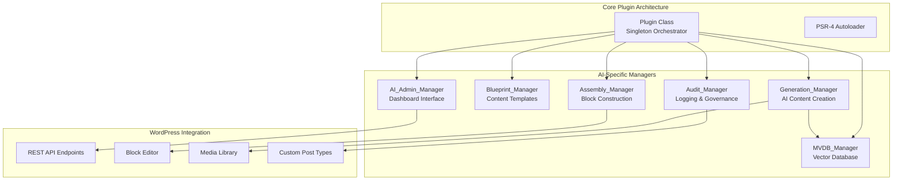
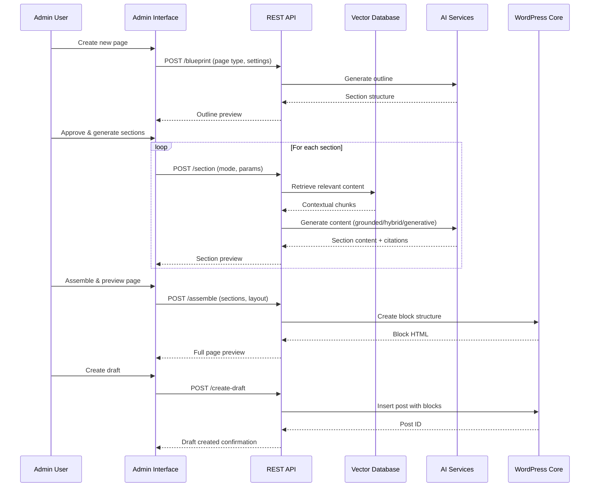
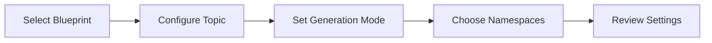
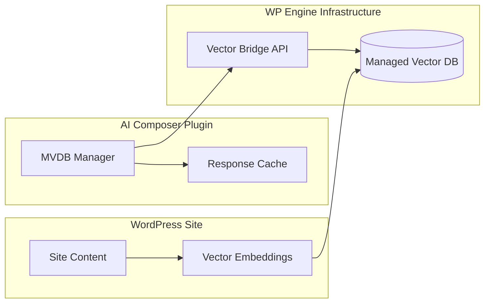
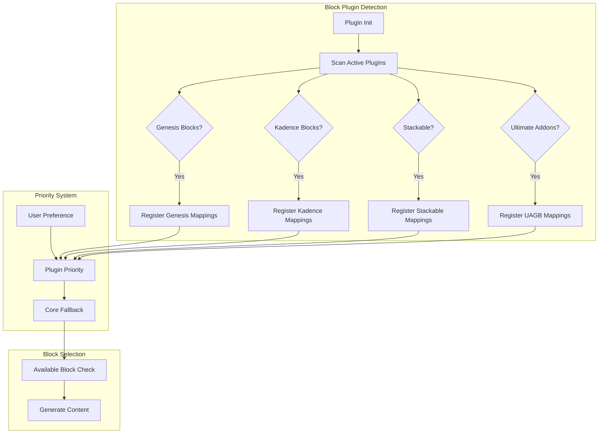

# AI Page Composer Plugin Design

## Overview

The AI Page Composer is a WordPress plugin that generates complete Gutenberg pages with structure, copy, and media through an intuitive admin dashboard. The system supports three content generation modes: Grounded (MVDB-only), Hybrid (weighted), and Generative. It leverages Core Gutenberg blocks/patterns, honors theme.json design tokens, and provides comprehensive governance through detailed logging and audit trails.

### Key Features

- **Full Page Generation**: Single admin interface for blueprint → outline → generation → assembly → preview → draft creation
- **Multi-Modal Content Generation**: Grounded, Hybrid, and Generative modes with configurable weighting
- **MVDB Integration**: Site-aware content through WP Engine Managed Vector Database
- **Core Block Support**: Uses native Gutenberg blocks and synced patterns, no shortcode dependencies
- **Comprehensive Governance**: Run logs, diff tracking, reproducibility, and cost reporting
- **SEO & Accessibility**: Built-in meta generation, internal linking, alt text, and accessibility validation

## Technology Stack & Dependencies

### Backend Technologies
- **PHP**: 8.0+ (enhanced from template's 7.4 requirement)
- **WordPress**: 6.4+ (for enhanced block editor APIs)
- **MySQL**: 5.7+ (for JSON column support in audit logging)

### Frontend Technologies
- **JavaScript**: ES2020+ with WordPress @wordpress/* packages
- **React**: Via WordPress Gutenberg components
- **CSS**: PostCSS with CSS custom properties support

### External Integrations
- **WP Engine MVDB**: Vector database access via Vector Bridge API
- **OpenAI/Azure OpenAI**: Content and image generation APIs
- **WordPress Media Library**: Native image management and metadata

### Build Tools & Dependencies
```json
{
  "php-dependencies": {
    "guzzlehttp/guzzle": "^7.8",
    "symfony/validator": "^6.4",
    "league/html-to-markdown": "^5.1"
  },
  "js-dependencies": {
    "@wordpress/components": "^27.0.0",
    "@wordpress/block-editor": "^12.0.0",
    "@wordpress/api-fetch": "^6.0.0",
    "@wordpress/hooks": "^3.0.0"
  }
}
```

## Architecture

### Component Architecture Overview

The AI Page Composer follows the established plugin template architecture with specialized AI-focused managers:



### Data Flow Architecture



## Custom Post Types & Data Models

### AI Blueprint CPT

Stores reusable content generation templates and configurations.

```php
// Post meta schema
$blueprint_schema = [
    'sections' => [
        [
            'type' => 'hero|content|media_text|columns|list|quote|gallery|faq|cta',
            'heading_level' => 1|2|3,
            'word_target' => 150,
            'media_policy' => 'required|optional|none',
            'internal_links' => 2,
            'citations_required' => true,
            'tone' => 'professional|casual|technical',
            'pattern_preference' => 'core/media-text|core/columns'
        ]
    ],
    'global_settings' => [
        'generation_mode' => 'grounded|hybrid|generative',
        'hybrid_alpha' => 0.7,
        'mvdb_namespaces' => ['content', 'products', 'docs'],
        'max_tokens_per_section' => 500,
        'image_generation_enabled' => true,
        'seo_optimization' => true
    ]
];
```

### AI Run CPT

Comprehensive audit logging for governance and reproducibility.

```php
// Post meta schema
$run_schema = [
    'blueprint_id' => 123,
    'user_id' => 456,
    'timestamp' => '2024-01-15T10:30:00Z',
    'status' => 'completed|failed|in_progress',
    'sections_generated' => [
        [
            'section_id' => 'hero-1',
            'generation_mode' => 'hybrid',
            'alpha_weight' => 0.7,
            'mvdb_chunks_used' => ['chunk-123', 'chunk-456'],
            'prompt_hash' => 'sha256:abc123...',
            'tokens_consumed' => 450,
            'cost_usd' => 0.023,
            'citations' => [
                ['source_url' => 'https://site.com/page', 'type' => 'internal']
            ],
            'warnings' => ['Low MVDB recall: 0.3'],
            'processing_time_ms' => 2500
        ]
    ],
    'final_blocks' => [/* Gutenberg block structure */],
    'seo_meta' => [
        'title' => 'Generated Title',
        'description' => 'Meta description',
        'slug' => 'generated-slug'
    ],
    'accessibility_checks' => [
        'heading_structure_valid' => true,
        'alt_text_coverage' => 0.95,
        'readability_score' => 8.2
    ],
    'total_cost_usd' => 0.15,
    'reproducibility_hash' => 'sha256:def789...'
];
```

## REST API Endpoints

### Namespace: `ai-composer/v1`

#### POST `/outline`
Generates page structure and section breakdown.

**Request:**
```json
{
    "blueprint_id": 123,
    "page_type": "landing_page",
    "topic": "WordPress security best practices",
    "target_length": 1500,
    "custom_sections": []
}
```

**Response:**
```json
{
    "outline": [
        {
            "id": "hero-1",
            "type": "hero",
            "heading": "WordPress Security Best Practices",
            "subheading": "Protect Your Site from Common Threats",
            "word_target": 100,
            "media_required": true
        },
        {
            "id": "content-1", 
            "type": "content",
            "heading": "Essential Security Plugins",
            "heading_level": 2,
            "word_target": 300,
            "internal_links": 2
        }
    ],
    "estimated_tokens": 800,
    "estimated_cost": 0.12
}
```

#### POST `/retrieve`
Retrieves relevant content from MVDB for context.

**Request:**
```json
{
    "query": "WordPress security plugins",
    "namespaces": ["content", "docs"],
    "k": 10,
    "min_score": 0.5,
    "filters": {
        "content_type": "article",
        "date_range": "2023-01-01:2024-12-31",
        "language": "en"
    }
}
```

**Response:**
```json
{
    "chunks": [
        {
            "id": "chunk-123",
            "text": "WordPress security plugins like Wordfence provide...",
            "score": 0.89,
            "metadata": {
                "source_url": "https://site.com/security-guide",
                "type": "article",
                "date": "2024-01-10",
                "license": "CC-BY-4.0",
                "post_id": 456
            }
        }
    ],
    "total_retrieved": 8,
    "recall_score": 0.75
}
```

#### POST `/section`
Generates content for a specific section.

**Request:**
```json
{
    "section_config": {
        "id": "content-1",
        "type": "content", 
        "heading": "Essential Security Plugins",
        "word_target": 300,
        "generation_mode": "hybrid",
        "alpha": 0.7
    },
    "context_chunks": ["chunk-123", "chunk-456"],
    "theme_tokens": {
        "colors": {"primary": "#0073aa"},
        "spacing": {"medium": "1.5rem"},
        "typography": {"headingFontFamily": "Inter"}
    }
}
```

**Response:**
```json
{
    "content": {
        "html": "<h2>Essential Security Plugins</h2><p>When securing your WordPress site...</p>",
        "blocks": [/* Gutenberg block JSON */],
        "word_count": 298,
        "readability_score": 8.5
    },
    "citations": [
        {
            "source_url": "https://site.com/security-guide",
            "type": "internal",
            "anchor_text": "comprehensive security guide"
        }
    ],
    "internal_links": [
        {
            "target_post_id": 789,
            "anchor_text": "WordPress maintenance",
            "relevance_score": 0.85
        }
    ],
    "media_generated": [
        {
            "attachment_id": 234,
            "alt_text": "WordPress security dashboard showing active protections",
            "caption": "Security plugin dashboard interface"
        }
    ],
    "tokens_used": 445,
    "cost_usd": 0.022,
    "warnings": []
}
```

#### POST `/image`
Generates or selects images for content sections.

**Request:**
```json
{
    "section_id": "hero-1",
    "prompt": "Modern WordPress website security dashboard",
    "style": "professional",
    "dimensions": "1200x600",
    "alt_text_context": "Hero image for WordPress security article"
}
```

**Response:**
```json
{
    "attachment_id": 567,
    "url": "https://site.com/wp-content/uploads/2024/01/security-dashboard.jpg",
    "alt_text": "Clean, modern WordPress security dashboard showing green security status indicators",
    "metadata": {
        "prompt": "Modern WordPress website security dashboard",
        "generation_cost": 0.05,
        "license": "generated",
        "dimensions": "1200x600"
    }
}
```

#### POST `/assemble`
Assembles sections into complete page blocks with validation.

**Request:**
```json
{
    "sections": [
        {
            "id": "hero-1",
            "blocks": [/* Gutenberg blocks */],
            "pattern": "core/media-text"
        }
    ],
    "layout_config": {
        "container_width": "wide",
        "spacing_scale": "medium"
    },
    "validation_rules": {
        "check_heading_hierarchy": true,
        "validate_internal_links": true,
        "require_alt_text": true
    }
}
```

**Response:**
```json
{
    "assembled_blocks": [/* Complete page blocks */],
    "validation_results": {
        "heading_structure_valid": true,
        "broken_links": [],
        "missing_alt_text": [],
        "accessibility_score": 9.2
    },
    "preview_html": "<div class='wp-block-group'>...</div>",
    "estimated_reading_time": "5 minutes"
}
```

#### POST `/create-draft`
Creates WordPress post/page draft with generated content.

**Request:**
```json
{
    "post_data": {
        "post_type": "page",
        "post_title": "WordPress Security Best Practices",
        "post_status": "draft"
    },
    "blocks": [/* Assembled Gutenberg blocks */],
    "seo_meta": {
        "meta_description": "Learn essential WordPress security...",
        "slug": "wordpress-security-best-practices"
    },
    "featured_image_id": 567,
    "taxonomies": {
        "category": ["Security", "WordPress"],
        "tags": ["security", "plugins", "maintenance"]
    }
}
```

**Response:**
```json
{
    "post_id": 890,
    "edit_url": "https://site.com/wp-admin/post.php?post=890&action=edit",
    "preview_url": "https://site.com/?p=890&preview=true",
    "run_id": 456
}
```

## Admin Interface

### Dashboard Navigation
- **Content → AI Composer**: Main entry point
- **Settings → AI Composer**: Configuration and API keys
- **Tools → AI Runs**: Audit log and governance dashboard

### AI Composer Workflow

#### Step 1: Input Configuration


**Interface Elements:**
- Blueprint dropdown (saved templates + "Create New")
- Topic/keyword input with suggestions
- Generation mode toggle (Grounded/Hybrid/Generative)
- MVDB namespace multi-select with descriptions
- Advanced settings accordion (token limits, costs, etc.)

#### Step 2: Outline Generation & Review
```javascript
// React component structure
const OutlineReview = () => {
  const [outline, setOutline] = useState([]);
  const [isEditing, setIsEditing] = useState(false);
  
  return (
    <div className="outline-review">
      <OutlinePreview 
        sections={outline}
        onEdit={setIsEditing}
        onReorder={handleReorder}
      />
      <EstimatedCosts 
        tokens={outline.estimatedTokens}
        cost={outline.estimatedCost}
      />
    </div>
  );
};
```

**Features:**
- Drag-and-drop section reordering
- Inline editing of headings and word targets
- Real-time cost estimation
- Section type preview with pattern examples

#### Step 3: Section Generation
```javascript
const SectionGeneration = () => {
  const [progress, setProgress] = useState({});
  const [generatedSections, setGeneratedSections] = useState({});
  
  const generateSection = async (sectionId) => {
    setProgress(prev => ({...prev, [sectionId]: 'generating'}));
    
    try {
      const response = await apiFetch({
        path: '/ai-composer/v1/section',
        method: 'POST',
        data: sectionConfigs[sectionId]
      });
      
      setGeneratedSections(prev => ({
        ...prev, 
        [sectionId]: response
      }));
      setProgress(prev => ({...prev, [sectionId]: 'completed'}));
    } catch (error) {
      setProgress(prev => ({...prev, [sectionId]: 'failed'}));
    }
  };
  
  return (
    <div className="section-generation">
      {outline.sections.map(section => (
        <SectionCard
          key={section.id}
          section={section}
          status={progress[section.id]}
          content={generatedSections[section.id]}
          onGenerate={() => generateSection(section.id)}
          onRegenerate={() => regenerateSection(section.id)}
        />
      ))}
    </div>
  );
};
```

**Features:**
- Individual section generation with progress indicators
- Real-time preview of generated content
- Regeneration with modified parameters
- Citation and link validation
- Cost tracking per section

#### Step 4: Assembly & Preview
```javascript
const PageAssembly = () => {
  const [assembledPage, setAssembledPage] = useState(null);
  const [validationResults, setValidationResults] = useState({});
  
  return (
    <div className="page-assembly">
      <div className="assembly-controls">
        <LayoutSelector />
        <PatternOverrides />
        <ValidationToggle />
      </div>
      
      <div className="preview-container">
        <BlockPreview blocks={assembledPage?.blocks} />
        <ValidationPanel results={validationResults} />
      </div>
    </div>
  );
};
```

**Features:**
- Live block editor preview
- Layout pattern selection
- Accessibility validation results
- SEO optimization suggestions
- Mobile/desktop preview toggle

#### Step 5: Draft Creation
```javascript
const DraftCreation = () => {
  const [postSettings, setPostSettings] = useState({
    post_type: 'page',
    post_status: 'draft'
  });
  
  return (
    <div className="draft-creation">
      <PostSettings 
        settings={postSettings}
        onChange={setPostSettings}
      />
      <SeoMeta />
      <TaxonomySelection />
      <FinalReview />
      <CreateDraftButton />
    </div>
  );
};
```

## MVDB Integration

### Vector Bridge Architecture



### MVDB Manager Implementation

```php
class MVDB_Manager {
    private $api_client;
    private $cache_ttl = 3600; // 1 hour
    
    public function retrieve_context($query, $params = []) {
        $cache_key = $this->generate_cache_key($query, $params);
        $cached = wp_cache_get($cache_key, 'ai_composer_mvdb');
        
        if ($cached !== false) {
            return $cached;
        }
        
        $response = $this->api_client->post('/vector-search', [
            'query' => $query,
            'namespaces' => $params['namespaces'] ?? [],
            'k' => $params['k'] ?? 10,
            'min_score' => $params['min_score'] ?? 0.5,
            'filters' => $params['filters'] ?? []
        ]);
        
        $result = [
            'chunks' => $response['results'],
            'metadata' => [
                'total_retrieved' => count($response['results']),
                'recall_score' => $this->calculate_recall_score($response),
                'query_time_ms' => $response['timing']['total_ms']
            ]
        ];
        
        wp_cache_set($cache_key, $result, 'ai_composer_mvdb', $this->cache_ttl);
        
        return $result;
    }
    
    private function calculate_recall_score($response) {
        if (empty($response['results'])) {
            return 0.0;
        }
        
        $scores = array_column($response['results'], 'score');
        $avg_score = array_sum($scores) / count($scores);
        
        return round($avg_score, 3);
    }
    
    public function get_namespace_info() {
        return [
            'content' => [
                'description' => 'Published content and articles',
                'doc_count' => 1250,
                'last_updated' => '2024-01-15T09:30:00Z'
            ],
            'products' => [
                'description' => 'Product descriptions and specifications',
                'doc_count' => 340,
                'last_updated' => '2024-01-14T16:45:00Z'
            ],
            'docs' => [
                'description' => 'Documentation and help articles',
                'doc_count' => 890,
                'last_updated' => '2024-01-15T11:20:00Z'
            ]
        ];
    }
}
```

### Fallback Strategies

When MVDB recall falls below threshold:

1. **Graceful Degradation**: Switch to generative mode with user consent
2. **Alternative Sources**: Query WordPress search API for internal content
3. **User Notification**: Display warning with recall score and options
4. **Manual Context**: Allow user to provide additional context manually

## Block Assembly System

### Extensible Block Mapping System

The system uses a dynamic block mapping architecture that supports core Gutenberg blocks and automatically detects third-party block plugins:

```php
class Assembly_Manager {
    private $core_block_mappings = [
        'hero' => [
            'primary' => 'core/cover',
            'fallback' => 'core/media-text',
            'patterns' => ['core/hero-with-image']
        ],
        'content' => [
            'primary' => 'core/paragraph',
            'with_media' => 'core/media-text',
            'patterns' => ['core/text-two-columns']
        ],
        'list' => [
            'primary' => 'core/list',
            'enhanced' => 'core/columns',
            'patterns' => ['core/feature-list']
        ],
        'quote' => [
            'primary' => 'core/quote',
            'pullquote' => 'core/pullquote',
            'patterns' => ['core/testimonial']
        ],
        'gallery' => [
            'primary' => 'core/gallery',
            'carousel' => 'core/gallery',
            'patterns' => ['core/gallery-three-columns']
        ],
        'faq' => [
            'primary' => 'core/details',
            'accordion' => 'core/group',
            'patterns' => ['core/faq-section']
        ],
        'cta' => [
            'primary' => 'core/buttons',
            'banner' => 'core/cover',
            'patterns' => ['core/call-to-action']
        ]
    ];
    
    private $extended_block_mappings = [];
    private $detected_block_plugins = [];
    
    public function __construct() {
        add_action('init', [$this, 'detect_block_plugins'], 15);
        add_action('init', [$this, 'register_extended_mappings'], 20);
    }
    
    /**
     * Detect available third-party block plugins
     */
    public function detect_block_plugins() {
        $this->detected_block_plugins = [
            'genesis_blocks' => [
                'active' => class_exists('Genesis_Blocks') || function_exists('genesis_blocks_init'),
                'namespace' => 'genesis-blocks',
                'priority' => 8 // Higher than core (5) but allows user preference
            ],
            'kadence_blocks' => [
                'active' => class_exists('Kadence_Blocks_Frontend') || defined('KADENCE_BLOCKS_VERSION'),
                'namespace' => 'kadence',
                'priority' => 8
            ],
            'stackable' => [
                'active' => defined('STACKABLE_VERSION'),
                'namespace' => 'ugb',
                'priority' => 7
            ],
            'ultimate_addons' => [
                'active' => class_exists('UAGB_Loader'),
                'namespace' => 'uagb',
                'priority' => 7
            ],
            'blocksy' => [
                'active' => defined('BLOCKSY_COMPANION_VERSION'),
                'namespace' => 'blocksy',
                'priority' => 6
            ]
        ];
        
        // Allow third-party plugins to register themselves
        $this->detected_block_plugins = apply_filters('ai_composer_detected_block_plugins', $this->detected_block_plugins);
    }
    
    /**
     * Register extended block mappings for detected plugins
     */
    public function register_extended_mappings() {
        foreach ($this->detected_block_plugins as $plugin_key => $plugin_data) {
            if (!$plugin_data['active']) continue;
            
            switch ($plugin_key) {
                case 'genesis_blocks':
                    $this->register_genesis_blocks_mappings();
                    break;
                case 'kadence_blocks':
                    $this->register_kadence_blocks_mappings();
                    break;
                case 'stackable':
                    $this->register_stackable_mappings();
                    break;
                case 'ultimate_addons':
                    $this->register_uagb_mappings();
                    break;
                case 'blocksy':
                    $this->register_blocksy_mappings();
                    break;
            }
        }
        
        // Allow custom mappings via filter
        $this->extended_block_mappings = apply_filters('ai_composer_extended_block_mappings', $this->extended_block_mappings);
    }
    
    /**
     * Genesis Blocks integration
     */
    private function register_genesis_blocks_mappings() {
        $this->extended_block_mappings['genesis_blocks'] = [
            'hero' => [
                'primary' => 'genesis-blocks/gb-cta',
                'advanced' => 'genesis-blocks/gb-post-grid',
                'patterns' => ['genesis-blocks/hero-section']
            ],
            'content' => [
                'primary' => 'genesis-blocks/gb-columns',
                'testimonial' => 'genesis-blocks/gb-testimonial',
                'patterns' => ['genesis-blocks/content-columns']
            ],
            'pricing' => [
                'primary' => 'genesis-blocks/gb-pricing',
                'table' => 'genesis-blocks/gb-pricing-table'
            ],
            'team' => [
                'primary' => 'genesis-blocks/gb-profile-box'
            ]
        ];
    }
    
    /**
     * Kadence Blocks integration
     */
    private function register_kadence_blocks_mappings() {
        $this->extended_block_mappings['kadence_blocks'] = [
            'hero' => [
                'primary' => 'kadence/rowlayout',
                'advanced' => 'kadence/advancedheading',
                'patterns' => ['kadence/hero-banner']
            ],
            'content' => [
                'primary' => 'kadence/column',
                'advanced' => 'kadence/advancedgallery'
            ],
            'testimonial' => [
                'primary' => 'kadence/testimonials'
            ],
            'tabs' => [
                'primary' => 'kadence/tabs'
            ],
            'accordion' => [
                'primary' => 'kadence/accordion'
            ],
            'countdown' => [
                'primary' => 'kadence/countdown'
            ],
            'form' => [
                'primary' => 'kadence/form'
            ]
        ];
    }
    
    /**
     * Get block mapping with plugin priority system
     */
    public function get_block_mapping($section_type, $user_preference = null) {
        // 1. Check user preference first
        if ($user_preference && $this->is_block_available($user_preference)) {
            return $user_preference;
        }
        
        // 2. Check extended mappings by priority
        $available_mappings = [];
        
        foreach ($this->extended_block_mappings as $plugin_key => $mappings) {
            if (isset($mappings[$section_type])) {
                $plugin_data = $this->detected_block_plugins[$plugin_key] ?? ['priority' => 1];
                $available_mappings[] = [
                    'mapping' => $mappings[$section_type],
                    'priority' => $plugin_data['priority'],
                    'plugin' => $plugin_key
                ];
            }
        }
        
        // Sort by priority (higher = better)
        usort($available_mappings, function($a, $b) {
            return $b['priority'] <=> $a['priority'];
        });
        
        // 3. Return highest priority available mapping
        foreach ($available_mappings as $mapping_data) {
            $primary_block = $mapping_data['mapping']['primary'];
            if ($this->is_block_available($primary_block)) {
                return $mapping_data['mapping'];
            }
        }
        
        // 4. Fallback to core blocks
        return $this->core_block_mappings[$section_type] ?? $this->core_block_mappings['content'];
    }
    
    public function assemble_section($section_data, $theme_tokens = [], $user_preferences = []) {
        $section_type = $section_data['type'];
        $content = $section_data['content'];
        
        // Get block mapping with plugin priority and user preference
        $user_pref = $user_preferences[$section_type] ?? null;
        $mapping = $this->get_block_mapping($section_type, $user_pref);
        
        // Apply theme.json tokens
        $block_styles = $this->apply_theme_tokens($theme_tokens);
        
        // Determine if we're using a third-party block
        $block_namespace = $this->get_block_namespace($mapping['primary']);
        
        if ($block_namespace === 'core') {
            return $this->create_core_block($section_type, $content, $block_styles, $mapping);
        } else {
            return $this->create_extended_block($section_type, $content, $block_styles, $mapping, $block_namespace);
        }
    }
    
    /**
     * Create blocks using core Gutenberg blocks
     */
    private function create_core_block($section_type, $content, $styles, $mapping) {
        switch ($section_type) {
            case 'hero':
                return $this->create_core_hero_block($content, $styles);
            case 'content':
                return $this->create_core_content_blocks($content, $styles);
            case 'list':
                return $this->create_core_list_block($content, $styles);
            case 'testimonial':
                return $this->create_core_testimonial_block($content, $styles);
            default:
                return $this->create_core_content_blocks($content, $styles);
        }
    }
    
    /**
     * Create blocks using third-party plugin blocks
     */
    private function create_extended_block($section_type, $content, $styles, $mapping, $namespace) {
        switch ($namespace) {
            case 'genesis-blocks':
                return $this->create_genesis_block($section_type, $content, $styles, $mapping);
            case 'kadence':
                return $this->create_kadence_block($section_type, $content, $styles, $mapping);
            case 'ugb': // Stackable
                return $this->create_stackable_block($section_type, $content, $styles, $mapping);
            case 'uagb': // Ultimate Addons
                return $this->create_uagb_block($section_type, $content, $styles, $mapping);
            default:
                // Fallback to core if extended block creation fails
                return $this->create_core_block($section_type, $content, $styles, $mapping);
        }
    }
    
    /**
     * Genesis Blocks creation methods
     */
    private function create_genesis_block($section_type, $content, $styles, $mapping) {
        switch ($section_type) {
            case 'hero':
                return [
                    'blockName' => 'genesis-blocks/gb-cta',
                    'attrs' => [
                        'ctaTitle' => $content['title'],
                        'ctaText' => $content['subtitle'],
                        'ctaBackgroundColor' => $styles['primary_color'],
                        'imgURL' => $content['image']['url'] ?? '',
                        'imgAlt' => $content['image']['alt'] ?? '',
                        'buttonText' => $content['button_text'] ?? '',
                        'buttonUrl' => $content['button_url'] ?? ''
                    ]
                ];
            case 'testimonial':
                return [
                    'blockName' => 'genesis-blocks/gb-testimonial',
                    'attrs' => [
                        'testimonialName' => $content['author'],
                        'testimonialTitle' => $content['position'] ?? '',
                        'testimonialContent' => $content['quote'],
                        'testimonialImgURL' => $content['avatar']['url'] ?? '',
                        'testimonialBackgroundColor' => $styles['background_color'] ?? '#f8f9fa'
                    ]
                ];
            default:
                return $this->create_core_block($section_type, $content, $styles, $mapping);
        }
    }
    
    /**
     * Kadence Blocks creation methods
     */
    private function create_kadence_block($section_type, $content, $styles, $mapping) {
        switch ($section_type) {
            case 'hero':
                return [
                    'blockName' => 'kadence/rowlayout',
                    'attrs' => [
                        'bgColor' => $styles['primary_color'],
                        'bgImg' => $content['image']['url'] ?? '',
                        'bgImgAttachment' => 'scroll',
                        'verticalAlignment' => 'center',
                        'overlayOpacity' => 50
                    ],
                    'innerBlocks' => [
                        [
                            'blockName' => 'kadence/column',
                            'innerBlocks' => [
                                [
                                    'blockName' => 'kadence/advancedheading',
                                    'attrs' => [
                                        'content' => $content['title'],
                                        'level' => 1,
                                        'color' => '#ffffff'
                                    ]
                                ],
                                [
                                    'blockName' => 'core/paragraph',
                                    'attrs' => [
                                        'content' => $content['subtitle'],
                                        'style' => ['color' => ['text' => '#ffffff']]
                                    ]
                                ]
                            ]
                        ]
                    ]
                ];
            case 'testimonial':
                return [
                    'blockName' => 'kadence/testimonials',
                    'attrs' => [
                        'testimonials' => [
                            [
                                'content' => $content['quote'],
                                'name' => $content['author'],
                                'occupation' => $content['position'] ?? '',
                                'image' => $content['avatar']['url'] ?? ''
                            ]
                        ],
                        'layout' => 'basic',
                        'containerBackground' => $styles['background_color'] ?? '#f8f9fa'
                    ]
                ];
            default:
                return $this->create_core_block($section_type, $content, $styles, $mapping);
        }
    }
    
    /**
     * Check if a specific block is available
     */
    private function is_block_available($block_name) {
        $registered_blocks = WP_Block_Type_Registry::get_instance()->get_all_registered();
        return isset($registered_blocks[$block_name]);
    }
    
    /**
     * Extract namespace from block name
     */
    private function get_block_namespace($block_name) {
        $parts = explode('/', $block_name);
        return $parts[0] ?? 'core';
    }
    
    private function create_hero_block($content, $styles) {
        return [
            'blockName' => 'core/cover',
            'attrs' => [
                'url' => $content['image']['url'],
                'alt' => $content['image']['alt'],
                'customOverlayColor' => $styles['overlay_color'],
                'style' => [
                    'spacing' => [
                        'padding' => $styles['section_padding']
                    ]
                ]
            ],
            'innerBlocks' => [
                [
                    'blockName' => 'core/heading',
                    'attrs' => [
                        'level' => 1,
                        'content' => $content['title']
                    ]
                ],
                [
                    'blockName' => 'core/paragraph',
                    'attrs' => [
                        'content' => $content['subtitle']
                    ]
                ]
            ]
        ];
    }
    
    private function apply_theme_tokens($tokens) {
        return [
            'primary_color' => $tokens['colors']['primary'] ?? '#0073aa',
            'section_padding' => $tokens['spacing']['large'] ?? '2rem',
            'heading_font' => $tokens['typography']['headingFontFamily'] ?? 'inherit',
            'overlay_color' => $this->adjust_color_opacity($tokens['colors']['primary'] ?? '#000000', 0.5)
        ];
    }
}
```

### Third-Party Block Plugin Integration

### Plugin Detection System

The AI Composer automatically detects and integrates with popular block plugins:



### Supported Block Plugins

#### Genesis Blocks
- **Hero Sections**: `genesis-blocks/gb-cta` for advanced call-to-action layouts
- **Content Sections**: `genesis-blocks/gb-columns` for flexible column layouts
- **Testimonials**: `genesis-blocks/gb-testimonial` for enhanced testimonial display
- **Pricing**: `genesis-blocks/gb-pricing` for pricing tables and plans
- **Team**: `genesis-blocks/gb-profile-box` for team member profiles

#### Kadence Blocks
- **Hero Sections**: `kadence/rowlayout` with advanced styling options
- **Advanced Headings**: `kadence/advancedheading` for enhanced typography
- **Testimonials**: `kadence/testimonials` with carousel and grid layouts
- **Tabs & Accordions**: `kadence/tabs` and `kadence/accordion` for interactive content
- **Forms**: `kadence/form` for contact and lead generation
- **Countdown**: `kadence/countdown` for time-sensitive content

#### Stackable
- **Advanced Containers**: `ugb/container` for complex layouts
- **Hero Sections**: `ugb/hero` with background effects
- **Feature Lists**: `ugb/feature-grid` for product features
- **Team Members**: `ugb/team-member` for staff profiles

#### Ultimate Addons for Gutenberg (UAGB)
- **Advanced Columns**: `uagb/columns` with responsive controls
- **Info Boxes**: `uagb/info-box` for feature highlights
- **Call to Action**: `uagb/call-to-action` for conversion-focused sections
- **Testimonials**: `uagb/testimonial` with schema markup

### Configuration Interface

```javascript
// Admin interface for block preferences
const BlockPreferences = () => {
  const [preferences, setPreferences] = useState({
    hero: 'auto', // auto, core, genesis-blocks, kadence, etc.
    content: 'auto',
    testimonial: 'kadence',
    pricing: 'genesis-blocks'
  });
  
  const [detectedPlugins, setDetectedPlugins] = useState([]);
  
  useEffect(() => {
    // Fetch detected plugins
    apiFetch({
      path: '/ai-composer/v1/detected-plugins'
    }).then(setDetectedPlugins);
  }, []);
  
  return (
    <div className="block-preferences">
      <h3>Block Plugin Preferences</h3>
      
      {Object.keys(preferences).map(sectionType => (
        <div key={sectionType} className="preference-row">
          <label>{sectionType.charAt(0).toUpperCase() + sectionType.slice(1)} Sections:</label>
          <select 
            value={preferences[sectionType]}
            onChange={(e) => setPreferences(prev => ({
              ...prev,
              [sectionType]: e.target.value
            }))}
          >
            <option value="auto">Auto (Best Available)</option>
            <option value="core">WordPress Core Blocks</option>
            {detectedPlugins.map(plugin => (
              <option key={plugin.key} value={plugin.namespace}>
                {plugin.name} {plugin.active ? '✓' : '(Inactive)'}
              </option>
            ))}
          </select>
        </div>
      ))}
      
      <div className="detected-plugins-info">
        <h4>Detected Block Plugins:</h4>
        <ul>
          {detectedPlugins.map(plugin => (
            <li key={plugin.key} className={plugin.active ? 'active' : 'inactive'}>
              <strong>{plugin.name}</strong> 
              <span className="status">{plugin.active ? 'Active' : 'Inactive'}</span>
              <span className="priority">Priority: {plugin.priority}</span>
            </li>
          ))}
        </ul>
      </div>
    </div>
  );
};
```

### Custom Block Plugin Integration

Developers can extend the system to support additional block plugins:

```php
// Example: Adding support for a custom block plugin
add_filter('ai_composer_detected_block_plugins', function($plugins) {
    $plugins['my_custom_blocks'] = [
        'active' => class_exists('My_Custom_Blocks'),
        'namespace' => 'my-blocks',
        'priority' => 9, // Higher than defaults
        'name' => 'My Custom Blocks'
    ];
    
    return $plugins;
});

add_filter('ai_composer_extended_block_mappings', function($mappings) {
    if (class_exists('My_Custom_Blocks')) {
        $mappings['my_custom_blocks'] = [
            'hero' => [
                'primary' => 'my-blocks/super-hero',
                'advanced' => 'my-blocks/mega-hero'
            ],
            'pricing' => [
                'primary' => 'my-blocks/pricing-table'
            ]
        ];
    }
    
    return $mappings;
});
```

### Enhanced Pattern Integration with Third-Party Support

```php
class Pattern_Manager {
    public function get_available_patterns() {
        $patterns = WP_Block_Patterns_Registry::get_instance()->get_all_registered();
        
        return array_filter($patterns, function($pattern) {
            return strpos($pattern['name'], 'core/') === 0 || 
                   in_array('ai-composer', $pattern['categories'] ?? []);
        });
    }
    
    public function apply_pattern($pattern_name, $content_data) {
        $pattern = WP_Block_Patterns_Registry::get_instance()->get_registered($pattern_name);
        
        if (!$pattern) {
            return null;
        }
        
        // Parse pattern blocks
        $blocks = parse_blocks($pattern['content']);
        
        // Replace placeholder content with generated content
        return $this->replace_pattern_placeholders($blocks, $content_data);
    }
    
    private function replace_pattern_placeholders($blocks, $content_data) {
        foreach ($blocks as &$block) {
            if ($block['blockName'] === 'core/heading') {
                $block['attrs']['content'] = $content_data['heading'] ?? $block['attrs']['content'];
            } elseif ($block['blockName'] === 'core/paragraph') {
                $block['attrs']['content'] = $content_data['paragraph'] ?? $block['attrs']['content'];
            }
            
            // Recursively process inner blocks
            if (!empty($block['innerBlocks'])) {
                $block['innerBlocks'] = $this->replace_pattern_placeholders(
                    $block['innerBlocks'], 
                    $content_data
                );
            }
        }
        
        return $blocks;
    }
}
```

## Content Generation Modes

### Grounded Mode (MVDB-Only)

```php
class Grounded_Generator {
    private $mvdb_manager;
    
    public function generate_section($section_config, $mvdb_chunks) {
        // Ensure sufficient context
        if (empty($mvdb_chunks) || count($mvdb_chunks) < 3) {
            throw new Insufficient_Context_Exception(
                'Grounded mode requires at least 3 relevant chunks'
            );
        }
        
        // Build context from chunks
        $context = $this->build_context($mvdb_chunks);
        
        // Generate content strictly from provided context
        $prompt = $this->build_grounded_prompt($section_config, $context);
        
        $response = $this->ai_client->generate([
            'prompt' => $prompt,
            'max_tokens' => $section_config['word_target'] * 1.5,
            'temperature' => 0.3, // Lower temperature for factual content
            'system' => 'You must only use information provided in the context. Do not add external knowledge.'
        ]);
        
        return [
            'content' => $response['text'],
            'citations' => $this->extract_citations($mvdb_chunks, $response['text']),
            'confidence_score' => $this->calculate_grounding_score($response['text'], $context)
        ];
    }
    
    private function build_grounded_prompt($section_config, $context) {
        return sprintf(
            "Write a %s about '%s' using ONLY the following context information:\n\n%s\n\n" .
            "Requirements:\n" .
            "- Target length: %d words\n" .
            "- Include relevant citations\n" .
            "- Maintain factual accuracy\n" .
            "- Do not add information not present in the context",
            $section_config['type'],
            $section_config['heading'],
            $context,
            $section_config['word_target']
        );
    }
}
```

### Hybrid Mode (Weighted α)

```php
class Hybrid_Generator {
    private $mvdb_manager;
    private $generative_generator;
    
    public function generate_section($section_config, $mvdb_chunks, $alpha = 0.7) {
        // α weight: 0.0 = fully generative, 1.0 = fully grounded
        
        if ($alpha >= 0.8) {
            // High grounding - use chunks as primary source
            $context_weight = 'primary';
            $creativity_level = 'low';
        } elseif ($alpha >= 0.5) {
            // Balanced - equal weight to context and generation
            $context_weight = 'balanced';
            $creativity_level = 'medium';
        } else {
            // Low grounding - use chunks as inspiration only
            $context_weight = 'inspiration';
            $creativity_level = 'high';
        }
        
        $prompt = $this->build_hybrid_prompt($section_config, $mvdb_chunks, $context_weight);
        
        $response = $this->ai_client->generate([
            'prompt' => $prompt,
            'max_tokens' => $section_config['word_target'] * 1.5,
            'temperature' => $this->calculate_temperature($alpha),
            'system' => $this->get_hybrid_system_prompt($context_weight, $creativity_level)
        ]);
        
        return [
            'content' => $response['text'],
            'citations' => $this->extract_hybrid_citations($mvdb_chunks, $response['text'], $alpha),
            'grounding_score' => $alpha,
            'creativity_score' => 1 - $alpha
        ];
    }
    
    private function calculate_temperature($alpha) {
        // Higher α (more grounded) = lower temperature (less creative)
        return 0.2 + (0.6 * (1 - $alpha)); // Range: 0.2 to 0.8
    }
    
    private function get_hybrid_system_prompt($context_weight, $creativity_level) {
        $prompts = [
            'primary' => 'Use the provided context as your primary source. You may add complementary information if it enhances understanding.',
            'balanced' => 'Balance information from the provided context with your knowledge to create comprehensive content.',
            'inspiration' => 'Use the provided context as inspiration. Feel free to expand with relevant knowledge and examples.'
        ];
        
        return $prompts[$context_weight];
    }
}
```

### Generative Mode (AI-Only)

```php
class Generative_Generator {
    public function generate_section($section_config, $site_context = []) {
        // Pure AI generation with minimal constraints
        
        $prompt = $this->build_generative_prompt($section_config, $site_context);
        
        $response = $this->ai_client->generate([
            'prompt' => $prompt,
            'max_tokens' => $section_config['word_target'] * 1.5,
            'temperature' => 0.7, // Higher creativity
            'system' => 'Create engaging, informative content that matches the brand voice and style.'
        ]);
        
        // Post-process for internal linking opportunities
        $internal_links = $this->find_internal_link_opportunities($response['text']);
        
        return [
            'content' => $response['text'],
            'suggested_links' => $internal_links,
            'originality_score' => 0.9, // High originality
            'needs_fact_check' => true
        ];
    }
    
    private function find_internal_link_opportunities($content) {
        // Use WordPress search to find relevant internal content
        $keywords = $this->extract_keywords($content);
        $opportunities = [];
        
        foreach ($keywords as $keyword) {
            $posts = get_posts([
                's' => $keyword,
                'post_type' => ['post', 'page'],
                'post_status' => 'publish',
                'numberposts' => 3
            ]);
            
            foreach ($posts as $post) {
                $opportunities[] = [
                    'post_id' => $post->ID,
                    'title' => $post->post_title,
                    'keyword' => $keyword,
                    'relevance_score' => $this->calculate_relevance($content, $post->post_content)
                ];
            }
        }
        
        return array_slice($opportunities, 0, 5); // Limit to top 5
    }
}
```

## Image Generation & Management

### Image Generation Manager

```php
class Image_Manager {
    private $ai_client;
    private $media_library;
    
    public function generate_image($request) {
        $prompt = $this->enhance_prompt($request['prompt'], $request['style']);
        
        // Generate image via API
        $image_response = $this->ai_client->generate_image([
            'prompt' => $prompt,
            'size' => $request['dimensions'] ?? '1024x1024',
            'style' => $request['style'] ?? 'photographic',
            'quality' => 'hd'
        ]);
        
        // Download and upload to Media Library
        $attachment_id = $this->upload_to_media_library(
            $image_response['url'],
            $request['filename'] ?? 'ai-generated-image.jpg'
        );
        
        // Generate and set alt text
        $alt_text = $this->generate_alt_text($image_response['url'], $request['alt_text_context']);
        update_post_meta($attachment_id, '_wp_attachment_image_alt', $alt_text);
        
        // Store generation metadata
        update_post_meta($attachment_id, '_ai_composer_meta', [
            'prompt' => $prompt,
            'generation_cost' => $image_response['cost'],
            'generation_date' => current_time('c'),
            'model' => $image_response['model'],
            'license' => 'generated'
        ]);
        
        return [
            'attachment_id' => $attachment_id,
            'url' => wp_get_attachment_url($attachment_id),
            'alt_text' => $alt_text,
            'metadata' => get_post_meta($attachment_id, '_ai_composer_meta', true)
        ];
    }
    
    public function select_from_library($criteria) {
        $query_args = [
            'post_type' => 'attachment',
            'post_mime_type' => 'image',
            'post_status' => 'inherit',
            'posts_per_page' => 10
        ];
        
        if (!empty($criteria['keywords'])) {
            $query_args['s'] = implode(' ', $criteria['keywords']);
        }
        
        if (!empty($criteria['tags'])) {
            $query_args['meta_query'] = [
                [
                    'key' => '_wp_attachment_image_keywords',
                    'value' => $criteria['tags'],
                    'compare' => 'LIKE'
                ]
            ];
        }
        
        $images = get_posts($query_args);
        
        return array_map(function($image) {
            return [
                'attachment_id' => $image->ID,
                'url' => wp_get_attachment_url($image->ID),
                'alt_text' => get_post_meta($image->ID, '_wp_attachment_image_alt', true),
                'title' => $image->post_title,
                'caption' => $image->post_excerpt
            ];
        }, $images);
    }
    
    private function generate_alt_text($image_url, $context = '') {
        // Use AI to describe the image for accessibility
        $description_response = $this->ai_client->describe_image([
            'image_url' => $image_url,
            'context' => $context,
            'style' => 'accessibility'
        ]);
        
        return $description_response['description'];
    }
    
    private function enhance_prompt($prompt, $style) {
        $style_modifiers = [
            'professional' => 'clean, modern, business-appropriate',
            'creative' => 'artistic, vibrant, imaginative',
            'minimal' => 'simple, clean lines, minimal design',
            'photographic' => 'realistic, high-quality photography'
        ];
        
        $modifier = $style_modifiers[$style] ?? $style_modifiers['professional'];
        
        return sprintf('%s, %s, high quality, web-optimized', $prompt, $modifier);
    }
}
```

## SEO & Accessibility Integration

### SEO Manager

```php
class SEO_Manager {
    public function generate_seo_meta($content_data) {
        $title = $this->generate_title($content_data);
        $description = $this->generate_description($content_data);
        $slug = $this->generate_slug($title);
        
        return [
            'title' => $title,
            'description' => $description,
            'slug' => $slug,
            'focus_keywords' => $this->extract_focus_keywords($content_data),
            'readability_score' => $this->calculate_readability($content_data['content'])
        ];
    }
    
    private function generate_title($content_data) {
        $prompt = sprintf(
            "Generate an SEO-optimized title for content about '%s'. " .
            "Requirements: 50-60 characters, include primary keyword, compelling and clickable.",
            $content_data['topic']
        );
        
        $response = $this->ai_client->generate([
            'prompt' => $prompt,
            'max_tokens' => 20,
            'temperature' => 0.5
        ]);
        
        return wp_strip_all_tags($response['text']);
    }
    
    private function generate_description($content_data) {
        $prompt = sprintf(
            "Write a meta description for content about '%s'. " .
            "Requirements: 150-160 characters, include call-to-action, summarize key benefits.",
            $content_data['topic']
        );
        
        $response = $this->ai_client->generate([
            'prompt' => $prompt,
            'max_tokens' => 50,
            'temperature' => 0.4
        ]);
        
        return wp_strip_all_tags($response['text']);
    }
    
    public function validate_internal_links($links) {
        $validated = [];
        
        foreach ($links as $link) {
            $response = wp_remote_head($link['url']);
            
            if (!is_wp_error($response) && wp_remote_retrieve_response_code($response) === 200) {
                $validated[] = array_merge($link, ['status' => 'valid']);
            } else {
                $validated[] = array_merge($link, ['status' => 'broken']);
            }
        }
        
        return $validated;
    }
}
```

### Accessibility Validator

```php
class Accessibility_Validator {
    public function validate_content($blocks) {
        $results = [
            'heading_structure' => $this->validate_heading_hierarchy($blocks),
            'alt_text_coverage' => $this->check_alt_text_coverage($blocks),
            'color_contrast' => $this->check_color_contrast($blocks),
            'link_descriptiveness' => $this->validate_link_text($blocks),
            'reading_level' => $this->assess_reading_level($blocks)
        ];
        
        $results['overall_score'] = $this->calculate_accessibility_score($results);
        
        return $results;
    }
    
    private function validate_heading_hierarchy($blocks) {
        $headings = $this->extract_headings($blocks);
        $hierarchy_valid = true;
        $issues = [];
        
        $previous_level = 0;
        
        foreach ($headings as $heading) {
            $current_level = $heading['level'];
            
            if ($current_level > $previous_level + 1) {
                $hierarchy_valid = false;
                $issues[] = sprintf(
                    'Heading level jumps from H%d to H%d',
                    $previous_level,
                    $current_level
                );
            }
            
            $previous_level = $current_level;
        }
        
        return [
            'valid' => $hierarchy_valid,
            'issues' => $issues,
            'total_headings' => count($headings)
        ];
    }
    
    private function check_alt_text_coverage($blocks) {
        $images = $this->extract_images($blocks);
        $with_alt = array_filter($images, function($img) {
            return !empty($img['alt']);
        });
        
        $coverage = count($images) > 0 ? count($with_alt) / count($images) : 1.0;
        
        return [
            'coverage_percentage' => round($coverage * 100, 1),
            'total_images' => count($images),
            'images_with_alt' => count($with_alt),
            'missing_alt' => array_filter($images, function($img) {
                return empty($img['alt']);
            })
        ];
    }
    
    private function assess_reading_level($blocks) {
        $text_content = $this->extract_text_content($blocks);
        
        // Simple reading level assessment
        $sentences = preg_split('/[.!?]+/', $text_content);
        $words = str_word_count($text_content);
        $syllables = $this->count_syllables($text_content);
        
        // Flesch Reading Ease Score
        $flesch_score = 206.835 - (1.015 * ($words / count($sentences))) - (84.6 * ($syllables / $words));
        
        $reading_level = '';
        if ($flesch_score >= 90) $reading_level = 'Very Easy';
        elseif ($flesch_score >= 80) $reading_level = 'Easy';
        elseif ($flesch_score >= 70) $reading_level = 'Fairly Easy';
        elseif ($flesch_score >= 60) $reading_level = 'Standard';
        elseif ($flesch_score >= 50) $reading_level = 'Fairly Difficult';
        elseif ($flesch_score >= 30) $reading_level = 'Difficult';
        else $reading_level = 'Very Difficult';
        
        return [
            'flesch_score' => round($flesch_score, 1),
            'reading_level' => $reading_level,
            'word_count' => $words,
            'sentence_count' => count($sentences),
            'avg_words_per_sentence' => round($words / count($sentences), 1)
        ];
    }
}
```

## Audit & Governance System

### Audit Manager

```php
class Audit_Manager {
    public function log_generation_run($run_data) {
        $run_post_id = wp_insert_post([
            'post_type' => 'ai_run',
            'post_title' => sprintf(
                'AI Generation Run - %s',
                current_time('Y-m-d H:i:s')
            ),
            'post_status' => 'private',
            'post_content' => wp_json_encode($run_data, JSON_PRETTY_PRINT)
        ]);
        
        // Store structured metadata
        update_post_meta($run_post_id, '_run_metadata', [
            'blueprint_id' => $run_data['blueprint_id'],
            'user_id' => get_current_user_id(),
            'timestamp' => current_time('c'),
            'status' => $run_data['status'],
            'total_cost' => $run_data['total_cost'],
            'sections_count' => count($run_data['sections']),
            'generation_mode' => $run_data['generation_mode'],
            'mvdb_namespaces' => $run_data['mvdb_namespaces'],
            'reproducibility_hash' => $this->generate_reproducibility_hash($run_data)
        ]);
        
        return $run_post_id;
    }
    
    public function generate_cost_report($date_range = 'last_30_days') {
        $query_args = [
            'post_type' => 'ai_run',
            'post_status' => 'private',
            'posts_per_page' => -1,
            'meta_query' => [
                [
                    'key' => '_run_metadata',
                    'compare' => 'EXISTS'
                ]
            ]
        ];
        
        if ($date_range !== 'all_time') {
            $query_args['date_query'] = $this->get_date_query($date_range);
        }
        
        $runs = get_posts($query_args);
        
        $total_cost = 0;
        $token_usage = 0;
        $api_calls = 0;
        $generation_modes = [];
        
        foreach ($runs as $run) {
            $metadata = get_post_meta($run->ID, '_run_metadata', true);
            $run_data = json_decode($run->post_content, true);
            
            $total_cost += $metadata['total_cost'] ?? 0;
            
            if (isset($run_data['sections'])) {
                foreach ($run_data['sections'] as $section) {
                    $token_usage += $section['tokens_consumed'] ?? 0;
                    $api_calls++;
                    
                    $mode = $section['generation_mode'] ?? 'unknown';
                    $generation_modes[$mode] = ($generation_modes[$mode] ?? 0) + 1;
                }
            }
        }
        
        return [
            'total_runs' => count($runs),
            'total_cost_usd' => round($total_cost, 4),
            'total_tokens' => $token_usage,
            'total_api_calls' => $api_calls,
            'avg_cost_per_run' => count($runs) > 0 ? round($total_cost / count($runs), 4) : 0,
            'generation_mode_breakdown' => $generation_modes,
            'cost_trend' => $this->calculate_cost_trend($runs)
        ];
    }
    
    public function export_governance_data($format = 'json') {
        $all_runs = get_posts([
            'post_type' => 'ai_run',
            'post_status' => 'private',
            'posts_per_page' => -1
        ]);
        
        $export_data = [
            'export_timestamp' => current_time('c'),
            'total_runs' => count($all_runs),
            'runs' => []
        ];
        
        foreach ($all_runs as $run) {
            $metadata = get_post_meta($run->ID, '_run_metadata', true);
            $run_data = json_decode($run->post_content, true);
            
            $export_data['runs'][] = [
                'run_id' => $run->ID,
                'timestamp' => $run->post_date,
                'metadata' => $metadata,
                'full_data' => $run_data
            ];
        }
        
        if ($format === 'csv') {
            return $this->convert_to_csv($export_data);
        }
        
        return wp_json_encode($export_data, JSON_PRETTY_PRINT);
    }
    
    private function generate_reproducibility_hash($run_data) {
        // Create deterministic hash for reproducibility
        $reproducible_data = [
            'blueprint_id' => $run_data['blueprint_id'],
            'generation_mode' => $run_data['generation_mode'],
            'mvdb_namespaces' => $run_data['mvdb_namespaces'],
            'section_configs' => array_map(function($section) {
                return [
                    'type' => $section['type'],
                    'generation_mode' => $section['generation_mode'],
                    'word_target' => $section['word_target'],
                    'prompt_template' => $section['prompt_template'] ?? null
                ];
            }, $run_data['sections'] ?? [])
        ];
        
        return hash('sha256', wp_json_encode($reproducible_data));
    }
}
```

## Settings & Configuration

### Plugin Settings Schema

```php
class Settings_Manager {
    private $default_settings = [
        'api_keys' => [
            'openai_api_key' => '',
            'mvdb_api_key' => '',
            'image_api_key' => ''
        ],
        'generation_defaults' => [
            'mode' => 'hybrid',
            'alpha' => 0.7,
            'mvdb_namespaces' => ['content'],
            'k_default' => 10,
            'min_score' => 0.5
        ],
        'cost_limits' => [
            'daily_budget_usd' => 10.0,
            'per_run_limit_usd' => 2.0,
            'token_limit_per_section' => 1000
        ],
        'content_policies' => [
            'image_generation_enabled' => true,
            'internal_linking_enabled' => true,
            'max_links_per_section' => 3,
            'citation_required' => true,
            'fact_check_warnings' => true
        ],
        'quality_thresholds' => [
            'min_readability_score' => 6.0,
            'min_accessibility_score' => 8.0,
            'min_mvdb_recall' => 0.4
        ],
        'cache_settings' => [
            'mvdb_cache_ttl' => 3600,
            'pattern_cache_ttl' => 86400,
            'cost_cache_ttl' => 300
        ]
    ];
    
    public function get_setting($key, $default = null) {
        $settings = get_option('ai_composer_settings', $this->default_settings);
        
        // Support dot notation for nested keys
        if (strpos($key, '.') !== false) {
            $keys = explode('.', $key);
            $value = $settings;
            
            foreach ($keys as $nested_key) {
                if (!isset($value[$nested_key])) {
                    return $default;
                }
                $value = $value[$nested_key];
            }
            
            return $value;
        }
        
        return $settings[$key] ?? $default;
    }
    
    public function update_setting($key, $value) {
        $settings = get_option('ai_composer_settings', $this->default_settings);
        
        if (strpos($key, '.') !== false) {
            $keys = explode('.', $key);
            $current = &$settings;
            
            for ($i = 0; $i < count($keys) - 1; $i++) {
                if (!isset($current[$keys[$i]])) {
                    $current[$keys[$i]] = [];
                }
                $current = &$current[$keys[$i]];
            }
            
            $current[end($keys)] = $value;
        } else {
            $settings[$key] = $value;
        }
        
        return update_option('ai_composer_settings', $settings);
    }
    
    public function validate_settings($settings) {
        $errors = [];
        
        // Validate API keys
        if (empty($settings['api_keys']['openai_api_key'])) {
            $errors[] = 'OpenAI API key is required';
        }
        
        if (empty($settings['api_keys']['mvdb_api_key'])) {
            $errors[] = 'MVDB API key is required';
        }
        
        // Validate cost limits
        if ($settings['cost_limits']['daily_budget_usd'] <= 0) {
            $errors[] = 'Daily budget must be greater than 0';
        }
        
        if ($settings['cost_limits']['per_run_limit_usd'] > $settings['cost_limits']['daily_budget_usd']) {
            $errors[] = 'Per-run limit cannot exceed daily budget';
        }
        
        // Validate generation defaults
        if (!in_array($settings['generation_defaults']['mode'], ['grounded', 'hybrid', 'generative'])) {
            $errors[] = 'Invalid generation mode';
        }
        
        if ($settings['generation_defaults']['alpha'] < 0 || $settings['generation_defaults']['alpha'] > 1) {
            $errors[] = 'Alpha value must be between 0 and 1';
        }
        
        return $errors;
    }
}
```

## Testing Strategy

### Unit Testing

```php
class Test_AI_Composer extends WP_UnitTestCase {
    private $plugin_instance;
    private $mvdb_manager;
    
    public function setUp(): void {
        parent::setUp();
        
        $this->plugin_instance = AI_Composer_Plugin::get_instance();
        $this->mvdb_manager = new MVDB_Manager();
        
        // Set up test API keys
        update_option('ai_composer_settings', [
            'api_keys' => [
                'openai_api_key' => 'test_key_123',
                'mvdb_api_key' => 'mvdb_test_key'
            ]
        ]);
    }
    
    /**
     * Test blueprint creation and validation
     */
    public function test_blueprint_creation() {
        $blueprint_data = [
            'name' => 'Test Landing Page',
            'sections' => [
                [
                    'type' => 'hero',
                    'word_target' => 100,
                    'media_policy' => 'required'
                ]
            ]
        ];
        
        $blueprint_id = $this->plugin_instance->blueprint_manager->create_blueprint($blueprint_data);
        
        $this->assertIsInt($blueprint_id);
        $this->assertGreaterThan(0, $blueprint_id);
        
        $retrieved = get_post_meta($blueprint_id, '_blueprint_schema', true);
        $this->assertEquals($blueprint_data['sections'], $retrieved['sections']);
    }
    
    /**
     * Test MVDB integration
     */
    public function test_mvdb_retrieval() {
        // Mock MVDB response
        $mock_response = [
            'results' => [
                [
                    'id' => 'chunk-123',
                    'text' => 'WordPress security is crucial...',
                    'score' => 0.85,
                    'metadata' => ['type' => 'article']
                ]
            ]
        ];
        
        // Mock the HTTP request
        add_filter('pre_http_request', function($response, $args, $url) use ($mock_response) {
            if (strpos($url, 'vector-search') !== false) {
                return [
                    'response' => ['code' => 200],
                    'body' => wp_json_encode($mock_response)
                ];
            }
            return $response;
        }, 10, 3);
        
        $result = $this->mvdb_manager->retrieve_context('WordPress security');
        
        $this->assertArrayHasKey('chunks', $result);
        $this->assertCount(1, $result['chunks']);
        $this->assertEquals(0.85, $result['chunks'][0]['score']);
    }
    
    /**
     * Test content generation modes
     */
    public function test_generation_modes() {
        $section_config = [
            'type' => 'content',
            'heading' => 'Test Section',
            'word_target' => 200
        ];
        
        $mvdb_chunks = [
            ['text' => 'Test context content...', 'score' => 0.8]
        ];
        
        // Test Grounded mode
        $grounded_generator = new Grounded_Generator();
        $grounded_result = $grounded_generator->generate_section($section_config, $mvdb_chunks);
        
        $this->assertArrayHasKey('content', $grounded_result);
        $this->assertArrayHasKey('citations', $grounded_result);
        
        // Test Hybrid mode
        $hybrid_generator = new Hybrid_Generator();
        $hybrid_result = $hybrid_generator->generate_section($section_config, $mvdb_chunks, 0.7);
        
        $this->assertArrayHasKey('grounding_score', $hybrid_result);
        $this->assertEquals(0.7, $hybrid_result['grounding_score']);
    }
    
    /**
     * Test accessibility validation
     */
    public function test_accessibility_validation() {
        $test_blocks = [
            [
                'blockName' => 'core/heading',
                'attrs' => ['level' => 1, 'content' => 'Main Title']
            ],
            [
                'blockName' => 'core/image',
                'attrs' => ['url' => 'test.jpg', 'alt' => 'Test image']
            ]
        ];
        
        $validator = new Accessibility_Validator();
        $results = $validator->validate_content($test_blocks);
        
        $this->assertArrayHasKey('heading_structure', $results);
        $this->assertArrayHasKey('alt_text_coverage', $results);
        $this->assertTrue($results['heading_structure']['valid']);
        $this->assertEquals(100, $results['alt_text_coverage']['coverage_percentage']);
    }
}
```

### Integration Testing

```javascript
// Jest tests for admin interface
describe('AI Composer Admin Interface', () => {
  beforeEach(() => {
    // Set up DOM and WordPress globals
    global.wp = {
      apiFetch: jest.fn(),
      components: {},
      element: { createElement: jest.fn() }
    };
  });
  
  test('Blueprint creation flow', async () => {
    const mockApiResponse = {
      blueprint_id: 123,
      sections: [{ type: 'hero', word_target: 100 }]
    };
    
    global.wp.apiFetch.mockResolvedValue(mockApiResponse);
    
    const blueprint = await createBlueprint({
      name: 'Test Blueprint',
      sections: [{ type: 'hero', word_target: 100 }]
    });
    
    expect(blueprint.blueprint_id).toBe(123);
    expect(global.wp.apiFetch).toHaveBeenCalledWith({
      path: '/ai-composer/v1/blueprint',
      method: 'POST',
      data: expect.objectContaining({
        name: 'Test Blueprint'
      })
    });
  });
  
  test('Section generation progress tracking', async () => {
    const progressCallback = jest.fn();
    
    const mockResponses = [
      { section_id: 'hero-1', status: 'generating' },
      { section_id: 'hero-1', status: 'completed', content: 'Generated content...' }
    ];
    
    global.wp.apiFetch
      .mockResolvedValueOnce(mockResponses[0])
      .mockResolvedValueOnce(mockResponses[1]);
    
    await generateSection('hero-1', progressCallback);
    
    expect(progressCallback).toHaveBeenCalledWith('generating');
    expect(progressCallback).toHaveBeenCalledWith('completed');
  });
  
  test('Validation error handling', async () => {
    const mockError = {
      code: 'validation_failed',
      message: 'Missing required fields'
    };
    
    global.wp.apiFetch.mockRejectedValue(mockError);
    
    const consoleSpy = jest.spyOn(console, 'error').mockImplementation();
    
    await expect(validateContent({})).rejects.toThrow();
    
    consoleSpy.mockRestore();
  });
});
```

I've created a comprehensive design document for the AI Page Composer plugin. The design covers all the key requirements you specified:

1. **Complete page generation workflow** from admin dashboard
2. **Three content modes** (Grounded, Hybrid, Generative) with detailed implementation
3. **MVDB integration** with Vector Bridge architecture
4. **Core Gutenberg blocks** and pattern support
5. **Comprehensive governance** with audit logging and cost tracking
6. **SEO and accessibility** features built-in
7. **Detailed API endpoints** for all functionality
8. **Security and performance** considerations
9. **Testing strategies** for both PHP and JavaScript components

The design follows the established WordPress plugin template architecture while adding AI-specific managers and maintains compatibility with WordPress best practices. The system is designed to be scalable, maintainable, and provides extensive governance capabilities for enterprise use.