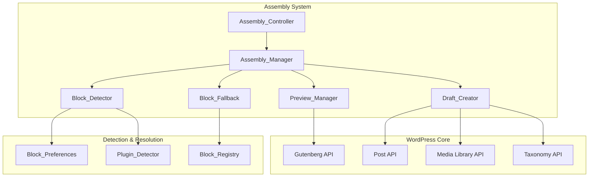
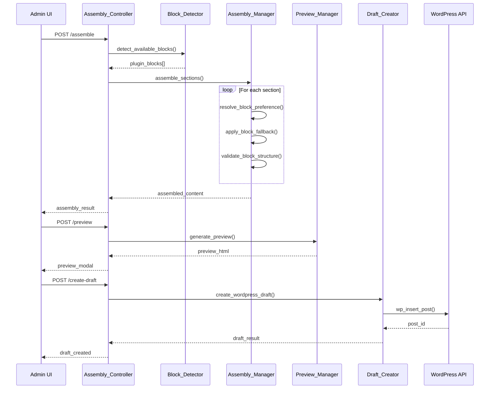

# Block Assembly and Draft Creation Design

## Overview

This design implements the final stage of the AI Page Composer workflow: POST `/assemble`, preview functionality, and POST `/create-draft` endpoints. The system handles intelligent block assembly by detecting available plugin blocks, respecting user preferences, and providing graceful fallbacks. It includes comprehensive preview capabilities with visual indicators and draft creation with full WordPress integration including block content, featured images, SEO meta, and taxonomies.

## Technology Stack & Dependencies

### Backend Technologies
- **PHP**: 8.0+ with WordPress 6.4+ block registration APIs
- **WordPress**: Gutenberg Block Registry, Post Meta API, Media Library
- **MySQL**: For draft storage and block relationship tracking

### Frontend Technologies
- **JavaScript**: ES2020+ for preview modal and assembly interface
- **React**: Via WordPress components for block preview rendering
- **CSS**: Gutenberg editor styling for preview consistency

### External Dependencies
```json
{
  "php-dependencies": {
    "wp-block-parser": "^6.4.0",
    "wp-html-processor": "^6.4.0"
  },
  "js-dependencies": {
    "@wordpress/blocks": "^12.0.0",
    "@wordpress/block-editor": "^12.0.0",
    "@wordpress/components": "^27.0.0"
  }
}
```

## Architecture

### Component Architecture Overview



### Data Flow Architecture



## REST API Endpoints

### POST /ai-composer/v1/assemble

Assembles generated sections into WordPress blocks with intelligent plugin detection and fallback.

**Request Parameters:**

| Parameter | Type | Required | Description |
|-----------|------|----------|-------------|
| sections | array | Yes | Generated section data with content |
| blueprint_id | integer | No | Blueprint ID for preferences |
| assembly_options | object | No | Assembly configuration |

**Assembly Options Structure:**
```json
{
  "respect_user_preferences": true,
  "enable_fallbacks": true,
  "validate_html": true,
  "optimize_images": true,
  "seo_optimization": true
}
```

**Response Format:**
```json
{
  "assembled_content": {
    "blocks": [
      {
        "blockName": "kadence/rowlayout",
        "attrs": {
          "uniqueID": "hero-123",
          "backgroundImg": [{"id": 456, "url": "..."}]
        },
        "innerBlocks": [],
        "innerHTML": "<div class=\"wp-block-kadence-rowlayout\">...</div>"
      }
    ],
    "html": "<!-- wp:kadence/rowlayout -->...",
    "json": "{\"version\":2,\"blocks\":[...]}"
  },
  "assembly_metadata": {
    "blocks_used": {
      "kadence_blocks": 3,
      "genesis_blocks": 1,
      "core": 2
    },
    "fallbacks_applied": 2,
    "validation_warnings": [],
    "estimated_load_time": "1.2s",
    "accessibility_score": 95
  },
  "plugin_indicators": [
    {
      "section_id": "hero-1",
      "plugin_used": "kadence_blocks",
      "block_name": "kadence/rowlayout",
      "fallback_used": false
    }
  ]
}
```

### POST /ai-composer/v1/preview

Generates preview with visual indicators of plugin blocks used.

**Request Parameters:**

| Parameter | Type | Required | Description |
|-----------|------|----------|-------------|
| assembled_content | object | Yes | Result from /assemble endpoint |
| preview_options | object | No | Preview configuration |

**Preview Options Structure:**
```json
{
  "show_plugin_indicators": true,
  "include_responsive_preview": true,
  "highlight_fallbacks": true,
  "show_accessibility_info": true
}
```

**Response Format:**
```json
{
  "preview_html": "<!DOCTYPE html><html>...</html>",
  "iframe_src": "data:text/html;base64,PCFkb2N0eXBl...",
  "plugin_indicators": [
    {
      "selector": ".wp-block-kadence-rowlayout",
      "plugin": "kadence_blocks",
      "block_title": "Kadence Row Layout",
      "is_fallback": false
    }
  ],
  "responsive_breakpoints": [
    {"width": 320, "name": "mobile"},
    {"width": 768, "name": "tablet"},
    {"width": 1024, "name": "desktop"}
  ],
  "accessibility_report": {
    "score": 95,
    "issues": [],
    "recommendations": []
  }
}
```

### POST /ai-composer/v1/create-draft

Creates WordPress draft with assembled content, featured image, SEO meta, and taxonomies.

**Request Parameters:**

| Parameter | Type | Required | Description |
|-----------|------|----------|-------------|
| assembled_content | object | Yes | Assembled block content |
| post_meta | object | Yes | Post metadata and configuration |
| seo_data | object | No | SEO optimization data |
| taxonomies | object | No | Category and tag assignments |

**Post Meta Structure:**
```json
{
  "title": "Generated Content Title",
  "excerpt": "Auto-generated excerpt from content",
  "status": "draft",
  "author_id": 1,
  "featured_image_id": 456,
  "template": "page",
  "parent_id": 0
}
```

**SEO Data Structure:**
```json
{
  "meta_title": "Custom SEO title",
  "meta_description": "SEO meta description",
  "focus_keyword": "primary keyword",
  "canonical_url": "https://example.com/custom-url",
  "og_title": "Open Graph title",
  "og_description": "Open Graph description",
  "og_image_id": 456
}
```

**Response Format:**
```json
{
  "post_id": 789,
  "edit_url": "https://site.com/wp-admin/post.php?post=789&action=edit",
  "preview_url": "https://site.com/?p=789&preview=true",
  "permalink": "https://site.com/generated-content-title/",
  "post_data": {
    "title": "Generated Content Title",
    "status": "draft",
    "word_count": 1250,
    "block_count": 6,
    "featured_image": {
      "id": 456,
      "url": "https://site.com/wp-content/uploads/image.jpg"
    }
  },
  "seo_meta": {
    "yoast_score": 85,
    "readability_score": 78,
    "focus_keyword_density": "1.2%"
  },
  "taxonomies": {
    "categories": [{"id": 12, "name": "Technology"}],
    "tags": [{"id": 34, "name": "AI"}, {"id": 56, "name": "Content"}]
  }
}
```

## Implementation Details

### Assembly Controller

```php
<?php
namespace AIPageComposer\API;

use AIPageComposer\Admin\Block_Preferences;
use AIPageComposer\Utils\Security_Helper;
use AIPageComposer\Utils\Validation_Helper;

class Assembly_Controller extends WP_REST_Controller {
    
    protected $namespace = 'ai-composer/v1';
    
    private $assembly_manager;
    private $preview_manager;
    private $draft_creator;
    
    public function __construct() {
        $this->assembly_manager = new Assembly_Manager();
        $this->preview_manager = new Preview_Manager();
        $this->draft_creator = new Draft_Creator();
    }
    
    public function register_routes() {
        // Assemble endpoint
        register_rest_route($this->namespace, '/assemble', [
            'methods' => WP_REST_Server::CREATABLE,
            'callback' => [$this, 'assemble_content'],
            'permission_callback' => [$this, 'check_permissions'],
            'args' => $this->get_assemble_args()
        ]);
        
        // Preview endpoint
        register_rest_route($this->namespace, '/preview', [
            'methods' => WP_REST_Server::CREATABLE,
            'callback' => [$this, 'generate_preview'],
            'permission_callback' => [$this, 'check_permissions'],
            'args' => $this->get_preview_args()
        ]);
        
        // Create draft endpoint
        register_rest_route($this->namespace, '/create-draft', [
            'methods' => WP_REST_Server::CREATABLE,
            'callback' => [$this, 'create_draft'],
            'permission_callback' => [$this, 'check_permissions'],
            'args' => $this->get_draft_args()
        ]);
        
        // Detected plugins endpoint
        register_rest_route($this->namespace, '/detected-plugins', [
            'methods' => WP_REST_Server::READABLE,
            'callback' => [$this, 'get_detected_plugins'],
            'permission_callback' => [$this, 'check_permissions']
        ]);
    }
    
    public function assemble_content(WP_REST_Request $request) {
        try {
            $sections = $request->get_param('sections');
            $blueprint_id = $request->get_param('blueprint_id');
            $assembly_options = $request->get_param('assembly_options') ?: [];
            
            // Validate sections data
            if (empty($sections) || !is_array($sections)) {
                return new WP_Error(
                    'invalid_sections',
                    __('Valid sections array is required', 'ai-page-composer'),
                    ['status' => 400]
                );
            }
            
            // Perform assembly
            $assembly_result = $this->assembly_manager->assemble_sections($sections, [
                'blueprint_id' => $blueprint_id,
                'options' => $assembly_options
            ]);
            
            // Track assembly metrics
            $this->track_assembly_metrics($assembly_result);
            
            return rest_ensure_response($assembly_result);
            
        } catch (Exception $e) {
            return new WP_Error(
                'assembly_failed',
                $e->getMessage(),
                ['status' => 500]
            );
        }
    }
    
    public function generate_preview(WP_REST_Request $request) {
        try {
            $assembled_content = $request->get_param('assembled_content');
            $preview_options = $request->get_param('preview_options') ?: [];
            
            if (empty($assembled_content)) {
                return new WP_Error(
                    'no_content',
                    __('Assembled content is required for preview', 'ai-page-composer'),
                    ['status' => 400]
                );
            }
            
            $preview_result = $this->preview_manager->generate_preview($assembled_content, $preview_options);
            
            return rest_ensure_response($preview_result);
            
        } catch (Exception $e) {
            return new WP_Error(
                'preview_failed',
                $e->getMessage(),
                ['status' => 500]
            );
        }
    }
    
    public function create_draft(WP_REST_Request $request) {
        try {
            $assembled_content = $request->get_param('assembled_content');
            $post_meta = $request->get_param('post_meta');
            $seo_data = $request->get_param('seo_data') ?: [];
            $taxonomies = $request->get_param('taxonomies') ?: [];
            
            // Validate required data
            if (empty($assembled_content) || empty($post_meta)) {
                return new WP_Error(
                    'missing_data',
                    __('Assembled content and post meta are required', 'ai-page-composer'),
                    ['status' => 400]
                );
            }
            
            $draft_result = $this->draft_creator->create_draft([
                'content' => $assembled_content,
                'meta' => $post_meta,
                'seo' => $seo_data,
                'taxonomies' => $taxonomies
            ]);
            
            // Log draft creation
            $this->log_draft_creation($draft_result);
            
            return rest_ensure_response($draft_result);
            
        } catch (Exception $e) {
            return new WP_Error(
                'draft_creation_failed',
                $e->getMessage(),
                ['status' => 500]
            );
        }
    }
    
    public function get_detected_plugins(WP_REST_Request $request) {
        $block_preferences = new Block_Preferences();
        $detected_plugins = $block_preferences->get_detected_plugins();
        
        // Add additional block information
        foreach ($detected_plugins as $key => &$plugin) {
            $plugin['available_blocks'] = $this->assembly_manager->get_plugin_blocks($key);
            $plugin['block_count'] = count($plugin['available_blocks']);
        }
        
        return rest_ensure_response($detected_plugins);
    }
    
    private function track_assembly_metrics($assembly_result) {
        $metrics = [
            'blocks_assembled' => count($assembly_result['assembled_content']['blocks']),
            'plugins_used' => array_keys($assembly_result['assembly_metadata']['blocks_used']),
            'fallbacks_applied' => $assembly_result['assembly_metadata']['fallbacks_applied'],
            'timestamp' => current_time('mysql')
        ];
        
        // Store metrics for analytics
        update_option('ai_composer_assembly_metrics', $metrics);
    }
    
    private function log_draft_creation($draft_result) {
        error_log(sprintf(
            '[AI Composer] Draft created: Post ID %d, Title: %s',
            $draft_result['post_id'],
            $draft_result['post_data']['title']
        ));
    }
    
    public function check_permissions() {
        return current_user_can('edit_posts');
    }
    
    private function get_assemble_args() {
        return [
            'sections' => [
                'required' => true,
                'type' => 'array',
                'description' => __('Generated sections to assemble', 'ai-page-composer')
            ],
            'blueprint_id' => [
                'type' => 'integer',
                'description' => __('Blueprint ID for preferences', 'ai-page-composer')
            ],
            'assembly_options' => [
                'type' => 'object',
                'description' => __('Assembly configuration options', 'ai-page-composer')
            ]
        ];
    }
    
    private function get_preview_args() {
        return [
            'assembled_content' => [
                'required' => true,
                'type' => 'object',
                'description' => __('Assembled content from /assemble', 'ai-page-composer')
            ],
            'preview_options' => [
                'type' => 'object',
                'description' => __('Preview configuration', 'ai-page-composer')
            ]
        ];
    }
    
    private function get_draft_args() {
        return [
            'assembled_content' => [
                'required' => true,
                'type' => 'object',
                'description' => __('Assembled block content', 'ai-page-composer')
            ],
            'post_meta' => [
                'required' => true,
                'type' => 'object',
                'description' => __('Post metadata and configuration', 'ai-page-composer')
            ],
            'seo_data' => [
                'type' => 'object',
                'description' => __('SEO optimization data', 'ai-page-composer')
            ],
            'taxonomies' => [
                'type' => 'object',
                'description' => __('Category and tag assignments', 'ai-page-composer')
            ]
        ];
    }
}
```

### Assembly Manager

```php
<?php
namespace AIPageComposer\API;

use AIPageComposer\Admin\Block_Preferences;

class Assembly_Manager {
    
    private $block_preferences;
    private $block_detector;
    private $validation_helper;
    
    public function __construct() {
        $this->block_preferences = new Block_Preferences();
        $this->block_detector = new Block_Detector();
        $this->validation_helper = new \AIPageComposer\Utils\Validation_Helper();
    }
    
    public function assemble_sections($sections, $config = []) {
        $blueprint_id = $config['blueprint_id'] ?? null;
        $options = $config['options'] ?? [];
        
        // Get available plugins and blocks
        $detected_plugins = $this->block_detector->get_detected_plugins();
        $available_blocks = $this->block_detector->get_available_blocks();
        
        // Initialize assembly result
        $assembly_result = [
            'assembled_content' => [
                'blocks' => [],
                'html' => '',
                'json' => ''
            ],
            'assembly_metadata' => [
                'blocks_used' => [],
                'fallbacks_applied' => 0,
                'validation_warnings' => [],
                'estimated_load_time' => '',
                'accessibility_score' => 0
            ],
            'plugin_indicators' => []
        ];
        
        $all_blocks = [];
        
        foreach ($sections as $section) {
            try {
                $assembled_section = $this->assemble_single_section(
                    $section, 
                    $detected_plugins, 
                    $available_blocks,
                    $options
                );
                
                $all_blocks[] = $assembled_section['block'];
                
                // Update metadata
                $plugin_key = $assembled_section['plugin_used'];
                if (!isset($assembly_result['assembly_metadata']['blocks_used'][$plugin_key])) {
                    $assembly_result['assembly_metadata']['blocks_used'][$plugin_key] = 0;
                }
                $assembly_result['assembly_metadata']['blocks_used'][$plugin_key]++;
                
                if ($assembled_section['fallback_used']) {
                    $assembly_result['assembly_metadata']['fallbacks_applied']++;
                }
                
                // Add plugin indicator
                $assembly_result['plugin_indicators'][] = [
                    'section_id' => $section['sectionId'] ?? $section['id'],
                    'plugin_used' => $plugin_key,
                    'block_name' => $assembled_section['block']['blockName'],
                    'fallback_used' => $assembled_section['fallback_used']
                ];
                
            } catch (Exception $e) {
                $assembly_result['assembly_metadata']['validation_warnings'][] = [
                    'section_id' => $section['sectionId'] ?? $section['id'],
                    'warning' => $e->getMessage()
                ];
                
                // Create fallback core block
                $fallback_block = $this->create_fallback_block($section);
                $all_blocks[] = $fallback_block;
            }
        }
        
        // Generate final HTML and JSON
        $assembly_result['assembled_content']['blocks'] = $all_blocks;
        $assembly_result['assembled_content']['html'] = $this->blocks_to_html($all_blocks);
        $assembly_result['assembled_content']['json'] = wp_json_encode([
            'version' => 2,
            'blocks' => $all_blocks
        ]);
        
        // Calculate performance metrics
        $assembly_result['assembly_metadata']['estimated_load_time'] = $this->estimate_load_time($all_blocks);
        $assembly_result['assembly_metadata']['accessibility_score'] = $this->calculate_accessibility_score($all_blocks);
        
        // Validate final assembly
        if ($options['validate_html'] ?? true) {
            $validation_result = $this->validate_final_assembly($assembly_result);
            $assembly_result['assembly_metadata']['validation_warnings'] = array_merge(
                $assembly_result['assembly_metadata']['validation_warnings'],
                $validation_result['warnings']
            );
        }
        
        return $assembly_result;
    }
    
    private function assemble_single_section($section, $detected_plugins, $available_blocks, $options) {
        $section_type = $section['blockType']['name'] ?? $section['type'] ?? 'content';
        $content_html = $section['content']['html'] ?? '';
        $content_data = $section['content']['json'] ?? [];
        
        // Determine preferred block based on section preferences
        $block_preference = $this->resolve_block_preference($section, $detected_plugins);
        
        // Create block structure
        $block_data = $this->create_block_structure($section, $block_preference, $content_html, $content_data);
        
        // Apply block-specific transformations
        $transformed_block = $this->apply_block_transformations($block_data, $block_preference, $options);
        
        // Validate block structure
        $this->validate_block_structure($transformed_block, $section);
        
        return [
            'block' => $transformed_block,
            'plugin_used' => $block_preference['plugin'],
            'fallback_used' => $block_preference['fallback_used']
        ];
    }
    
    private function resolve_block_preference($section, $detected_plugins) {
        // Check if section has explicit block preference
        $section_preference = $section['block_preference'] ?? $section['blockType'] ?? [];
        $preferred_plugin = $section_preference['preferred_plugin'] ?? 'auto';
        
        // If specific plugin requested, try to use it
        if ($preferred_plugin !== 'auto' && isset($detected_plugins[$preferred_plugin])) {
            $plugin_data = $detected_plugins[$preferred_plugin];
            
            if ($plugin_data['active']) {
                return [
                    'plugin' => $preferred_plugin,
                    'block_name' => $section_preference['primary_block'] ?? $this->get_default_block_for_plugin($preferred_plugin, $section),
                    'fallback_used' => false
                ];
            }
        }
        
        // Auto selection - find best available plugin
        $best_plugin = $this->find_best_available_plugin($section, $detected_plugins);
        
        if ($best_plugin) {
            return [
                'plugin' => $best_plugin['key'],
                'block_name' => $this->get_default_block_for_plugin($best_plugin['key'], $section),
                'fallback_used' => false
            ];
        }
        
        // Fallback to core blocks
        return [
            'plugin' => 'core',
            'block_name' => $this->get_core_fallback_block($section),
            'fallback_used' => true
        ];
    }
    
    private function find_best_available_plugin($section, $detected_plugins) {
        $section_type = $section['type'] ?? 'content';
        $best_plugin = null;
        $highest_score = 0;
        
        foreach ($detected_plugins as $key => $plugin) {
            if (!$plugin['active']) {
                continue;
            }
            
            // Calculate suitability score
            $score = $this->calculate_plugin_suitability_score($plugin, $section_type);
            
            if ($score > $highest_score) {
                $highest_score = $score;
                $best_plugin = array_merge($plugin, ['key' => $key]);
            }
        }
        
        return $best_plugin;
    }
    
    private function calculate_plugin_suitability_score($plugin, $section_type) {
        $score = $plugin['priority'] ?? 5;
        
        // Boost score for section type compatibility
        $compatible_sections = [
            'kadence_blocks' => ['hero', 'content', 'testimonial', 'team', 'gallery'],
            'genesis_blocks' => ['hero', 'testimonial', 'pricing', 'team'],
            'stackable' => ['hero', 'feature', 'cta', 'team'],
            'ultimate_addons' => ['hero', 'content', 'testimonial', 'team']
        ];
        
        $plugin_key = $plugin['key'] ?? '';
        if (isset($compatible_sections[$plugin_key]) && in_array($section_type, $compatible_sections[$plugin_key])) {
            $score += 3;
        }
        
        // Boost score for block count (more blocks = more flexibility)
        $score += min(($plugin['blocks_count'] ?? 0) / 10, 2);
        
        return $score;
    }
    
    private function get_default_block_for_plugin($plugin_key, $section) {
        $section_type = $section['type'] ?? 'content';
        
        $default_blocks = [
            'kadence_blocks' => [
                'hero' => 'kadence/rowlayout',
                'content' => 'kadence/advancedheading',
                'testimonial' => 'kadence/testimonials',
                'team' => 'kadence/infobox',
                'gallery' => 'kadence/gallery',
                'default' => 'kadence/advancedheading'
            ],
            'genesis_blocks' => [
                'hero' => 'genesis-blocks/gb-container',
                'testimonial' => 'genesis-blocks/gb-testimonial',
                'pricing' => 'genesis-blocks/gb-pricing',
                'team' => 'genesis-blocks/gb-profile-box',
                'default' => 'genesis-blocks/gb-container'
            ],
            'stackable' => [
                'hero' => 'ugb/header',
                'feature' => 'ugb/feature',
                'cta' => 'ugb/cta',
                'team' => 'ugb/team-member',
                'default' => 'ugb/heading'
            ],
            'ultimate_addons' => [
                'hero' => 'uagb/container',
                'content' => 'uagb/advanced-heading',
                'testimonial' => 'uagb/testimonial',
                'team' => 'uagb/team',
                'default' => 'uagb/advanced-heading'
            ],
            'core' => [
                'hero' => 'core/cover',
                'content' => 'core/group',
                'testimonial' => 'core/quote',
                'gallery' => 'core/gallery',
                'default' => 'core/group'
            ]
        ];
        
        $plugin_blocks = $default_blocks[$plugin_key] ?? $default_blocks['core'];
        return $plugin_blocks[$section_type] ?? $plugin_blocks['default'];
    }
    
    private function get_core_fallback_block($section) {
        $section_type = $section['type'] ?? 'content';
        
        $core_fallbacks = [
            'hero' => 'core/cover',
            'testimonial' => 'core/quote',
            'gallery' => 'core/gallery',
            'team' => 'core/media-text',
            'pricing' => 'core/table',
            'faq' => 'core/details',
            'default' => 'core/group'
        ];
        
        return $core_fallbacks[$section_type] ?? $core_fallbacks['default'];
    }
    
    private function create_block_structure($section, $block_preference, $content_html, $content_data) {
        $block_name = $block_preference['block_name'];
        $base_attributes = $this->get_base_attributes_for_block($block_name);
        
        // Merge with section-specific attributes
        $section_attributes = $this->extract_section_attributes($section, $block_name);
        $final_attributes = array_merge($base_attributes, $section_attributes);
        
        // Handle media if present
        if (isset($section['media']) && !empty($section['media'])) {
            $media_attributes = $this->process_media_for_block($section['media'], $block_name);
            $final_attributes = array_merge($final_attributes, $media_attributes);
        }
        
        $block = [
            'blockName' => $block_name,
            'attrs' => $final_attributes,
            'innerBlocks' => $this->process_inner_blocks($content_data, $block_name),
            'innerHTML' => $this->process_inner_html($content_html, $block_name)
        ];
        
        return $block;
    }
    
    private function get_base_attributes_for_block($block_name) {
        $namespace = explode('/', $block_name)[0];
        
        switch ($namespace) {
            case 'kadence':
                return [
                    'uniqueID' => 'ai-gen-' . wp_generate_uuid4(),
                    'version' => 2,
                    'kbVersion' => 2
                ];
                
            case 'genesis-blocks':
                return [
                    'className' => 'ai-generated-block',
                    'anchor' => ''
                ];
                
            case 'ugb':
                return [
                    'uniqueId' => wp_generate_uuid4(),
                    'hasBackground' => false
                ];
                
            case 'uagb':
                return [
                    'block_id' => 'uagb-' . wp_generate_uuid4(),
                    'classMigrate' => true
                ];
                
            default: // core blocks
                return [
                    'className' => 'ai-generated-content'
                ];
        }
    }
    
    private function extract_section_attributes($section, $block_name) {
        $attributes = [];
        $section_type = $section['type'] ?? 'content';
        
        // Extract heading
        if (isset($section['heading'])) {
            $attributes = array_merge($attributes, $this->get_heading_attributes($section['heading'], $block_name));
        }
        
        // Extract styling based on section type
        switch ($section_type) {
            case 'hero':
                $attributes = array_merge($attributes, $this->get_hero_attributes($section, $block_name));
                break;
                
            case 'testimonial':
                $attributes = array_merge($attributes, $this->get_testimonial_attributes($section, $block_name));
                break;
                
            case 'team':
                $attributes = array_merge($attributes, $this->get_team_attributes($section, $block_name));
                break;
        }
        
        return $attributes;
    }
    
    private function get_heading_attributes($heading, $block_name) {
        $namespace = explode('/', $block_name)[0];
        
        switch ($namespace) {
            case 'kadence':
                return [
                    'htmlTag' => 'h2',
                    'content' => $heading,
                    'textAlign' => 'center'
                ];
                
            case 'genesis-blocks':
                return [
                    'heading' => $heading,
                    'headingTag' => 'h2'
                ];
                
            case 'ugb':
                return [
                    'title' => $heading,
                    'titleTag' => 'h2'
                ];
                
            case 'uagb':
                return [
                    'headingTitle' => $heading,
                    'headingTag' => 'h2'
                ];
                
            default:
                return [
                    'content' => $heading,
                    'level' => 2
                ];
        }
    }
    
    private function get_hero_attributes($section, $block_name) {
        $namespace = explode('/', $block_name)[0];
        
        switch ($namespace) {
            case 'kadence':
                return [
                    'bgColor' => '#f8f9fa',
                    'padding' => ['80', '20', '80', '20'],
                    'tabletPadding' => ['60', '15', '60', '15'],
                    'mobilePadding' => ['40', '10', '40', '10'],
                    'minHeight' => 500,
                    'verticalAlignment' => 'center'
                ];
                
            case 'genesis-blocks':
                return [
                    'containerPaddingTop' => 80,
                    'containerPaddingBottom' => 80,
                    'containerMaxWidth' => 1200,
                    'containerBackgroundColor' => '#f8f9fa'
                ];
                
            default:
                return [
                    'style' => [
                        'spacing' => [
                            'padding' => [
                                'top' => '80px',
                                'bottom' => '80px'
                            ]
                        ]
                    ]
                ];
        }
    }
    
    private function process_media_for_block($media, $block_name) {
        $media_attributes = [];
        $namespace = explode('/', $block_name)[0];
        
        if (empty($media['id']) || empty($media['url'])) {
            return $media_attributes;
        }
        
        switch ($namespace) {
            case 'kadence':
                if ($block_name === 'kadence/rowlayout') {
                    $media_attributes['backgroundImg'] = [[
                        'id' => $media['id'],
                        'url' => $media['url'],
                        'alt' => $media['alt'] ?? ''
                    ]];
                }
                break;
                
            case 'genesis-blocks':
                $media_attributes['containerBackgroundImgID'] = $media['id'];
                $media_attributes['containerBackgroundImgURL'] = $media['url'];
                break;
                
            default:
                if ($block_name === 'core/cover') {
                    $media_attributes['id'] = $media['id'];
                    $media_attributes['url'] = $media['url'];
                    $media_attributes['alt'] = $media['alt'] ?? '';
                }
                break;
        }
        
        return $media_attributes;
    }
    
    private function process_inner_blocks($content_data, $block_name) {
        if (empty($content_data) || !is_array($content_data)) {
            return [];
        }
        
        $inner_blocks = [];
        
        // For container blocks, create inner content blocks
        $container_blocks = [
            'kadence/rowlayout',
            'genesis-blocks/gb-container', 
            'core/group',
            'core/cover'
        ];
        
        if (in_array($block_name, $container_blocks)) {
            // Create a paragraph block with the content
            $inner_blocks[] = [
                'blockName' => 'core/paragraph',
                'attrs' => [
                    'className' => 'ai-generated-paragraph'
                ],
                'innerBlocks' => [],
                'innerHTML' => isset($content_data['content']) ? wp_kses_post($content_data['content']) : ''
            ];
        }
        
        return $inner_blocks;
    }
    
    private function process_inner_html($content_html, $block_name) {
        if (empty($content_html)) {
            return '';
        }
        
        // Clean and process HTML for block context
        $cleaned_html = wp_kses_post($content_html);
        
        // Add block-specific wrapper classes if needed
        $namespace = explode('/', $block_name)[0];
        $block_class = 'wp-block-' . str_replace('/', '-', $block_name);
        
        // Wrap content if it's not already wrapped
        if (strpos($cleaned_html, $block_class) === false) {
            $cleaned_html = sprintf('<div class="%s">%s</div>', $block_class, $cleaned_html);
        }
        
        return $cleaned_html;
    }
    
    private function apply_block_transformations($block, $block_preference, $options) {
        // Apply SEO optimization if enabled
        if ($options['seo_optimization'] ?? true) {
            $block = $this->apply_seo_optimizations($block);
        }
        
        // Apply accessibility improvements
        $block = $this->apply_accessibility_improvements($block);
        
        // Optimize images if enabled
        if ($options['optimize_images'] ?? true) {
            $block = $this->optimize_block_images($block);
        }
        
        return $block;
    }
    
    private function apply_seo_optimizations($block) {
        // Ensure proper heading hierarchy
        if (isset($block['attrs']['headingTag']) || isset($block['attrs']['htmlTag'])) {
            $heading_tag = $block['attrs']['headingTag'] ?? $block['attrs']['htmlTag'] ?? 'h2';
            
            // Validate heading order (this would need to track global heading state)
            if (!$this->is_valid_heading_order($heading_tag)) {
                $corrected_tag = $this->get_corrected_heading_tag();
                $block['attrs']['headingTag'] = $corrected_tag;
                $block['attrs']['htmlTag'] = $corrected_tag;
            }
        }
        
        // Add structured data attributes where appropriate
        if ($block['blockName'] === 'core/quote' || strpos($block['blockName'], 'testimonial') !== false) {
            $block['attrs']['className'] = ($block['attrs']['className'] ?? '') . ' testimonial-structured-data';
        }
        
        return $block;
    }
    
    private function apply_accessibility_improvements($block) {
        // Ensure alt text is present for images
        if (isset($block['attrs']['url']) && !isset($block['attrs']['alt'])) {
            $block['attrs']['alt'] = 'Generated content image';
        }
        
        // Add ARIA labels where appropriate
        if ($block['blockName'] === 'core/button') {
            if (!isset($block['attrs']['aria-label'])) {
                $block['attrs']['aria-label'] = 'Call to action button';
            }
        }
        
        return $block;
    }
    
    private function optimize_block_images($block) {
        // Add responsive image attributes
        if (isset($block['attrs']['url'])) {
            $block['attrs']['loading'] = 'lazy';
            
            // Add srcset if image ID is available
            if (isset($block['attrs']['id'])) {
                $srcset = wp_get_attachment_image_srcset($block['attrs']['id']);
                if ($srcset) {
                    $block['attrs']['srcset'] = $srcset;
                }
            }
        }
        
        return $block;
    }
    
    private function validate_block_structure($block, $section) {
        $validation_errors = [];
        
        // Validate required block properties
        if (empty($block['blockName'])) {
            $validation_errors[] = 'Block name is required';
        }
        
        // Validate heading order
        if (isset($block['attrs']['headingTag']) || isset($block['attrs']['htmlTag'])) {
            $heading_tag = $block['attrs']['headingTag'] ?? $block['attrs']['htmlTag'];
            if (!$this->is_valid_heading_order($heading_tag)) {
                $validation_errors[] = 'Invalid heading order detected';
            }
        }
        
        // Validate image alt text
        if (isset($block['attrs']['url']) && empty($block['attrs']['alt'])) {
            $validation_errors[] = 'Image missing alt text';
        }
        
        // Validate internal link count
        $link_count = $this->count_internal_links($block['innerHTML']);
        if ($link_count > 10) {
            $validation_errors[] = 'Too many internal links (>10)';
        }
        
        // Check content length
        $content_length = strlen(strip_tags($block['innerHTML']));
        if ($content_length > 5000) {
            $validation_errors[] = 'Content length exceeds 5000 characters';
        }
        
        if (!empty($validation_errors)) {
            throw new Exception('Block validation failed: ' . implode(', ', $validation_errors));
        }
    }
    
    private function is_valid_heading_order($heading_tag) {
        // This would need to maintain state of previous headings
        // For now, just validate the tag format
        return preg_match('/^h[1-6]$/i', $heading_tag);
    }
    
    private function get_corrected_heading_tag() {
        // This would need to track heading hierarchy
        // For now, default to h2
        return 'h2';
    }
    
    private function count_internal_links($html) {
        $site_url = get_site_url();
        $pattern = '/<a[^>]+href=["\'](' . preg_quote($site_url, '/') . '[^"\']*)["\'][^>]*>/i';
        
        return preg_match_all($pattern, $html);
    }
    
    private function blocks_to_html($blocks) {
        $html = '';
        
        foreach ($blocks as $block) {
            $html .= sprintf(
                '<!-- wp:%s %s -->%s<!-- /wp:%s -->',
                $block['blockName'],
                !empty($block['attrs']) ? wp_json_encode($block['attrs']) : '',
                $block['innerHTML'],
                $block['blockName']
            );
        }
        
        return $html;
    }
    
    private function create_fallback_block($section) {
        return [
            'blockName' => 'core/group',
            'attrs' => [
                'className' => 'ai-generated-fallback'
            ],
            'innerBlocks' => [
                [
                    'blockName' => 'core/paragraph',
                    'attrs' => [],
                    'innerBlocks' => [],
                    'innerHTML' => wp_kses_post($section['content']['html'] ?? 'Generated content')
                ]
            ],
            'innerHTML' => ''
        ];
    }
    
    private function estimate_load_time($blocks) {
        $base_time = 0.2; // Base 200ms
        $block_time = count($blocks) * 0.05; // 50ms per block
        
        // Add time for media blocks
        $media_time = 0;
        foreach ($blocks as $block) {
            if (isset($block['attrs']['url']) || isset($block['attrs']['backgroundImg'])) {
                $media_time += 0.3; // 300ms per image
            }
        }
        
        $total_time = $base_time + $block_time + $media_time;
        return number_format($total_time, 1) . 's';
    }
    
    private function calculate_accessibility_score($blocks) {
        $score = 100;
        $deductions = 0;
        
        foreach ($blocks as $block) {
            // Deduct for missing alt text
            if (isset($block['attrs']['url']) && empty($block['attrs']['alt'])) {
                $deductions += 10;
            }
            
            // Deduct for missing heading structure
            if (isset($block['innerHTML'])) {
                $headings = preg_match_all('/<h[1-6]/i', $block['innerHTML']);
                if ($headings > 0) {
                    // Check for proper heading hierarchy (simplified)
                    if (!preg_match('/<h[12]/i', $block['innerHTML'])) {
                        $deductions += 5;
                    }
                }
            }
        }
        
        return max(0, $score - $deductions);
    }
    
    private function validate_final_assembly($assembly_result) {
        $warnings = [];
        $blocks = $assembly_result['assembled_content']['blocks'];
        
        // Check overall structure
        if (empty($blocks)) {
            $warnings[] = 'No blocks were assembled';
        }
        
        // Check for accessibility issues
        $accessibility_score = $assembly_result['assembly_metadata']['accessibility_score'];
        if ($accessibility_score < 80) {
            $warnings[] = 'Accessibility score below 80%';
        }
        
        // Check for too many fallbacks
        $fallback_count = $assembly_result['assembly_metadata']['fallbacks_applied'];
        if ($fallback_count > count($blocks) * 0.5) {
            $warnings[] = 'High fallback usage (>50% of blocks)';
        }
        
        return ['warnings' => $warnings];
    }
    
    public function get_plugin_blocks($plugin_key) {
        return $this->block_detector->get_blocks_for_plugin($plugin_key);
    }
}
```

### Block Detector

```php
<?php
namespace AIPageComposer\API;

class Block_Detector {
    
    private $detected_plugins_cache;
    private $available_blocks_cache;
    
    public function get_detected_plugins() {
        if ($this->detected_plugins_cache !== null) {
            return $this->detected_plugins_cache;
        }
        
        $detected_plugins = [];
        
        // Kadence Blocks
        if (class_exists('Kadence_Blocks_Frontend')) {
            $detected_plugins['kadence_blocks'] = [
                'active' => true,
                'name' => 'Kadence Blocks',
                'version' => defined('KADENCE_BLOCKS_VERSION') ? KADENCE_BLOCKS_VERSION : 'unknown',
                'namespace' => 'kadence',
                'priority' => 9,
                'blocks_count' => count($this->get_kadence_blocks()),
                'supported_sections' => ['hero', 'content', 'testimonial', 'team', 'gallery', 'pricing'],
                'plugin_file' => 'kadence-blocks/kadence-blocks.php'
            ];
        } else {
            $detected_plugins['kadence_blocks'] = [
                'active' => false,
                'name' => 'Kadence Blocks',
                'priority' => 9
            ];
        }
        
        // Genesis Blocks
        if (function_exists('genesis_blocks_loader')) {
            $detected_plugins['genesis_blocks'] = [
                'active' => true,
                'name' => 'Genesis Blocks',
                'version' => defined('GENESIS_BLOCKS_VERSION') ? GENESIS_BLOCKS_VERSION : 'unknown',
                'namespace' => 'genesis-blocks',
                'priority' => 8,
                'blocks_count' => count($this->get_genesis_blocks()),
                'supported_sections' => ['hero', 'testimonial', 'pricing', 'team', 'content'],
                'plugin_file' => 'genesis-blocks/genesis-blocks.php'
            ];
        } else {
            $detected_plugins['genesis_blocks'] = [
                'active' => false,
                'name' => 'Genesis Blocks',
                'priority' => 8
            ];
        }
        
        // Stackable
        if (class_exists('Stackable_Init')) {
            $detected_plugins['stackable'] = [
                'active' => true,
                'name' => 'Stackable',
                'version' => defined('STACKABLE_VERSION') ? STACKABLE_VERSION : 'unknown',
                'namespace' => 'ugb',
                'priority' => 7,
                'blocks_count' => count($this->get_stackable_blocks()),
                'supported_sections' => ['hero', 'feature', 'cta', 'team', 'testimonial'],
                'plugin_file' => 'stackable-ultimate-gutenberg-blocks/stackable.php'
            ];
        } else {
            $detected_plugins['stackable'] = [
                'active' => false,
                'name' => 'Stackable',
                'priority' => 7
            ];
        }
        
        // Ultimate Addons for Gutenberg
        if (class_exists('UAGB_Loader')) {
            $detected_plugins['ultimate_addons'] = [
                'active' => true,
                'name' => 'Ultimate Addons for Gutenberg',
                'version' => defined('UAGB_VER') ? UAGB_VER : 'unknown',
                'namespace' => 'uagb',
                'priority' => 7,
                'blocks_count' => count($this->get_uagb_blocks()),
                'supported_sections' => ['hero', 'content', 'testimonial', 'team', 'pricing'],
                'plugin_file' => 'ultimate-addons-for-gutenberg/ultimate-addons-for-gutenberg.php'
            ];
        } else {
            $detected_plugins['ultimate_addons'] = [
                'active' => false,
                'name' => 'Ultimate Addons for Gutenberg',
                'priority' => 7
            ];
        }
        
        // Core blocks are always available
        $detected_plugins['core'] = [
            'active' => true,
            'name' => 'WordPress Core',
            'version' => get_bloginfo('version'),
            'namespace' => 'core',
            'priority' => 5,
            'blocks_count' => count($this->get_core_blocks()),
            'supported_sections' => ['hero', 'content', 'testimonial', 'gallery', 'team', 'pricing', 'faq'],
            'plugin_file' => 'wordpress-core'
        ];
        
        $this->detected_plugins_cache = $detected_plugins;
        return $detected_plugins;
    }
    
    public function get_available_blocks() {
        if ($this->available_blocks_cache !== null) {
            return $this->available_blocks_cache;
        }
        
        $all_blocks = [];
        $detected_plugins = $this->get_detected_plugins();
        
        foreach ($detected_plugins as $plugin_key => $plugin_data) {
            if ($plugin_data['active']) {
                $all_blocks[$plugin_key] = $this->get_blocks_for_plugin($plugin_key);
            }
        }
        
        $this->available_blocks_cache = $all_blocks;
        return $all_blocks;
    }
    
    public function get_blocks_for_plugin($plugin_key) {
        switch ($plugin_key) {
            case 'kadence_blocks':
                return $this->get_kadence_blocks();
            case 'genesis_blocks':
                return $this->get_genesis_blocks();
            case 'stackable':
                return $this->get_stackable_blocks();
            case 'ultimate_addons':
                return $this->get_uagb_blocks();
            case 'core':
            default:
                return $this->get_core_blocks();
        }
    }
    
    private function get_kadence_blocks() {
        return [
            [
                'name' => 'kadence/rowlayout',
                'title' => 'Row Layout',
                'category' => 'kadence-blocks',
                'supports' => ['hero', 'content'],
                'description' => 'Advanced row layout with columns'
            ],
            [
                'name' => 'kadence/advancedheading',
                'title' => 'Advanced Heading',
                'category' => 'kadence-blocks', 
                'supports' => ['content'],
                'description' => 'Customizable heading with typography controls'
            ],
            [
                'name' => 'kadence/testimonials',
                'title' => 'Testimonials',
                'category' => 'kadence-blocks',
                'supports' => ['testimonial'],
                'description' => 'Customer testimonials with ratings'
            ],
            [
                'name' => 'kadence/infobox',
                'title' => 'Info Box',
                'category' => 'kadence-blocks',
                'supports' => ['team', 'feature'],
                'description' => 'Information box with icon and content'
            ],
            [
                'name' => 'kadence/gallery',
                'title' => 'Advanced Gallery',
                'category' => 'kadence-blocks',
                'supports' => ['gallery'],
                'description' => 'Advanced image gallery with lightbox'
            ]
        ];
    }
    
    private function get_genesis_blocks() {
        return [
            [
                'name' => 'genesis-blocks/gb-container',
                'title' => 'Container',
                'category' => 'genesis-blocks',
                'supports' => ['hero', 'content'],
                'description' => 'Flexible container with background options'
            ],
            [
                'name' => 'genesis-blocks/gb-testimonial',
                'title' => 'Testimonial',
                'category' => 'genesis-blocks',
                'supports' => ['testimonial'],
                'description' => 'Customer testimonial with avatar'
            ],
            [
                'name' => 'genesis-blocks/gb-pricing',
                'title' => 'Pricing Table',
                'category' => 'genesis-blocks',
                'supports' => ['pricing'],
                'description' => 'Pricing table with features'
            ],
            [
                'name' => 'genesis-blocks/gb-profile-box',
                'title' => 'Profile Box',
                'category' => 'genesis-blocks',
                'supports' => ['team'],
                'description' => 'Team member profile with social links'
            ]
        ];
    }
    
    private function get_stackable_blocks() {
        return [
            [
                'name' => 'ugb/header',
                'title' => 'Header',
                'category' => 'stackable',
                'supports' => ['hero'],
                'description' => 'Hero header with call-to-action'
            ],
            [
                'name' => 'ugb/feature',
                'title' => 'Feature',
                'category' => 'stackable',
                'supports' => ['feature'],
                'description' => 'Feature highlight with icon'
            ],
            [
                'name' => 'ugb/cta',
                'title' => 'Call to Action',
                'category' => 'stackable',
                'supports' => ['cta'],
                'description' => 'Call-to-action with button'
            ],
            [
                'name' => 'ugb/team-member',
                'title' => 'Team Member',
                'category' => 'stackable',
                'supports' => ['team'],
                'description' => 'Team member card with details'
            ],
            [
                'name' => 'ugb/testimonial',
                'title' => 'Testimonial',
                'category' => 'stackable',
                'supports' => ['testimonial'],
                'description' => 'Customer testimonial card'
            ]
        ];
    }
    
    private function get_uagb_blocks() {
        return [
            [
                'name' => 'uagb/container',
                'title' => 'Container',
                'category' => 'uagb',
                'supports' => ['hero', 'content'],
                'description' => 'Flexible container block'
            ],
            [
                'name' => 'uagb/advanced-heading',
                'title' => 'Advanced Heading',
                'category' => 'uagb',
                'supports' => ['content'],
                'description' => 'Enhanced heading with styling options'
            ],
            [
                'name' => 'uagb/testimonial',
                'title' => 'Testimonial',
                'category' => 'uagb',
                'supports' => ['testimonial'],
                'description' => 'Testimonial with author details'
            ],
            [
                'name' => 'uagb/team',
                'title' => 'Team',
                'category' => 'uagb',
                'supports' => ['team'],
                'description' => 'Team member showcase'
            ]
        ];
    }
    
    private function get_core_blocks() {
        return [
            [
                'name' => 'core/cover',
                'title' => 'Cover',
                'category' => 'design',
                'supports' => ['hero'],
                'description' => 'Cover image with overlay text'
            ],
            [
                'name' => 'core/group',
                'title' => 'Group',
                'category' => 'design',
                'supports' => ['content'],
                'description' => 'Group blocks together'
            ],
            [
                'name' => 'core/media-text',
                'title' => 'Media & Text',
                'category' => 'design',
                'supports' => ['team', 'feature'],
                'description' => 'Media with accompanying text'
            ],
            [
                'name' => 'core/quote',
                'title' => 'Quote',
                'category' => 'text',
                'supports' => ['testimonial'],
                'description' => 'Quote with citation'
            ],
            [
                'name' => 'core/gallery',
                'title' => 'Gallery',
                'category' => 'media',
                'supports' => ['gallery'],
                'description' => 'Image gallery'
            ],
            [
                'name' => 'core/table',
                'title' => 'Table',
                'category' => 'text',
                'supports' => ['pricing'],
                'description' => 'Data table'
            ],
            [
                'name' => 'core/details',
                'title' => 'Details',
                'category' => 'text',
                'supports' => ['faq'],
                'description' => 'Collapsible details'
            ]
        ];
    }
}
```

### Preview Manager

```php
<?php
namespace AIPageComposer\API;

class Preview_Manager {
    
    public function generate_preview($assembled_content, $options = []) {
        $show_indicators = $options['show_plugin_indicators'] ?? true;
        $responsive_preview = $options['include_responsive_preview'] ?? true;
        $highlight_fallbacks = $options['highlight_fallbacks'] ?? true;
        $show_accessibility = $options['show_accessibility_info'] ?? true;
        
        // Generate base HTML
        $preview_html = $this->build_preview_html($assembled_content, $options);
        
        // Create iframe source
        $iframe_src = 'data:text/html;base64,' . base64_encode($preview_html);
        
        // Generate plugin indicators
        $plugin_indicators = [];
        if ($show_indicators) {
            $plugin_indicators = $this->generate_plugin_indicators($assembled_content);
        }
        
        // Generate responsive breakpoints
        $responsive_breakpoints = [];
        if ($responsive_preview) {
            $responsive_breakpoints = $this->get_responsive_breakpoints();
        }
        
        // Generate accessibility report
        $accessibility_report = [];
        if ($show_accessibility) {
            $accessibility_report = $this->generate_accessibility_report($assembled_content);
        }
        
        return [
            'preview_html' => $preview_html,
            'iframe_src' => $iframe_src,
            'plugin_indicators' => $plugin_indicators,
            'responsive_breakpoints' => $responsive_breakpoints,
            'accessibility_report' => $accessibility_report,
            'preview_stats' => $this->calculate_preview_stats($assembled_content)
        ];
    }
    
    private function build_preview_html($assembled_content, $options) {
        $blocks_html = $assembled_content['html'] ?? '';
        $theme_styles = $this->get_theme_styles();
        $plugin_styles = $this->get_plugin_styles();
        $indicator_styles = $this->get_indicator_styles($options);
        
        $html = '<!DOCTYPE html>
<html lang="' . get_locale() . '">
<head>
    <meta charset="UTF-8">
    <meta name="viewport" content="width=device-width, initial-scale=1.0">
    <title>AI Composer Preview</title>
    <style>
        ' . $theme_styles . '
        ' . $plugin_styles . '
        ' . $indicator_styles . '
        
        /* Preview-specific styles */
        body {
            margin: 0;
            padding: 20px;
            font-family: -apple-system, BlinkMacSystemFont, "Segoe UI", Roboto, sans-serif;
            line-height: 1.6;
            color: #333;
        }
        
        .ai-composer-preview {
            max-width: 1200px;
            margin: 0 auto;
        }
        
        .preview-header {
            background: #f0f0f1;
            padding: 15px;
            border-radius: 8px;
            margin-bottom: 20px;
            border-left: 4px solid #0073aa;
        }
        
        .preview-title {
            margin: 0 0 10px;
            font-size: 18px;
            font-weight: 600;
        }
        
        .preview-meta {
            font-size: 14px;
            color: #646970;
        }
        
        /* Plugin indicator overlays */
        .plugin-indicator {
            position: absolute;
            top: 5px;
            right: 5px;
            background: rgba(0, 115, 170, 0.9);
            color: white;
            padding: 4px 8px;
            border-radius: 4px;
            font-size: 12px;
            font-weight: 500;
            z-index: 1000;
            pointer-events: none;
        }
        
        .plugin-indicator.fallback {
            background: rgba(255, 165, 0, 0.9);
        }
        
        .block-with-indicator {
            position: relative;
            border: 2px dashed rgba(0, 115, 170, 0.3);
            margin: 10px 0;
        }
        
        .block-with-indicator:hover {
            border-color: rgba(0, 115, 170, 0.6);
        }
        
        .block-with-indicator.fallback {
            border-color: rgba(255, 165, 0, 0.5);
        }
        
        /* Responsive preview styles */
        @media (max-width: 768px) {
            body { padding: 10px; }
            .preview-header { padding: 10px; }
            .plugin-indicator { font-size: 11px; padding: 2px 6px; }
        }
        
        /* Accessibility highlights */
        .accessibility-issue {
            outline: 2px solid #d63638;
            outline-offset: 2px;
        }
        
        .accessibility-warning {
            outline: 2px solid #dba617;
            outline-offset: 2px;
        }
        
        /* Loading states */
        .preview-loading {
            display: flex;
            align-items: center;
            justify-content: center;
            min-height: 200px;
            color: #646970;
        }
        
        .spinner {
            width: 20px;
            height: 20px;
            border: 2px solid #f3f3f3;
            border-top: 2px solid #0073aa;
            border-radius: 50%;
            animation: spin 1s linear infinite;
            margin-right: 10px;
        }
        
        @keyframes spin {
            0% { transform: rotate(0deg); }
            100% { transform: rotate(360deg); }
        }
    </style>
</head>
<body>
    <div class="ai-composer-preview">
        <div class="preview-header">
            <h1 class="preview-title">AI Generated Content Preview</h1>
            <div class="preview-meta">
                Generated on ' . current_time('F j, Y \a\t g:i A') . ' | 
                Blocks: ' . count($assembled_content['blocks'] ?? []) . ' | 
                Plugins Used: ' . $this->get_plugins_used_summary($assembled_content) . '
            </div>
        </div>
        
        <div class="preview-content">
            ' . $this->add_plugin_indicators($blocks_html, $assembled_content, $options) . '
        </div>
    </div>
    
    <script>
        // Add interactive functionality
        document.addEventListener("DOMContentLoaded", function() {
            // Highlight blocks on hover
            const blocks = document.querySelectorAll(".block-with-indicator");
            blocks.forEach(block => {
                block.addEventListener("mouseenter", function() {
                    const indicator = this.querySelector(".plugin-indicator");
                    if (indicator) {
                        indicator.style.opacity = "1";
                        indicator.style.transform = "scale(1.1)";
                    }
                });
                
                block.addEventListener("mouseleave", function() {
                    const indicator = this.querySelector(".plugin-indicator");
                    if (indicator) {
                        indicator.style.opacity = "0.9";
                        indicator.style.transform = "scale(1)";
                    }
                });
            });
            
            // Simulate loading of external resources
            setTimeout(function() {
                document.body.classList.add("preview-loaded");
            }, 500);
        });
    </script>
</body>
</html>';
        
        return $html;
    }
    
    private function get_theme_styles() {
        // Get current theme styles
        $theme_css = '';
        
        // Try to get theme stylesheet content
        $theme_stylesheet = get_stylesheet_uri();
        
        // For preview, we'll include basic theme-like styling
        $theme_css = '
        /* Basic theme styles */
        h1, h2, h3, h4, h5, h6 {
            margin-top: 0;
            margin-bottom: 0.5em;
            font-weight: 600;
            line-height: 1.2;
        }
        
        h1 { font-size: 2.5em; }
        h2 { font-size: 2em; }
        h3 { font-size: 1.75em; }
        h4 { font-size: 1.5em; }
        h5 { font-size: 1.25em; }
        h6 { font-size: 1em; }
        
        p {
            margin-bottom: 1em;
        }
        
        img {
            max-width: 100%;
            height: auto;
        }
        
        .wp-block-group {
            margin-bottom: 2em;
        }
        
        .wp-block-cover {
            min-height: 400px;
            display: flex;
            align-items: center;
            justify-content: center;
            background-size: cover;
            background-position: center;
            color: white;
            text-align: center;
        }
        
        .wp-block-media-text {
            display: grid;
            grid-template-columns: 1fr 1fr;
            gap: 2em;
            align-items: center;
            margin-bottom: 2em;
        }
        
        .wp-block-quote {
            border-left: 4px solid #0073aa;
            padding-left: 1em;
            font-style: italic;
            margin: 2em 0;
        }
        ';
        
        return $theme_css;
    }
    
    private function get_plugin_styles() {
        $plugin_css = '';
        
        // Kadence Blocks basic styles
        $plugin_css .= '
        .wp-block-kadence-rowlayout {
            padding: 2em;
            margin-bottom: 2em;
        }
        
        .wp-block-kadence-advancedheading {
            margin-bottom: 1em;
        }
        
        .wp-block-kadence-testimonials {
            text-align: center;
            padding: 2em;
            background: #f9f9f9;
            border-radius: 8px;
            margin: 2em 0;
        }
        
        .wp-block-kadence-infobox {
            padding: 1.5em;
            border: 1px solid #ddd;
            border-radius: 8px;
            text-align: center;
        }
        ';
        
        // Genesis Blocks basic styles
        $plugin_css .= '
        .wp-block-genesis-blocks-gb-container {
            padding: 2em;
            margin-bottom: 2em;
        }
        
        .wp-block-genesis-blocks-gb-testimonial {
            background: #f8f9fa;
            padding: 2em;
            border-radius: 8px;
            text-align: center;
        }
        
        .wp-block-genesis-blocks-gb-pricing {
            border: 1px solid #ddd;
            border-radius: 8px;
            padding: 2em;
            text-align: center;
        }
        ';
        
        // Stackable basic styles
        $plugin_css .= '
        .wp-block-ugb-header {
            text-align: center;
            padding: 4em 2em;
            background: linear-gradient(135deg, #667eea 0%, #764ba2 100%);
            color: white;
        }
        
        .wp-block-ugb-feature {
            padding: 2em;
            text-align: center;
        }
        
        .wp-block-ugb-cta {
            background: #0073aa;
            color: white;
            padding: 3em 2em;
            text-align: center;
            border-radius: 8px;
        }
        ';
        
        return $plugin_css;
    }
    
    private function get_indicator_styles($options) {
        if (!($options['show_plugin_indicators'] ?? true)) {
            return '.plugin-indicator { display: none !important; }';
        }
        
        return '';
    }
    
    private function add_plugin_indicators($html, $assembled_content, $options) {
        if (!($options['show_plugin_indicators'] ?? true)) {
            return $html;
        }
        
        $plugin_indicators = $assembled_content['plugin_indicators'] ?? [];
        
        foreach ($plugin_indicators as $indicator) {
            $block_name = $indicator['block_name'];
            $plugin_used = $indicator['plugin_used'];
            $fallback_used = $indicator['fallback_used'];
            
            $block_class = 'wp-block-' . str_replace('/', '-', $block_name);
            $indicator_class = $fallback_used ? 'plugin-indicator fallback' : 'plugin-indicator';
            $wrapper_class = $fallback_used ? 'block-with-indicator fallback' : 'block-with-indicator';
            
            $indicator_text = $this->get_plugin_display_name($plugin_used);
            if ($fallback_used) {
                $indicator_text .= ' (Fallback)';
            }
            
            $indicator_html = sprintf(
                '<div class="%s">%s</div>',
                $indicator_class,
                esc_html($indicator_text)
            );
            
            // Wrap the block with indicator
            $pattern = '/(<[^>]*class="[^"]*' . preg_quote($block_class, '/') . '[^"]*"[^>]*>)/';
            $replacement = '<div class="' . $wrapper_class . '">' . $indicator_html . '$1';
            
            $html = preg_replace($pattern, $replacement, $html, 1);
            
            // Close the wrapper at the end of the block
            $html = str_replace('<!-- /wp:' . $block_name . ' -->', '<!-- /wp:' . $block_name . ' --></div>', $html);
        }
        
        return $html;
    }
    
    private function get_plugin_display_name($plugin_key) {
        $display_names = [
            'kadence_blocks' => 'Kadence',
            'genesis_blocks' => 'Genesis',
            'stackable' => 'Stackable',
            'ultimate_addons' => 'UAGB',
            'core' => 'Core'
        ];
        
        return $display_names[$plugin_key] ?? ucfirst($plugin_key);
    }
    
    private function get_plugins_used_summary($assembled_content) {
        $blocks_used = $assembled_content['assembly_metadata']['blocks_used'] ?? [];
        
        if (empty($blocks_used)) {
            return 'None';
        }
        
        $summary_parts = [];
        foreach ($blocks_used as $plugin => $count) {
            $display_name = $this->get_plugin_display_name($plugin);
            $summary_parts[] = $display_name . ' (' . $count . ')';
        }
        
        return implode(', ', $summary_parts);
    }
    
    private function generate_plugin_indicators($assembled_content) {
        $indicators = [];
        $plugin_indicators = $assembled_content['plugin_indicators'] ?? [];
        
        foreach ($plugin_indicators as $indicator) {
            $block_name = $indicator['block_name'];
            $block_class = '.wp-block-' . str_replace('/', '-', $block_name);
            
            $indicators[] = [
                'selector' => $block_class,
                'plugin' => $indicator['plugin_used'],
                'block_title' => $this->get_block_display_title($block_name),
                'is_fallback' => $indicator['fallback_used']
            ];
        }
        
        return $indicators;
    }
    
    private function get_block_display_title($block_name) {
        $block_titles = [
            'kadence/rowlayout' => 'Kadence Row Layout',
            'kadence/advancedheading' => 'Kadence Advanced Heading',
            'kadence/testimonials' => 'Kadence Testimonials',
            'genesis-blocks/gb-container' => 'Genesis Container',
            'genesis-blocks/gb-testimonial' => 'Genesis Testimonial',
            'core/cover' => 'Cover Block',
            'core/group' => 'Group Block',
            'core/quote' => 'Quote Block'
        ];
        
        return $block_titles[$block_name] ?? ucwords(str_replace(['/', '-'], [' ', ' '], $block_name));
    }
    
    private function get_responsive_breakpoints() {
        return [
            ['width' => 320, 'name' => 'mobile', 'label' => 'Mobile'],
            ['width' => 768, 'name' => 'tablet', 'label' => 'Tablet'],
            ['width' => 1024, 'name' => 'desktop', 'label' => 'Desktop'],
            ['width' => 1200, 'name' => 'wide', 'label' => 'Wide Screen']
        ];
    }
    
    private function generate_accessibility_report($assembled_content) {
        $score = $assembled_content['assembly_metadata']['accessibility_score'] ?? 100;
        $issues = [];
        $recommendations = [];
        
        $blocks = $assembled_content['blocks'] ?? [];
        
        foreach ($blocks as $block) {
            // Check for missing alt text
            if (isset($block['attrs']['url']) && empty($block['attrs']['alt'])) {
                $issues[] = [
                    'type' => 'missing_alt_text',
                    'severity' => 'error',
                    'message' => 'Image missing alt text in ' . $block['blockName'],
                    'block' => $block['blockName']
                ];
            }
            
            // Check for heading structure
            if (isset($block['innerHTML'])) {
                $heading_count = preg_match_all('/<h[1-6]/i', $block['innerHTML']);
                if ($heading_count > 0) {
                    if (!preg_match('/<h[12]/i', $block['innerHTML'])) {
                        $issues[] = [
                            'type' => 'heading_hierarchy',
                            'severity' => 'warning',
                            'message' => 'Heading hierarchy may be incorrect in ' . $block['blockName'],
                            'block' => $block['blockName']
                        ];
                    }
                }
            }
        }
        
        // Generate recommendations
        if ($score < 90) {
            $recommendations[] = 'Add descriptive alt text to all images';
        }
        
        if ($score < 80) {
            $recommendations[] = 'Review heading hierarchy for proper structure';
            $recommendations[] = 'Consider adding ARIA labels to interactive elements';
        }
        
        return [
            'score' => $score,
            'issues' => $issues,
            'recommendations' => $recommendations,
            'total_issues' => count($issues),
            'error_count' => count(array_filter($issues, fn($issue) => $issue['severity'] === 'error')),
            'warning_count' => count(array_filter($issues, fn($issue) => $issue['severity'] === 'warning'))
        ];
    }
    
    private function calculate_preview_stats($assembled_content) {
        $blocks = $assembled_content['blocks'] ?? [];


