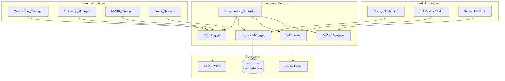
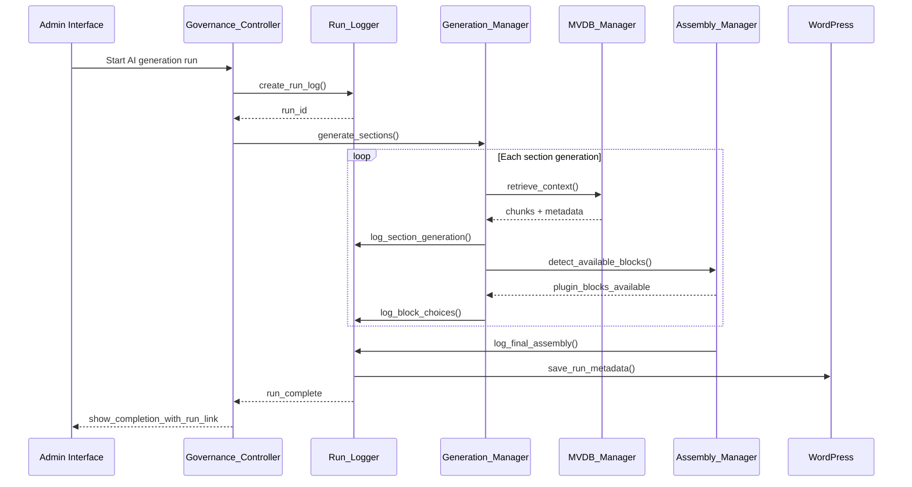
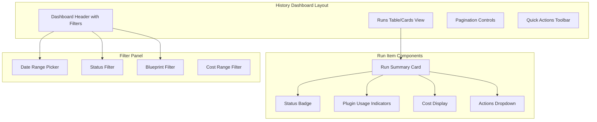
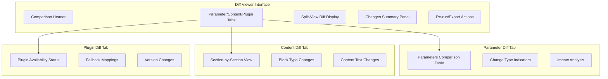

# Governance Run Logging Design

## Overview

The Governance Run Logging system implements comprehensive audit trails, historical tracking, and diff visualization for AI Page Composer runs. This system enables full governance over the AI generation process by logging every run with detailed parameters, plugin choices, costs, and outcomes. It provides a History UI for reviewing past runs, a Diff Viewer for visualizing block type changes, and Re-run functionality to reproduce previous generations while gracefully handling plugin availability changes.

## Architecture

### Component Architecture Overview



### Data Flow Architecture



## Data Models & Storage

### AI Run Custom Post Type Schema

```php
// Post meta structure for comprehensive run logging
$run_log_schema = [
    'run_metadata' => [
        'run_id' => 'run_20241215_143022_abc123',
        'user_id' => 456,
        'blueprint_id' => 123,
        'start_timestamp' => '2024-12-15T14:30:22Z',
        'end_timestamp' => '2024-12-15T14:32:45Z',
        'status' => 'completed|failed|in_progress',
        'total_duration_ms' => 143000,
        'wordpress_version' => '6.4.2',
        'plugin_version' => '1.2.0'
    ],
    'generation_parameters' => [
        'prompt' => 'Create a technology consulting landing page...',
        'namespaces_versions' => [
            'content@v2.1' => true,
            'products@v1.8' => true,
            'docs@v1.5' => false
        ],
        'alpha_weight' => 0.7,
        'k_value' => 10,
        'min_score' => 0.5,
        'generation_mode' => 'hybrid'
    ],
    'sections_log' => [
        [
            'section_id' => 'hero-1',
            'section_type' => 'hero',
            'chunk_ids_used' => ['chunk-123', 'chunk-456', 'chunk-789'],
            'prompt_hash' => 'sha256:def456...',
            'tokens_consumed' => 450,
            'cost_usd' => 0.023,
            'processing_time_ms' => 2500,
            'block_type_used' => 'kadence/rowlayout',
            'fallback_applied' => false,
            'plugin_required' => 'kadence_blocks',
            'warnings' => ['Low MVDB recall: 0.3'],
            'citations' => [
                ['source_url' => 'https://site.com/page', 'confidence' => 0.89]
            ]
        ]
    ],
    'plugin_usage' => [
        'kadence_blocks' => [
            'version' => '3.2.1',
            'blocks_used' => ['kadence/rowlayout', 'kadence/column'],
            'availability_status' => 'active',
            'usage_count' => 3
        ],
        'genesis_blocks' => [
            'version' => '1.1.5',
            'blocks_used' => ['genesis-blocks/gb-container'],
            'availability_status' => 'active',
            'usage_count' => 1
        ]
    ],
    'cost_breakdown' => [
        'total_cost_usd' => 0.156,
        'openai_api_cost' => 0.134,
        'mvdb_query_cost' => 0.022,
        'token_breakdown' => [
            'input_tokens' => 2340,
            'output_tokens' => 1890,
            'total_tokens' => 4230
        ]
    ],
    'quality_metrics' => [
        'overall_recall_score' => 0.78,
        'citation_coverage' => 0.92,
        'accessibility_score' => 95,
        'seo_optimization_score' => 88,
        'performance_impact' => 'low'
    ],
    'final_output' => [
        'post_id' => 789,
        'block_structure_hash' => 'sha256:ghi789...',
        'total_blocks' => 12,
        'total_word_count' => 1450,
        'featured_image_id' => 234,
        'seo_meta' => [
            'title' => 'Generated SEO Title',
            'description' => 'Generated meta description'
        ]
    ]
];
```

### Run Diff Data Structure

```php
$diff_schema = [
    'comparison_metadata' => [
        'original_run_id' => 'run_20241215_143022_abc123',
        'comparison_run_id' => 'run_20241215_150045_def456',
        'diff_timestamp' => '2024-12-15T15:15:30Z',
        'comparison_type' => 'run_to_run|run_to_current'
    ],
    'parameter_changes' => [
        'alpha_weight' => ['from' => 0.7, 'to' => 0.8],
        'namespaces_versions' => [
            'content@v2.1' => 'unchanged',
            'products@v1.8' => ['from' => true, 'to' => false],
            'docs@v1.5' => 'unchanged'
        ]
    ],
    'section_diffs' => [
        [
            'section_id' => 'hero-1',
            'block_type_change' => [
                'from' => 'kadence/rowlayout',
                'to' => 'core/columns',
                'reason' => 'kadence_blocks plugin deactivated'
            ],
            'content_changes' => [
                'word_count_delta' => +45,
                'citation_changes' => ['added' => 2, 'removed' => 1],
                'significant_changes' => true
            ]
        ]
    ],
    'plugin_availability_changes' => [
        'kadence_blocks' => [
            'status_change' => ['from' => 'active', 'to' => 'inactive'],
            'impact' => 'fallback_to_core',
            'affected_sections' => ['hero-1', 'features-2']
        ]
    ],
    'cost_comparison' => [
        'cost_delta_usd' => +0.034,
        'token_delta' => +567,
        'efficiency_change' => -0.05
    ]
];
```

## REST API Endpoints

### GET `/ai-composer/v1/governance/runs`

Retrieves paginated list of AI generation runs with filtering capabilities.

**Request Parameters:**

| Parameter | Type | Required | Description |
|-----------|------|----------|-------------|
| page | integer | No | Page number (default: 1) |
| per_page | integer | No | Results per page (default: 20, max: 100) |
| status | string | No | Filter by status: all\|completed\|failed\|in_progress |
| date_from | string | No | Filter runs from date (ISO 8601) |
| date_to | string | No | Filter runs to date (ISO 8601) |
| blueprint_id | integer | No | Filter by blueprint ID |
| user_id | integer | No | Filter by user ID |

**Response Schema:**

```json
{
  "runs": [
    {
      "run_id": "run_20241215_143022_abc123",
      "blueprint_title": "Technology Consulting Landing Page",
      "user_name": "John Doe",
      "status": "completed",
      "start_time": "2024-12-15T14:30:22Z",
      "duration_seconds": 143,
      "total_cost_usd": 0.156,
      "sections_count": 6,
      "plugins_used": ["kadence_blocks", "genesis_blocks"],
      "post_id": 789,
      "quality_score": 87
    }
  ],
  "pagination": {
    "current_page": 1,
    "per_page": 20,
    "total_pages": 5,
    "total_items": 94
  },
  "filters_applied": {
    "status": "completed",
    "date_range": "last_30_days"
  }
}
```

### GET `/ai-composer/v1/governance/runs/{run_id}`

Retrieves detailed information for a specific run.

**Response Schema:**

```json
{
  "run_details": {
    "run_metadata": {/* Full run metadata */},
    "generation_parameters": {/* Parameters used */},
    "sections_log": [/* Detailed section logs */],
    "plugin_usage": {/* Plugin usage details */},
    "cost_breakdown": {/* Cost analysis */},
    "quality_metrics": {/* Quality scores */}
  },
  "regeneration_capability": {
    "can_regenerate": true,
    "missing_plugins": [],
    "parameter_adjustments_needed": false,
    "estimated_cost": 0.145
  }
}
```

### POST `/ai-composer/v1/governance/runs/{run_id}/diff`

Generates diff comparison between two runs or a run and current configuration.

**Request Parameters:**

| Parameter | Type | Required | Description |
|-----------|------|----------|-------------|
| compare_to | string | Yes | Target: run_id\|current |
| diff_options | object | No | Diff visualization options |

**Diff Options Structure:**

```json
{
  "include_content_changes": true,
  "include_parameter_changes": true,
  "include_plugin_changes": true,
  "include_cost_analysis": true,
  "highlight_significant_changes": true
}
```

**Response Schema:**

```json
{
  "diff_result": {
    "comparison_metadata": {/* Comparison info */},
    "parameter_changes": {/* Parameter diffs */},
    "section_diffs": [/* Section-by-section changes */],
    "plugin_availability_changes": {/* Plugin status changes */},
    "cost_comparison": {/* Cost analysis */}
  },
  "visualization_data": {
    "change_summary": {
      "total_changes": 8,
      "significant_changes": 3,
      "plugin_changes": 2,
      "content_changes": 6
    },
    "change_impact": "medium",
    "recommendation": "Review plugin availability before re-run"
  }
}
```

### POST `/ai-composer/v1/governance/runs/{run_id}/rerun`

Regenerates content using parameters from a previous run with graceful plugin handling.

**Request Parameters:**

| Parameter | Type | Required | Description |
|-----------|------|----------|-------------|
| rerun_options | object | No | Re-run configuration options |
| parameter_overrides | object | No | Override specific parameters |

**Rerun Options Structure:**

```json
{
  "preserve_plugin_preferences": true,
  "fallback_on_missing_plugins": true,
  "update_namespace_versions": false,
  "maintain_cost_limits": true,
  "notification_on_changes": true
}
```

**Response Schema:**

```json
{
  "rerun_result": {
    "new_run_id": "run_20241215_170422_xyz789",
    "status": "completed",
    "parameter_adaptations": [
      {
        "parameter": "block_preference",
        "original": "kadence/rowlayout",
        "adapted": "core/columns",
        "reason": "kadence_blocks plugin not available"
      }
    ],
    "plugin_fallbacks": {
      "kadence_blocks": "core_blocks",
      "genesis_blocks": "maintained"
    },
    "cost_comparison": {
      "original_cost": 0.156,
      "new_cost": 0.134,
      "savings": 0.022
    }
  },
  "diff_preview": {
    "major_changes": 2,
    "block_type_changes": 1,
    "content_similarity": 0.92
  }
}
```

## Admin Interface Components

### History Dashboard



### Diff Viewer Modal



## Run Logger Implementation

### Core Run Logger Class

```php
<?php
/**
 * Run Logger - Comprehensive audit logging for AI generation runs
 *
 * @package AIPageComposer\Governance
 */

namespace AIPageComposer\Governance;

use AIPageComposer\Utils\Security_Helper;
use AIPageComposer\Utils\Validation_Helper;

class Run_Logger {

    /**
     * Current run ID being tracked
     */
    private string $current_run_id;

    /**
     * Run start timestamp
     */
    private float $run_start_time;

    /**
     * Accumulated run data
     */
    private array $run_data = [];

    /**
     * Initialize new run logging session
     */
    public function start_run(array $parameters): string {
        $this->current_run_id = $this->generate_run_id();
        $this->run_start_time = microtime(true);
        
        $this->run_data = [
            'run_metadata' => [
                'run_id' => $this->current_run_id,
                'user_id' => get_current_user_id(),
                'blueprint_id' => $parameters['blueprint_id'] ?? null,
                'start_timestamp' => current_time('c'),
                'status' => 'in_progress',
                'wordpress_version' => get_bloginfo('version'),
                'plugin_version' => AI_COMPOSER_VERSION
            ],
            'generation_parameters' => $parameters,
            'sections_log' => [],
            'plugin_usage' => [],
            'cost_breakdown' => [
                'total_cost_usd' => 0,
                'openai_api_cost' => 0,
                'mvdb_query_cost' => 0,
                'token_breakdown' => [
                    'input_tokens' => 0,
                    'output_tokens' => 0,
                    'total_tokens' => 0
                ]
            ]
        ];

        // Create run post immediately for tracking
        $this->create_run_post();
        
        return $this->current_run_id;
    }

    /**
     * Log section generation details
     */
    public function log_section_generation(array $section_data): void {
        $section_log = [
            'section_id' => $section_data['section_id'],
            'section_type' => $section_data['section_type'],
            'timestamp' => current_time('c'),
            'chunk_ids_used' => $section_data['chunk_ids'] ?? [],
            'prompt_hash' => hash('sha256', $section_data['prompt'] ?? ''),
            'tokens_consumed' => $section_data['tokens_consumed'] ?? 0,
            'cost_usd' => $section_data['cost_usd'] ?? 0,
            'processing_time_ms' => $section_data['processing_time_ms'] ?? 0,
            'block_type_used' => $section_data['block_type_used'] ?? 'core/paragraph',
            'fallback_applied' => $section_data['fallback_applied'] ?? false,
            'plugin_required' => $section_data['plugin_required'] ?? 'core',
            'warnings' => $section_data['warnings'] ?? [],
            'citations' => $section_data['citations'] ?? []
        ];

        $this->run_data['sections_log'][] = $section_log;
        
        // Update cost tracking
        $this->run_data['cost_breakdown']['total_cost_usd'] += $section_log['cost_usd'];
        $this->run_data['cost_breakdown']['openai_api_cost'] += $section_log['cost_usd'];
        $this->run_data['cost_breakdown']['token_breakdown']['total_tokens'] += $section_log['tokens_consumed'];

        $this->update_run_post();
    }

    /**
     * Log plugin usage and availability
     */
    public function log_plugin_usage(string $plugin_slug, array $usage_data): void {
        $this->run_data['plugin_usage'][$plugin_slug] = [
            'version' => $usage_data['version'] ?? 'unknown',
            'blocks_used' => $usage_data['blocks_used'] ?? [],
            'availability_status' => $usage_data['availability_status'] ?? 'unknown',
            'usage_count' => $usage_data['usage_count'] ?? 0,
            'fallbacks_triggered' => $usage_data['fallbacks_triggered'] ?? 0
        ];

        $this->update_run_post();
    }

    /**
     * Complete run logging with final results
     */
    public function complete_run(array $final_data): void {
        $end_time = microtime(true);
        
        $this->run_data['run_metadata']['end_timestamp'] = current_time('c');
        $this->run_data['run_metadata']['total_duration_ms'] = ($end_time - $this->run_start_time) * 1000;
        $this->run_data['run_metadata']['status'] = 'completed';
        
        $this->run_data['quality_metrics'] = $final_data['quality_metrics'] ?? [];
        $this->run_data['final_output'] = $final_data['final_output'] ?? [];

        $this->update_run_post();
        
        // Trigger completion hooks
        do_action('ai_composer_run_completed', $this->current_run_id, $this->run_data);
    }

    /**
     * Generate unique run ID
     */
    private function generate_run_id(): string {
        return 'run_' . date('Ymd_His') . '_' . substr(wp_generate_uuid4(), 0, 8);
    }

    /**
     * Create WordPress post for run tracking
     */
    private function create_run_post(): int {
        $post_data = [
            'post_type' => 'ai_composer_run',
            'post_title' => 'AI Run ' . $this->current_run_id,
            'post_status' => 'private',
            'post_content' => '',
            'meta_input' => [
                'run_data' => wp_json_encode($this->run_data),
                'run_id' => $this->current_run_id,
                'run_status' => 'in_progress'
            ]
        ];

        return wp_insert_post($post_data);
    }

    /**
     * Update run post with latest data
     */
    private function update_run_post(): void {
        $posts = get_posts([
            'post_type' => 'ai_composer_run',
            'meta_key' => 'run_id',
            'meta_value' => $this->current_run_id,
            'posts_per_page' => 1
        ]);

        if (!empty($posts)) {
            update_post_meta($posts[0]->ID, 'run_data', wp_json_encode($this->run_data));
            update_post_meta($posts[0]->ID, 'run_status', $this->run_data['run_metadata']['status']);
        }
    }
}
```

## Block Change Detection

### Block Type Change Tracking

```php
<?php
/**
 * Block Change Detector - Tracks and analyzes block type changes between runs
 */

namespace AIPageComposer\Governance;

class Block_Change_Detector {

    /**
     * Detect block type changes between two runs
     */
    public function detect_block_changes(string $original_run_id, string $comparison_run_id): array {
        $original_data = $this->get_run_data($original_run_id);
        $comparison_data = $this->get_run_data($comparison_run_id);

        $changes = [];

        foreach ($original_data['sections_log'] as $index => $original_section) {
            $comparison_section = $comparison_data['sections_log'][$index] ?? null;
            
            if (!$comparison_section) {
                continue;
            }

            $change = $this->analyze_section_change($original_section, $comparison_section);
            
            if ($change['has_changes']) {
                $changes[] = $change;
            }
        }

        return $changes;
    }

    /**
     * Analyze changes in a specific section
     */
    private function analyze_section_change(array $original, array $comparison): array {
        $change = [
            'section_id' => $original['section_id'],
            'has_changes' => false,
            'block_type_change' => null,
            'plugin_change' => null,
            'fallback_change' => null,
            'performance_impact' => null
        ];

        // Detect block type changes
        if ($original['block_type_used'] !== $comparison['block_type_used']) {
            $change['has_changes'] = true;
            $change['block_type_change'] = [
                'from' => $original['block_type_used'],
                'to' => $comparison['block_type_used'],
                'from_plugin' => $original['plugin_required'],
                'to_plugin' => $comparison['plugin_required'],
                'change_reason' => $this->determine_change_reason(
                    $original['plugin_required'], 
                    $comparison['plugin_required']
                )
            ];
        }

        // Detect plugin availability changes
        if ($original['plugin_required'] !== $comparison['plugin_required']) {
            $change['has_changes'] = true;
            $change['plugin_change'] = [
                'from' => $original['plugin_required'],
                'to' => $comparison['plugin_required'],
                'availability_change' => $this->check_plugin_availability_change(
                    $original['plugin_required'],
                    $comparison['plugin_required']
                )
            ];
        }

        // Detect fallback changes
        if ($original['fallback_applied'] !== $comparison['fallback_applied']) {
            $change['has_changes'] = true;
            $change['fallback_change'] = [
                'from' => $original['fallback_applied'],
                'to' => $comparison['fallback_applied'],
                'impact' => $comparison['fallback_applied'] ? 'degraded' : 'improved'
            ];
        }

        // Analyze performance impact
        $performance_delta = $comparison['processing_time_ms'] - $original['processing_time_ms'];
        if (abs($performance_delta) > 500) { // 500ms threshold
            $change['performance_impact'] = [
                'time_delta_ms' => $performance_delta,
                'impact_level' => abs($performance_delta) > 2000 ? 'high' : 'medium'
            ];
        }

        return $change;
    }

    /**
     * Determine reason for block type change
     */
    private function determine_change_reason(string $from_plugin, string $to_plugin): string {
        if ($from_plugin !== 'core' && $to_plugin === 'core') {
            return 'plugin_unavailable';
        } elseif ($from_plugin === 'core' && $to_plugin !== 'core') {
            return 'plugin_became_available';
        } elseif ($from_plugin !== $to_plugin && $from_plugin !== 'core' && $to_plugin !== 'core') {
            return 'plugin_preference_changed';
        } else {
            return 'user_preference_or_algorithm_change';
        }
    }
}
```

## Testing Strategy

### Unit Testing Components

```php
/**
 * Test suite for run logging functionality
 */
class Test_Run_Logger extends WP_UnitTestCase {

    private $run_logger;

    public function setUp(): void {
        parent::setUp();
        $this->run_logger = new Run_Logger();
    }

    /**
     * Test run initialization and ID generation
     */
    public function test_start_run_creates_unique_id(): void {
        $parameters = [
            'blueprint_id' => 123,
            'generation_mode' => 'hybrid'
        ];

        $run_id_1 = $this->run_logger->start_run($parameters);
        $run_id_2 = $this->run_logger->start_run($parameters);

        $this->assertNotEquals($run_id_1, $run_id_2);
        $this->assertStringStartsWith('run_', $run_id_1);
    }

    /**
     * Test section logging accumulates data correctly
     */
    public function test_log_section_generation_accumulates_costs(): void {
        $run_id = $this->run_logger->start_run(['blueprint_id' => 123]);

        $this->run_logger->log_section_generation([
            'section_id' => 'hero-1',
            'section_type' => 'hero',
            'cost_usd' => 0.025,
            'tokens_consumed' => 500
        ]);

        $this->run_logger->log_section_generation([
            'section_id' => 'content-1',
            'section_type' => 'content',
            'cost_usd' => 0.015,
            'tokens_consumed' => 300
        ]);

        $run_data = $this->run_logger->get_current_run_data();
        
        $this->assertEquals(0.040, $run_data['cost_breakdown']['total_cost_usd']);
        $this->assertEquals(800, $run_data['cost_breakdown']['token_breakdown']['total_tokens']);
    }

    /**
     * Test plugin usage logging
     */
    public function test_log_plugin_usage_tracks_correctly(): void {
        $run_id = $this->run_logger->start_run(['blueprint_id' => 123]);

        $this->run_logger->log_plugin_usage('kadence_blocks', [
            'version' => '3.2.1',
            'blocks_used' => ['kadence/rowlayout', 'kadence/column'],
            'availability_status' => 'active',
            'usage_count' => 2
        ]);

        $run_data = $this->run_logger->get_current_run_data();
        
        $this->assertArrayHasKey('kadence_blocks', $run_data['plugin_usage']);
        $this->assertEquals('3.2.1', $run_data['plugin_usage']['kadence_blocks']['version']);
        $this->assertEquals(2, $run_data['plugin_usage']['kadence_blocks']['usage_count']);
    }
}
```