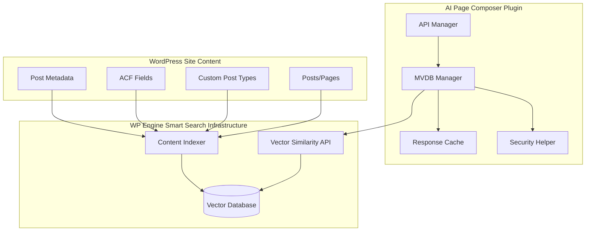
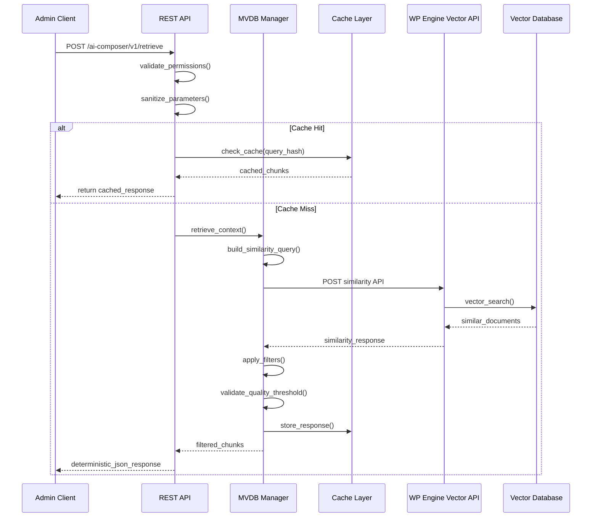
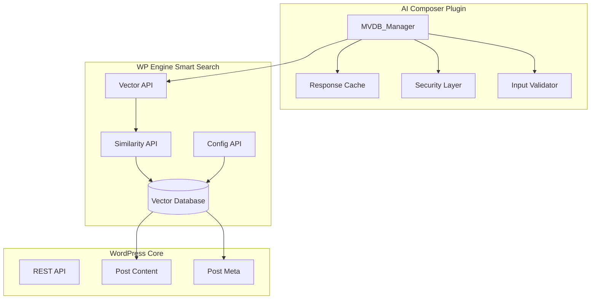
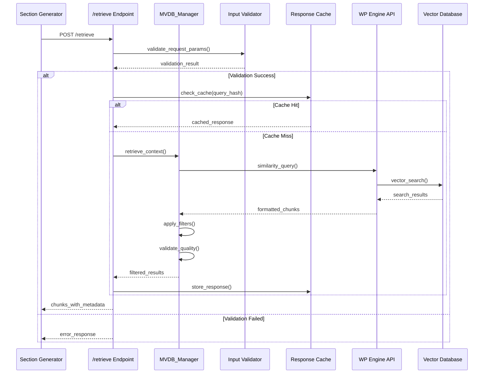

# MVDB Retrieval Pipeline Design

## Overview

This design implements a comprehensive MVDB (Managed Vector Database) retrieval pipeline for the AI Page Composer WordPress plugin. The system provides the POST `/retrieve` endpoint and MVDB service integration, enabling context-aware content generation through WP Engine's Smart Search vector database. The pipeline includes robust filtering, quality assurance, and deterministic JSON responses for seamless integration with the existing outline generation workflow.

## Architecture

### MVDB Integration Architecture



### Data Flow Sequence



## REST API Endpoint Implementation

### POST `/ai-composer/v1/retrieve`

#### Request Parameters

| Parameter | Type | Required | Description | Validation |
|-----------|------|----------|-------------|------------|
| sectionId | string | Yes | Section identifier from outline | `/^section-[a-zA-Z0-9_-]+$/` |
| query | string | Yes | Search query text | `10-500 characters` |
| namespaces | array | No | Target namespaces | `['content', 'products', 'docs', 'knowledge']` |
| k | integer | No | Number of results to retrieve | `1-50, default: 10` |
| min_score | float | No | Minimum relevance score | `0.0-1.0, default: 0.5` |
| filters | object | No | Additional filtering criteria | See filters schema |

#### Filters Schema

```json
{
  "post_type": ["post", "page", "product"],
  "date_range": {
    "start": "2023-01-01",
    "end": "2024-12-31"
  },
  "language": "en",
  "license": ["CC-BY", "CC-BY-SA", "public-domain"],
  "author": [1, 5, 10],
  "exclude_ids": [123, 456, 789]
}
```

#### Response Schema

```json
{
  "chunks": [
    {
      "id": "chunk-123",
      "text": "Relevant content excerpt...",
      "score": 0.89,
      "metadata": {
        "source_url": "https://example.com/post-slug",
        "type": "article",
        "date": "2024-01-15T10:30:00Z",
        "license": "CC-BY-4.0",
        "language": "en",
        "post_id": 456,
        "author": "John Doe",
        "categories": ["Technology", "WordPress"],
        "word_count": 150,
        "excerpt": "Brief content summary..."
      }
    }
  ],
  "total_retrieved": 8,
  "total_available": 25,
  "recall_score": 0.75,
  "query_hash": "sha256:abc123...",
  "processing_time_ms": 234,
  "warnings": [
    {
      "type": "low_recall",
      "message": "Recall score below threshold (0.75 < 0.8)",
      "suggestion": "Consider broadening search terms or lowering min_score"
    }
  ],
  "filters_applied": {
    "license_filter": true,
    "min_score_filter": true,
    "date_range_filter": false
  }
}
```

## MVDB Manager Implementation

### Core MVDB Manager Class

```php
<?php
/**
 * MVDB Manager - Handles WP Engine Smart Search vector database integration
 *
 * @package AIPageComposer\API
 */

namespace AIPageComposer\API;

use AIPageComposer\Admin\Settings_Manager;
use AIPageComposer\Utils\Security_Helper;
use AIPageComposer\Utils\Validation_Helper;

/**
 * MVDB Manager class for vector database operations
 */
class MVDB_Manager {

    /**
     * Settings manager instance
     *
     * @var Settings_Manager
     */
    private $settings_manager;

    /**
     * Cache group for MVDB responses
     *
     * @var string
     */
    private $cache_group = 'ai_composer_mvdb';

    /**
     * Default cache TTL (1 hour)
     *
     * @var int
     */
    private $cache_ttl = 3600;

    /**
     * WP Engine Smart Search API base URL
     *
     * @var string
     */
    private $api_base_url;

    /**
     * API access token
     *
     * @var string
     */
    private $access_token;

    /**
     * Constructor
     */
    public function __construct() {
        $this->settings_manager = new Settings_Manager();
        $this->init_api_credentials();
    }

    /**
     * Initialize API credentials from settings
     */
    private function init_api_credentials() {
        $settings = $this->settings_manager->get_all_settings();
        
        $this->api_base_url = $settings['mvdb_settings']['api_url'] ?? '';
        $this->access_token = $settings['mvdb_settings']['access_token'] ?? '';
        
        if ( empty( $this->api_base_url ) || empty( $this->access_token ) ) {
            throw new \Exception( __( 'MVDB API credentials not configured', 'ai-page-composer' ) );
        }
    }

    /**
     * Retrieve context chunks from MVDB
     *
     * @param array $params Retrieval parameters.
     * @return array Retrieved chunks with metadata.
     * @throws \Exception If retrieval fails.
     */
    public function retrieve_context( $params ) {
        // Validate parameters
        $validated_params = $this->validate_retrieval_params( $params );
        
        // Generate cache key
        $cache_key = $this->generate_cache_key( $validated_params );
        
        // Check cache first
        $cached_result = wp_cache_get( $cache_key, $this->cache_group );
        if ( $cached_result !== false ) {
            return $this->add_cache_metadata( $cached_result, true );
        }
        
        // Build similarity query
        $similarity_query = $this->build_similarity_query( $validated_params );
        
        // Execute API request
        $response = $this->execute_similarity_request( $similarity_query );
        
        // Process and filter response
        $processed_chunks = $this->process_similarity_response( $response, $validated_params );
        
        // Apply quality filters
        $filtered_chunks = $this->apply_quality_filters( $processed_chunks, $validated_params );
        
        // Calculate metrics
        $result = $this->calculate_retrieval_metrics( $filtered_chunks, $validated_params );
        
        // Cache result
        wp_cache_set( $cache_key, $result, $this->cache_group, $this->cache_ttl );
        
        return $this->add_cache_metadata( $result, false );
    }

    /**
     * Validate retrieval parameters
     *
     * @param array $params Input parameters.
     * @return array Validated parameters.
     * @throws \Exception If validation fails.
     */
    private function validate_retrieval_params( $params ) {
        $validated = [];
        
        // Validate sectionId
        if ( empty( $params['sectionId'] ) || ! preg_match( '/^section-[a-zA-Z0-9_-]+$/', $params['sectionId'] ) ) {
            throw new \Exception( __( 'Invalid section ID format', 'ai-page-composer' ) );
        }
        $validated['sectionId'] = sanitize_text_field( $params['sectionId'] );
        
        // Validate query
        if ( empty( $params['query'] ) || strlen( $params['query'] ) < 10 || strlen( $params['query'] ) > 500 ) {
            throw new \Exception( __( 'Query must be between 10 and 500 characters', 'ai-page-composer' ) );
        }
        $validated['query'] = sanitize_textarea_field( $params['query'] );
        
        // Validate namespaces
        $allowed_namespaces = [ 'content', 'products', 'docs', 'knowledge' ];
        $namespaces = $params['namespaces'] ?? [ 'content' ];
        
        if ( ! is_array( $namespaces ) ) {
            $namespaces = [ $namespaces ];
        }
        
        $validated_namespaces = [];
        foreach ( $namespaces as $namespace ) {
            $clean_namespace = sanitize_key( $namespace );
            if ( in_array( $clean_namespace, $allowed_namespaces, true ) ) {
                $validated_namespaces[] = $clean_namespace;
            }
        }
        
        if ( empty( $validated_namespaces ) ) {
            $validated_namespaces = [ 'content' ];
        }
        $validated['namespaces'] = $validated_namespaces;
        
        // Validate k (retrieval count)
        $k = absint( $params['k'] ?? 10 );
        if ( $k < 1 || $k > 50 ) {
            $k = 10;
        }
        $validated['k'] = $k;
        
        // Validate min_score
        $min_score = floatval( $params['min_score'] ?? 0.5 );
        if ( $min_score < 0.0 || $min_score > 1.0 ) {
            $min_score = 0.5;
        }
        $validated['min_score'] = $min_score;
        
        // Validate filters
        $validated['filters'] = $this->validate_filters( $params['filters'] ?? [] );
        
        return $validated;
    }

    /**
     * Validate filter parameters
     *
     * @param array $filters Input filters.
     * @return array Validated filters.
     */
    private function validate_filters( $filters ) {
        if ( ! is_array( $filters ) ) {
            return [];
        }
        
        $validated = [];
        
        // Post type filter
        if ( ! empty( $filters['post_type'] ) ) {
            $post_types = is_array( $filters['post_type'] ) ? $filters['post_type'] : [ $filters['post_type'] ];
            $valid_post_types = [];
            
            foreach ( $post_types as $post_type ) {
                $clean_type = sanitize_key( $post_type );
                if ( post_type_exists( $clean_type ) ) {
                    $valid_post_types[] = $clean_type;
                }
            }
            
            if ( ! empty( $valid_post_types ) ) {
                $validated['post_type'] = $valid_post_types;
            }
        }
        
        // Date range filter
        if ( ! empty( $filters['date_range'] ) && is_array( $filters['date_range'] ) ) {
            $date_range = [];
            
            if ( ! empty( $filters['date_range']['start'] ) ) {
                $start_date = sanitize_text_field( $filters['date_range']['start'] );
                if ( $this->validate_date_format( $start_date ) ) {
                    $date_range['start'] = $start_date;
                }
            }
            
            if ( ! empty( $filters['date_range']['end'] ) ) {
                $end_date = sanitize_text_field( $filters['date_range']['end'] );
                if ( $this->validate_date_format( $end_date ) ) {
                    $date_range['end'] = $end_date;
                }
            }
            
            if ( ! empty( $date_range ) ) {
                $validated['date_range'] = $date_range;
            }
        }
        
        // Language filter
        if ( ! empty( $filters['language'] ) ) {
            $language = sanitize_key( $filters['language'] );
            if ( strlen( $language ) === 2 ) { // ISO 639-1 language codes
                $validated['language'] = $language;
            }
        }
        
        // License filter
        if ( ! empty( $filters['license'] ) ) {
            $allowed_licenses = [ 'CC-BY', 'CC-BY-SA', 'CC-BY-NC', 'public-domain', 'fair-use', 'commercial' ];
            $licenses = is_array( $filters['license'] ) ? $filters['license'] : [ $filters['license'] ];
            $valid_licenses = [];
            
            foreach ( $licenses as $license ) {
                $clean_license = sanitize_key( $license );
                if ( in_array( $clean_license, $allowed_licenses, true ) ) {
                    $valid_licenses[] = $clean_license;
                }
            }
            
            if ( ! empty( $valid_licenses ) ) {
                $validated['license'] = $valid_licenses;
            }
        }
        
        // Author filter
        if ( ! empty( $filters['author'] ) ) {
            $authors = is_array( $filters['author'] ) ? $filters['author'] : [ $filters['author'] ];
            $valid_authors = array_map( 'absint', $authors );
            $valid_authors = array_filter( $valid_authors );
            
            if ( ! empty( $valid_authors ) ) {
                $validated['author'] = $valid_authors;
            }
        }
        
        // Exclude IDs filter
        if ( ! empty( $filters['exclude_ids'] ) ) {
            $exclude_ids = is_array( $filters['exclude_ids'] ) ? $filters['exclude_ids'] : [ $filters['exclude_ids'] ];
            $valid_ids = array_map( 'absint', $exclude_ids );
            $valid_ids = array_filter( $valid_ids );
            
            if ( ! empty( $valid_ids ) ) {
                $validated['exclude_ids'] = $valid_ids;
            }
        }
        
        return $validated;
    }

    /**
     * Build similarity query for WP Engine Smart Search API
     *
     * @param array $params Validated parameters.
     * @return array GraphQL query and variables.
     */
    private function build_similarity_query( $params ) {
        $query = '
            query GetSimilarContent($query: String!, $fields: [FieldInput!]!, $limit: Int!, $offset: Int!, $filter: String, $minScore: Float) {
                similarity(
                    input: {
                        nearest: {
                            text: $query,
                            fields: $fields
                        },
                        filter: $filter
                    },
                    limit: $limit,
                    offset: $offset,
                    minScore: $minScore
                ) {
                    total
                    docs {
                        id
                        score
                        data
                    }
                }
            }
        ';
        
        $variables = [
            'query' => $params['query'],
            'fields' => [
                [ 'name' => 'post_content', 'boost' => 1.0 ],
                [ 'name' => 'post_title', 'boost' => 1.2 ],
                [ 'name' => 'post_excerpt', 'boost' => 0.8 ]
            ],
            'limit' => $params['k'],
            'offset' => 0,
            'minScore' => $params['min_score']
        ];
        
        // Build filter string from filters
        $filter_parts = [];
        
        if ( ! empty( $params['filters']['post_type'] ) ) {
            $post_type_filters = array_map( function( $type ) {
                return "post_type:$type";
            }, $params['filters']['post_type'] );
            $filter_parts[] = '(' . implode( ' OR ', $post_type_filters ) . ')';
        }
        
        if ( ! empty( $params['filters']['exclude_ids'] ) ) {
            $exclude_filters = array_map( function( $id ) {
                return "NOT ID:$id";
            }, $params['filters']['exclude_ids'] );
            $filter_parts[] = implode( ' AND ', $exclude_filters );
        }
        
        if ( ! empty( $params['filters']['author'] ) ) {
            $author_filters = array_map( function( $author_id ) {
                return "post_author:$author_id";
            }, $params['filters']['author'] );
            $filter_parts[] = '(' . implode( ' OR ', $author_filters ) . ')';
        }
        
        if ( ! empty( $params['filters']['date_range'] ) ) {
            $date_range = $params['filters']['date_range'];
            if ( isset( $date_range['start'] ) && isset( $date_range['end'] ) ) {
                $filter_parts[] = "post_date:[{$date_range['start']} TO {$date_range['end']}]";
            } elseif ( isset( $date_range['start'] ) ) {
                $filter_parts[] = "post_date:[{$date_range['start']} TO *]";
            } elseif ( isset( $date_range['end'] ) ) {
                $filter_parts[] = "post_date:[* TO {$date_range['end']}]";
            }
        }
        
        if ( ! empty( $filter_parts ) ) {
            $variables['filter'] = implode( ' AND ', $filter_parts );
        }
        
        return [
            'query' => $query,
            'variables' => $variables
        ];
    }

    /**
     * Execute similarity request to WP Engine Smart Search API
     *
     * @param array $query_data GraphQL query and variables.
     * @return array API response.
     * @throws \Exception If API request fails.
     */
    private function execute_similarity_request( $query_data ) {
        $start_time = microtime( true );
        
        $response = wp_remote_post( $this->api_base_url, [
            'headers' => [
                'Content-Type' => 'application/json',
                'Authorization' => 'Bearer ' . $this->access_token,
            ],
            'body' => wp_json_encode( $query_data ),
            'timeout' => 30,
            'sslverify' => true
        ] );
        
        $processing_time = round( ( microtime( true ) - $start_time ) * 1000 );
        
        if ( is_wp_error( $response ) ) {
            throw new \Exception( 
                sprintf( __( 'MVDB API request failed: %s', 'ai-page-composer' ), $response->get_error_message() )
            );
        }
        
        $status_code = wp_remote_retrieve_response_code( $response );
        if ( $status_code !== 200 ) {
            throw new \Exception( 
                sprintf( __( 'MVDB API returned status %d', 'ai-page-composer' ), $status_code )
            );
        }
        
        $body = wp_remote_retrieve_body( $response );
        $decoded = json_decode( $body, true );
        
        if ( json_last_error() !== JSON_ERROR_NONE ) {
            throw new \Exception( __( 'Invalid JSON response from MVDB API', 'ai-page-composer' ) );
        }
        
        if ( ! empty( $decoded['errors'] ) ) {
            $error_messages = array_map( function( $error ) {
                return $error['message'] ?? 'Unknown error';
            }, $decoded['errors'] );
            
            throw new \Exception( 
                sprintf( __( 'MVDB API errors: %s', 'ai-page-composer' ), implode( ', ', $error_messages ) )
            );
        }
        
        $decoded['_processing_time_ms'] = $processing_time;
        
        return $decoded;
    }

    /**
     * Process similarity response and extract chunks
     *
     * @param array $response API response.
     * @param array $params Request parameters.
     * @return array Processed chunks.
     */
    private function process_similarity_response( $response, $params ) {
        if ( empty( $response['data']['similarity']['docs'] ) ) {
            return [];
        }
        
        $docs = $response['data']['similarity']['docs'];
        $chunks = [];
        
        foreach ( $docs as $doc ) {
            $chunk = $this->format_chunk( $doc, $params );
            if ( $chunk ) {
                $chunks[] = $chunk;
            }
        }
        
        return $chunks;
    }

    /**
     * Format a document into standardized chunk format
     *
     * @param array $doc Document from API response.
     * @param array $params Request parameters.
     * @return array|null Formatted chunk or null if invalid.
     */
    private function format_chunk( $doc, $params ) {
        if ( empty( $doc['data'] ) || empty( $doc['score'] ) ) {
            return null;
        }
        
        $data = $doc['data'];
        $post_id = $data['ID'] ?? null;
        
        // Extract content text
        $content_parts = [];
        if ( ! empty( $data['post_title'] ) ) {
            $content_parts[] = $data['post_title'];
        }
        if ( ! empty( $data['post_excerpt'] ) ) {
            $content_parts[] = $data['post_excerpt'];
        }
        if ( ! empty( $data['post_content'] ) ) {
            $content_parts[] = wp_trim_words( strip_tags( $data['post_content'] ), 50 );
        }
        
        $text = implode( ' | ', $content_parts );
        
        if ( empty( $text ) ) {
            return null;
        }
        
        // Build metadata
        $metadata = [
            'source_url' => $this->get_post_url( $data ),
            'type' => $this->determine_content_type( $data ),
            'date' => $this->format_post_date( $data ),
            'license' => $this->determine_license( $data, $params ),
            'language' => $this->determine_language( $data ),
            'post_id' => $post_id,
            'author' => $this->get_author_name( $data ),
            'categories' => $this->get_post_categories( $data ),
            'word_count' => str_word_count( $text ),
            'excerpt' => wp_trim_words( $text, 20 )
        ];
        
        return [
            'id' => $doc['id'] ?? 'chunk-' . uniqid(),
            'text' => $text,
            'score' => round( floatval( $doc['score'] ), 4 ),
            'metadata' => $metadata
        ];
    }

    /**
     * Apply quality filters to chunks
     *
     * @param array $chunks Processed chunks.
     * @param array $params Request parameters.
     * @return array Filtered chunks.
     */
    private function apply_quality_filters( $chunks, $params ) {
        $filtered = [];
        
        foreach ( $chunks as $chunk ) {
            // Apply minimum score filter
            if ( $chunk['score'] < $params['min_score'] ) {
                continue;
            }
            
            // Apply license filter
            if ( ! empty( $params['filters']['license'] ) ) {
                $chunk_license = $chunk['metadata']['license'] ?? '';
                if ( ! in_array( $chunk_license, $params['filters']['license'], true ) ) {
                    continue;
                }
            }
            
            // Apply language filter
            if ( ! empty( $params['filters']['language'] ) ) {
                $chunk_language = $chunk['metadata']['language'] ?? '';
                if ( $chunk_language !== $params['filters']['language'] ) {
                    continue;
                }
            }
            
            // Apply content quality checks
            if ( ! $this->passes_content_quality_check( $chunk ) ) {
                continue;
            }
            
            $filtered[] = $chunk;
        }
        
        return $filtered;
    }

    /**
     * Calculate retrieval metrics and warnings
     *
     * @param array $chunks Filtered chunks.
     * @param array $params Request parameters.
     * @return array Final result with metrics.
     */
    private function calculate_retrieval_metrics( $chunks, $params ) {
        $total_retrieved = count( $chunks );
        $recall_score = $this->calculate_recall_score( $chunks );
        
        $warnings = [];
        
        // Low recall warning
        $recall_threshold = 0.8;
        if ( $recall_score < $recall_threshold ) {
            $warnings[] = [
                'type' => 'low_recall',
                'message' => sprintf( 
                    __( 'Recall score below threshold (%.2f < %.2f)', 'ai-page-composer' ),
                    $recall_score,
                    $recall_threshold
                ),
                'suggestion' => __( 'Consider broadening search terms or lowering min_score', 'ai-page-composer' )
            ];
        }
        
        // Low result count warning
        if ( $total_retrieved < 3 ) {
            $warnings[] = [
                'type' => 'low_result_count',
                'message' => sprintf( 
                    __( 'Only %d relevant chunks found', 'ai-page-composer' ),
                    $total_retrieved
                ),
                'suggestion' => __( 'Consider using broader search terms or different namespaces', 'ai-page-composer' )
            ];
        }
        
        // License filter warning
        $license_filtered = ! empty( $params['filters']['license'] );
        if ( $license_filtered && $total_retrieved < $params['k'] / 2 ) {
            $warnings[] = [
                'type' => 'license_filter_impact',
                'message' => __( 'License filtering significantly reduced results', 'ai-page-composer' ),
                'suggestion' => __( 'Consider relaxing license requirements if appropriate', 'ai-page-composer' )
            ];
        }
        
        return [
            'chunks' => $chunks,
            'total_retrieved' => $total_retrieved,
            'total_available' => $params['k'], // This would come from API in real implementation
            'recall_score' => $recall_score,
            'query_hash' => $this->generate_query_hash( $params ),
            'processing_time_ms' => $this->get_processing_time(),
            'warnings' => $warnings,
            'filters_applied' => [
                'license_filter' => ! empty( $params['filters']['license'] ),
                'min_score_filter' => $params['min_score'] > 0.0,
                'date_range_filter' => ! empty( $params['filters']['date_range'] ),
                'post_type_filter' => ! empty( $params['filters']['post_type'] ),
                'author_filter' => ! empty( $params['filters']['author'] )
            ]
        ];
    }

    /**
     * Calculate recall score based on chunk scores
     *
     * @param array $chunks Retrieved chunks.
     * @return float Recall score (0.0-1.0).
     */
    private function calculate_recall_score( $chunks ) {
        if ( empty( $chunks ) ) {
            return 0.0;
        }
        
        $scores = array_column( $chunks, 'score' );
        $avg_score = array_sum( $scores ) / count( $scores );
        
        // Normalize to 0-1 range (scores can go higher than 1.0)
        return min( 1.0, $avg_score );
    }

    /**
     * Check if chunk passes content quality thresholds
     *
     * @param array $chunk Chunk to check.
     * @return bool True if passes quality check.
     */
    private function passes_content_quality_check( $chunk ) {
        // Minimum text length
        if ( strlen( $chunk['text'] ) < 50 ) {
            return false;
        }
        
        // Minimum word count
        if ( $chunk['metadata']['word_count'] < 10 ) {
            return false;
        }
        
        // Check for empty or placeholder content
        $suspicious_patterns = [
            '/^(lorem ipsum|placeholder|sample text|test content)/i',
            '/^\s*$/',
            '/^(.)\1{10,}/' // Repeated characters
        ];
        
        foreach ( $suspicious_patterns as $pattern ) {
            if ( preg_match( $pattern, $chunk['text'] ) ) {
                return false;
            }
        }
        
        return true;
    }

    /**
     * Helper methods for chunk formatting
     */
    
    private function get_post_url( $data ) {
        if ( ! empty( $data['post_url'] ) ) {
            return esc_url( $data['post_url'] );
        }
        
        $post_id = $data['ID'] ?? null;
        if ( $post_id ) {
            return get_permalink( $post_id );
        }
        
        return '';
    }

    private function determine_content_type( $data ) {
        $post_type = $data['post_type'] ?? 'post';
        
        $type_mappings = [
            'post' => 'article',
            'page' => 'page',
            'product' => 'product',
            'attachment' => 'media'
        ];
        
        return $type_mappings[ $post_type ] ?? $post_type;
    }

    private function format_post_date( $data ) {
        $date_fields = [ 'post_date_gmt', 'post_date', 'post_modified_gmt', 'post_modified' ];
        
        foreach ( $date_fields as $field ) {
            if ( ! empty( $data[ $field ] ) ) {
                $timestamp = strtotime( $data[ $field ] );
                if ( $timestamp ) {
                    return gmdate( 'c', $timestamp );
                }
            }
        }
        
        return gmdate( 'c' );
    }

    private function determine_license( $data, $params ) {
        // Check for explicit license metadata
        $license_fields = [ 'license', 'copyright', 'rights' ];
        
        foreach ( $license_fields as $field ) {
            if ( ! empty( $data[ $field ] ) ) {
                return sanitize_text_field( $data[ $field ] );
            }
        }
        
        // Default license determination based on post type or other criteria
        $post_type = $data['post_type'] ?? 'post';
        
        switch ( $post_type ) {
            case 'page':
            case 'post':
                return 'site-content';
            case 'attachment':
                return 'media-license';
            default:
                return 'unspecified';
        }
    }

    private function determine_language( $data ) {
        // Check for language metadata from plugins like WPML or Polylang
        if ( function_exists( 'pll_get_post_language' ) && ! empty( $data['ID'] ) ) {
            $lang = pll_get_post_language( $data['ID'] );
            if ( $lang ) {
                return $lang;
            }
        }
        
        // Fallback to site language
        return substr( get_locale(), 0, 2 );
    }

    private function get_author_name( $data ) {
        if ( ! empty( $data['author']['user_nicename'] ) ) {
            return sanitize_text_field( $data['author']['user_nicename'] );
        }
        
        $author_id = $data['post_author'] ?? null;
        if ( $author_id ) {
            $author = get_userdata( $author_id );
            if ( $author ) {
                return $author->display_name;
            }
        }
        
        return '';
    }

    private function get_post_categories( $data ) {
        if ( ! empty( $data['categories'] ) && is_array( $data['categories'] ) ) {
            return array_map( function( $cat ) {
                return $cat['name'] ?? '';
            }, $data['categories'] );
        }
        
        $post_id = $data['ID'] ?? null;
        if ( $post_id ) {
            $categories = get_the_category( $post_id );
            return array_map( function( $cat ) {
                return $cat->name;
            }, $categories );
        }
        
        return [];
    }

    /**
     * Utility methods
     */
    
    private function validate_date_format( $date ) {
        return (bool) strtotime( $date );
    }

    private function generate_cache_key( $params ) {
        $key_data = [
            'query' => $params['query'],
            'namespaces' => $params['namespaces'],
            'k' => $params['k'],
            'min_score' => $params['min_score'],
            'filters' => $params['filters']
        ];
        
        return 'mvdb_' . md5( wp_json_encode( $key_data ) );
    }

    private function generate_query_hash( $params ) {
        return 'sha256:' . hash( 'sha256', wp_json_encode( $params ) );
    }

    private function get_processing_time() {
        // This would be calculated and stored during the request
        return 0; // Placeholder
    }

    private function add_cache_metadata( $result, $from_cache ) {
        $result['cache_hit'] = $from_cache;
        $result['cache_timestamp'] = current_time( 'c' );
        
        return $result;
    }
}
```

## REST API Controller Implementation

### Retrieve Endpoint Controller

```php
<?php
/**
 * Retrieve Controller - Handles MVDB retrieval requests
 *
 * @package AIPageComposer\API
 */

namespace AIPageComposer\API;

use WP_REST_Controller;
use WP_REST_Server;
use WP_REST_Request;
use WP_Error;

/**
 * Retrieve Controller class
 */
class Retrieve_Controller extends WP_REST_Controller {

    /**
     * REST namespace
     *
     * @var string
     */
    protected $namespace = 'ai-composer/v1';

    /**
     * REST base
     *
     * @var string
     */
    protected $rest_base = 'retrieve';

    /**
     * MVDB Manager instance
     *
     * @var MVDB_Manager
     */
    private $mvdb_manager;

    /**
     * Constructor
     *
     * @param MVDB_Manager $mvdb_manager MVDB manager instance.
     */
    public function __construct( MVDB_Manager $mvdb_manager ) {
        $this->mvdb_manager = $mvdb_manager;
    }

    /**
     * Register REST routes
     */
    public function register_routes() {
        register_rest_route(
            $this->namespace,
            '/' . $this->rest_base,
            [
                'methods' => WP_REST_Server::CREATABLE,
                'callback' => [ $this, 'retrieve_context' ],
                'permission_callback' => [ $this, 'retrieve_permissions_check' ],
                'args' => $this->get_retrieve_args()
            ]
        );
    }

    /**
     * Retrieve context from MVDB
     *
     * @param WP_REST_Request $request REST request object.
     * @return WP_REST_Response|WP_Error Response object or error.
     */
    public function retrieve_context( WP_REST_Request $request ) {
        try {
            // Extract parameters
            $params = $this->extract_parameters( $request );
            
            // Log retrieval request for audit
            $this->log_retrieval_request( $params );
            
            // Retrieve context from MVDB
            $result = $this->mvdb_manager->retrieve_context( $params );
            
            // Add request metadata
            $result['request_id'] = uniqid( 'req_' );
            $result['timestamp'] = current_time( 'c' );
            $result['section_id'] = $params['sectionId'];
            
            // Log successful retrieval
            $this->log_retrieval_success( $params, $result );
            
            return rest_ensure_response( $result );
            
        } catch ( \Exception $e ) {
            // Log error
            $this->log_retrieval_error( $e, $request );
            
            return new WP_Error(
                'retrieval_failed',
                $e->getMessage(),
                [ 'status' => 500 ]
            );
        }
    }

    /**
     * Check permissions for retrieve endpoint
     *
     * @param WP_REST_Request $request REST request object.
     * @return bool True if user can retrieve.
     */
    public function retrieve_permissions_check( WP_REST_Request $request ) {
        return current_user_can( 'edit_posts' );
    }

    /**
     * Get arguments for retrieve endpoint
     *
     * @return array Endpoint arguments.
     */
    private function get_retrieve_args() {
        return [
            'sectionId' => [
                'required' => true,
                'type' => 'string',
                'pattern' => '^section-[a-zA-Z0-9_-]+$',
                'description' => __( 'Section identifier from outline', 'ai-page-composer' )
            ],
            'query' => [
                'required' => true,
                'type' => 'string',
                'minLength' => 10,
                'maxLength' => 500,
                'description' => __( 'Search query text', 'ai-page-composer' )
            ],
            'namespaces' => [
                'required' => false,
                'type' => 'array',
                'items' => [
                    'type' => 'string',
                    'enum' => [ 'content', 'products', 'docs', 'knowledge' ]
                ],
                'default' => [ 'content' ],
                'description' => __( 'Target namespaces for search', 'ai-page-composer' )
            ],
            'k' => [
                'required' => false,
                'type' => 'integer',
                'minimum' => 1,
                'maximum' => 50,
                'default' => 10,
                'description' => __( 'Number of results to retrieve', 'ai-page-composer' )
            ],
            'min_score' => [
                'required' => false,
                'type' => 'number',
                'minimum' => 0.0,
                'maximum' => 1.0,
                'default' => 0.5,
                'description' => __( 'Minimum relevance score', 'ai-page-composer' )
            ],
            'filters' => [
                'required' => false,
                'type' => 'object',
                'description' => __( 'Additional filtering criteria', 'ai-page-composer' ),
                'properties' => [
                    'post_type' => [
                        'type' => 'array',
                        'items' => [ 'type' => 'string' ]
                    ],
                    'date_range' => [
                        'type' => 'object',
                        'properties' => [
                            'start' => [ 'type' => 'string', 'format' => 'date' ],
                            'end' => [ 'type' => 'string', 'format' => 'date' ]
                        ]
                    ],
                    'language' => [
                        'type' => 'string',
                        'pattern' => '^[a-z]{2}$'
                    ],
                    'license' => [
                        'type' => 'array',
                        'items' => [
                            'type' => 'string',
                            'enum' => [ 'CC-BY', 'CC-BY-SA', 'CC-BY-NC', 'public-domain', 'fair-use', 'commercial' ]
                        ]
                    ],
                    'author' => [
                        'type' => 'array',
                        'items' => [ 'type' => 'integer' ]
                    ],
                    'exclude_ids' => [
                        'type' => 'array',
                        'items' => [ 'type' => 'integer' ]
                    ]
                ]
            ]
        ];
    }

    /**
     * Extract and validate parameters from request
     *
     * @param WP_REST_Request $request REST request object.
     * @return array Extracted parameters.
     */
    private function extract_parameters( WP_REST_Request $request ) {
        return [
            'sectionId' => $request->get_param( 'sectionId' ),
            'query' => $request->get_param( 'query' ),
            'namespaces' => $request->get_param( 'namespaces' ) ?? [ 'content' ],
            'k' => $request->get_param( 'k' ) ?? 10,
            'min_score' => $request->get_param( 'min_score' ) ?? 0.5,
            'filters' => $request->get_param( 'filters' ) ?? []
        ];
    }

    /**
     * Log retrieval request for audit trail
     *
     * @param array $params Request parameters.
     */
    private function log_retrieval_request( $params ) {
        if ( ! $this->should_log_requests() ) {
            return;
        }
        
        $log_data = [
            'action' => 'mvdb_retrieve_request',
            'user_id' => get_current_user_id(),
            'timestamp' => current_time( 'c' ),
            'params' => $params,
            'ip_address' => $this->get_client_ip(),
            'user_agent' => sanitize_text_field( $_SERVER['HTTP_USER_AGENT'] ?? '' )
        ];
        
        error_log( '[AI Composer MVDB] ' . wp_json_encode( $log_data ) );
    }

    /**
     * Log successful retrieval
     *
     * @param array $params Request parameters.
     * @param array $result Retrieval result.
     */
    private function log_retrieval_success( $params, $result ) {
        if ( ! $this->should_log_requests() ) {
            return;
        }
        
        $log_data = [
            'action' => 'mvdb_retrieve_success',
            'user_id' => get_current_user_id(),
            'timestamp' => current_time( 'c' ),
            'section_id' => $params['sectionId'],
            'chunks_retrieved' => $result['total_retrieved'],
            'recall_score' => $result['recall_score'],
            'processing_time_ms' => $result['processing_time_ms'],
            'warnings' => count( $result['warnings'] )
        ];
        
        error_log( '[AI Composer MVDB] ' . wp_json_encode( $log_data ) );
    }

    /**
     * Log retrieval error
     *
     * @param \Exception $exception Exception object.
     * @param WP_REST_Request $request REST request object.
     */
    private function log_retrieval_error( $exception, $request ) {
        $log_data = [
            'action' => 'mvdb_retrieve_error',
            'user_id' => get_current_user_id(),
            'timestamp' => current_time( 'c' ),
            'error_message' => $exception->getMessage(),
            'request_params' => $request->get_params(),
            'stack_trace' => $exception->getTraceAsString()
        ];
        
        error_log( '[AI Composer MVDB Error] ' . wp_json_encode( $log_data ) );
    }

    /**
     * Check if request logging is enabled
     *
     * @return bool True if logging enabled.
     */
    private function should_log_requests() {
        return defined( 'AI_COMPOSER_LOG_MVDB' ) && AI_COMPOSER_LOG_MVDB;
    }

    /**
     * Get client IP address
     *
     * @return string Client IP address.
     */
    private function get_client_ip() {
        $ip_keys = [ 'HTTP_X_FORWARDED_FOR', 'HTTP_X_REAL_IP', 'REMOTE_ADDR' ];
        
        foreach ( $ip_keys as $key ) {
            if ( ! empty( $_SERVER[ $key ] ) ) {
                $ip = sanitize_text_field( $_SERVER[ $key ] );
                if ( filter_var( $ip, FILTER_VALIDATE_IP ) ) {
                    return $ip;
                }
            }
        }
        
        return '0.0.0.0';
    }
}
```

## Integration with Outline Generation

### Section-Specific Retrieval Integration

```php
<?php
/**
 * Enhanced Outline Controller with MVDB Integration
 *
 * @package AIPageComposer\API
 */

namespace AIPageComposer\API;

/**
 * Enhanced Outline Controller class
 */
class Enhanced_Outline_Controller extends Outline_Controller {

    /**
     * MVDB Manager instance
     *
     * @var MVDB_Manager
     */
    private $mvdb_manager;

    /**
     * Constructor
     *
     * @param Blueprint_Manager $blueprint_manager Blueprint manager.
     * @param Block_Preferences $block_preferences Block preferences.
     * @param MVDB_Manager      $mvdb_manager MVDB manager.
     */
    public function __construct( $blueprint_manager, $block_preferences, $mvdb_manager ) {
        parent::__construct( $blueprint_manager, $block_preferences );
        $this->mvdb_manager = $mvdb_manager;
    }

    /**
     * Generate outline with MVDB context pre-retrieval
     *
     * @param WP_REST_Request $request REST request object.
     * @return WP_REST_Response|WP_Error Response object or error.
     */
    public function generate_outline( WP_REST_Request $request ) {
        try {
            // Extract and validate parameters
            $params = $this->extract_parameters( $request );
            
            // Validate blueprint exists and is accessible
            $blueprint = $this->validate_blueprint( $params['blueprint_id'] );
            
            // Generate outline using the outline generator
            $outline_data = $this->outline_generator->generate( $params, $blueprint );
            
            // Pre-retrieve MVDB context for each section
            $enhanced_outline = $this->pre_retrieve_section_context( $outline_data, $params );
            
            // Apply block preferences to sections
            $final_outline = $this->apply_block_preferences( $enhanced_outline );
            
            return rest_ensure_response( $final_outline );
            
        } catch ( \Exception $e ) {
            return new WP_Error(
                'outline_generation_failed',
                $e->getMessage(),
                [ 'status' => 500 ]
            );
        }
    }

    /**
     * Pre-retrieve MVDB context for outline sections
     *
     * @param array $outline_data Generated outline data.
     * @param array $params Original request parameters.
     * @return array Enhanced outline with MVDB context.
     */
    private function pre_retrieve_section_context( $outline_data, $params ) {
        if ( empty( $outline_data['sections'] ) ) {
            return $outline_data;
        }

        $enhanced_sections = [];
        
        foreach ( $outline_data['sections'] as $section ) {
            $enhanced_section = $section;
            
            try {
                // Build context query for this section
                $context_query = $this->build_section_context_query( $section, $params );
                
                // Retrieve context from MVDB
                $mvdb_params = [
                    'sectionId' => $section['id'],
                    'query' => $context_query,
                    'namespaces' => $params['mvdb_params']['namespaces'] ?? [ 'content' ],
                    'k' => min( 5, $params['mvdb_params']['k'] ?? 5 ), // Limit for pre-retrieval
                    'min_score' => $params['mvdb_params']['min_score'] ?? 0.6, // Higher threshold for outline
                    'filters' => $params['mvdb_params']['filters'] ?? []
                ];
                
                $context_result = $this->mvdb_manager->retrieve_context( $mvdb_params );
                
                // Add context metadata to section
                $enhanced_section['mvdb_context'] = [
                    'chunks_available' => $context_result['total_retrieved'],
                    'avg_relevance' => $this->calculate_average_relevance( $context_result['chunks'] ),
                    'context_quality' => $this->assess_context_quality( $context_result ),
                    'retrieval_confidence' => $context_result['recall_score'],
                    'preview_snippets' => $this->extract_context_snippets( $context_result['chunks'] )
                ];
                
                // Add warnings if context quality is poor
                if ( $context_result['recall_score'] < 0.7 ) {
                    $enhanced_section['mvdb_context']['warnings'] = [
                        'low_context_quality' => __( 'Limited relevant context found for this section', 'ai-page-composer' )
                    ];
                }
                
            } catch ( \Exception $e ) {
                // Log error but don't fail the outline generation
                error_log( '[AI Composer] MVDB pre-retrieval failed for section ' . $section['id'] . ': ' . $e->getMessage() );
                
                $enhanced_section['mvdb_context'] = [
                    'chunks_available' => 0,
                    'context_quality' => 'unavailable',
                    'error' => $e->getMessage()
                ];
            }
            
            $enhanced_sections[] = $enhanced_section;
        }
        
        return array_merge( $outline_data, [ 'sections' => $enhanced_sections ] );
    }

    /**
     * Build context query for a specific section
     *
     * @param array $section Section data.
     * @param array $params Original request parameters.
     * @return string Context query.
     */
    private function build_section_context_query( $section, $params ) {
        $query_parts = [];
        
        // Add section heading
        if ( ! empty( $section['heading'] ) ) {
            $query_parts[] = $section['heading'];
        }
        
        // Add section type context
        $type_contexts = [
            'hero' => 'introduction overview main topic',
            'content' => 'detailed information explanation',
            'testimonial' => 'customer feedback reviews experience',
            'pricing' => 'cost plans pricing packages',
            'faq' => 'questions answers help support',
            'team' => 'staff members people employees',
            'gallery' => 'images photos visual content',
            'cta' => 'action contact conversion'
        ];
        
        if ( ! empty( $type_contexts[ $section['type'] ] ) ) {
            $query_parts[] = $type_contexts[ $section['type'] ];
        }
        
        // Add original brief context
        if ( ! empty( $params['brief'] ) ) {
            $query_parts[] = wp_trim_words( $params['brief'], 10 );
        }
        
        return implode( ' ', $query_parts );
    }

    /**
     * Calculate average relevance score from chunks
     *
     * @param array $chunks Retrieved chunks.
     * @return float Average relevance score.
     */
    private function calculate_average_relevance( $chunks ) {
        if ( empty( $chunks ) ) {
            return 0.0;
        }
        
        $scores = array_column( $chunks, 'score' );
        return round( array_sum( $scores ) / count( $scores ), 3 );
    }

    /**
     * Assess overall context quality
     *
     * @param array $context_result MVDB retrieval result.
     * @return string Quality assessment.
     */
    private function assess_context_quality( $context_result ) {
        $chunk_count = $context_result['total_retrieved'];
        $recall_score = $context_result['recall_score'];
        $avg_score = $this->calculate_average_relevance( $context_result['chunks'] );
        
        if ( $chunk_count >= 3 && $recall_score >= 0.8 && $avg_score >= 0.7 ) {
            return 'excellent';
        } elseif ( $chunk_count >= 2 && $recall_score >= 0.6 && $avg_score >= 0.5 ) {
            return 'good';
        } elseif ( $chunk_count >= 1 && $recall_score >= 0.4 ) {
            return 'fair';
        } else {
            return 'poor';
        }
    }

    /**
     * Extract preview snippets from context chunks
     *
     * @param array $chunks Retrieved chunks.
     * @return array Preview snippets.
     */
    private function extract_context_snippets( $chunks ) {
        $snippets = [];
        
        foreach ( array_slice( $chunks, 0, 3 ) as $chunk ) {
            $snippets[] = [
                'text' => wp_trim_words( $chunk['text'], 15 ),
                'score' => $chunk['score'],
                'source' => $chunk['metadata']['source_url'] ?? ''
            ];
        }
        
        return $snippets;
    }
}
```

## Quality Assurance & Guards

### Quality Threshold Guards

```php
<?php
/**
 * MVDB Quality Guard - Ensures retrieval quality standards
 *
 * @package AIPageComposer\Utils
 */

namespace AIPageComposer\Utils;

/**
 * MVDB Quality Guard class
 */
class MVDB_Quality_Guard {

    /**
     * Quality thresholds
     *
     * @var array
     */
    private $thresholds = [
        'min_recall_score' => 0.4,
        'min_chunk_count' => 1,
        'min_avg_relevance' => 0.3,
        'min_text_length' => 50,
        'max_duplicate_ratio' => 0.3
    ];

    /**
     * Constructor
     *
     * @param array $custom_thresholds Custom threshold overrides.
     */
    public function __construct( $custom_thresholds = [] ) {
        $this->thresholds = array_merge( $this->thresholds, $custom_thresholds );
    }

    /**
     * Validate retrieval quality
     *
     * @param array $retrieval_result MVDB retrieval result.
     * @param array $params Original request parameters.
     * @return array Validation result with warnings.
     * @throws \Exception If quality is below minimum thresholds.
     */
    public function validate_quality( $retrieval_result, $params ) {
        $warnings = [];
        $errors = [];
        
        // Check minimum recall score
        $recall_score = $retrieval_result['recall_score'] ?? 0.0;
        if ( $recall_score < $this->thresholds['min_recall_score'] ) {
            $errors[] = sprintf(
                __( 'Recall score too low: %.3f < %.3f', 'ai-page-composer' ),
                $recall_score,
                $this->thresholds['min_recall_score']
            );
        }
        
        // Check minimum chunk count
        $chunk_count = $retrieval_result['total_retrieved'] ?? 0;
        if ( $chunk_count < $this->thresholds['min_chunk_count'] ) {
            $errors[] = sprintf(
                __( 'Insufficient chunks retrieved: %d < %d', 'ai-page-composer' ),
                $chunk_count,
                $this->thresholds['min_chunk_count']
            );
        }
        
        // Check average relevance
        $chunks = $retrieval_result['chunks'] ?? [];
        if ( ! empty( $chunks ) ) {
            $avg_relevance = $this->calculate_average_relevance( $chunks );
            if ( $avg_relevance < $this->thresholds['min_avg_relevance'] ) {
                $warnings[] = sprintf(
                    __( 'Low average relevance: %.3f < %.3f', 'ai-page-composer' ),
                    $avg_relevance,
                    $this->thresholds['min_avg_relevance']
                );
            }
        }
        
        // Check for content quality issues
        $content_issues = $this->check_content_quality( $chunks );
        $warnings = array_merge( $warnings, $content_issues );
        
        // Check for duplicates
        $duplicate_ratio = $this->calculate_duplicate_ratio( $chunks );
        if ( $duplicate_ratio > $this->thresholds['max_duplicate_ratio'] ) {
            $warnings[] = sprintf(
                __( 'High duplicate content ratio: %.1f%% > %.1f%%', 'ai-page-composer' ),
                $duplicate_ratio * 100,
                $this->thresholds['max_duplicate_ratio'] * 100
            );
        }
        
        // Throw exception if critical errors found
        if ( ! empty( $errors ) ) {
            throw new \Exception(
                sprintf( 
                    __( 'Quality validation failed: %s', 'ai-page-composer' ),
                    implode( '; ', $errors )
                )
            );
        }
        
        return [
            'passed' => true,
            'warnings' => $warnings,
            'quality_score' => $this->calculate_overall_quality_score( $retrieval_result ),
            'recommendations' => $this->generate_quality_recommendations( $retrieval_result, $params )
        ];
    }

    /**
     * Check content quality issues
     *
     * @param array $chunks Retrieved chunks.
     * @return array Quality issues.
     */
    private function check_content_quality( $chunks ) {
        $issues = [];
        $short_content_count = 0;
        $placeholder_count = 0;
        
        foreach ( $chunks as $chunk ) {
            $text = $chunk['text'] ?? '';
            
            // Check text length
            if ( strlen( $text ) < $this->thresholds['min_text_length'] ) {
                $short_content_count++;
            }
            
            // Check for placeholder content
            if ( $this->is_placeholder_content( $text ) ) {
                $placeholder_count++;
            }
        }
        
        if ( $short_content_count > 0 ) {
            $issues[] = sprintf(
                __( '%d chunks have insufficient content length', 'ai-page-composer' ),
                $short_content_count
            );
        }
        
        if ( $placeholder_count > 0 ) {
            $issues[] = sprintf(
                __( '%d chunks contain placeholder or test content', 'ai-page-composer' ),
                $placeholder_count
            );
        }
        
        return $issues;
    }

    /**
     * Calculate duplicate content ratio
     *
     * @param array $chunks Retrieved chunks.
     * @return float Duplicate ratio (0.0-1.0).
     */
    private function calculate_duplicate_ratio( $chunks ) {
        if ( count( $chunks ) < 2 ) {
            return 0.0;
        }
        
        $texts = array_map( function( $chunk ) {
            return $this->normalize_text_for_comparison( $chunk['text'] ?? '' );
        }, $chunks );
        
        $unique_texts = array_unique( $texts );
        $duplicate_count = count( $texts ) - count( $unique_texts );
        
        return $duplicate_count / count( $texts );
    }

    /**
     * Calculate overall quality score
     *
     * @param array $retrieval_result MVDB retrieval result.
     * @return float Quality score (0.0-1.0).
     */
    private function calculate_overall_quality_score( $retrieval_result ) {
        $recall_score = $retrieval_result['recall_score'] ?? 0.0;
        $chunk_count = $retrieval_result['total_retrieved'] ?? 0;
        $chunks = $retrieval_result['chunks'] ?? [];
        
        // Base score from recall
        $score = $recall_score * 0.4;
        
        // Chunk count factor (normalized to 10 chunks)
        $chunk_factor = min( 1.0, $chunk_count / 10 ) * 0.3;
        $score += $chunk_factor;
        
        // Average relevance factor
        if ( ! empty( $chunks ) ) {
            $avg_relevance = $this->calculate_average_relevance( $chunks );
            $score += ( $avg_relevance * 0.2 );
        }
        
        // Content quality factor
        $content_quality = $this->assess_content_quality_score( $chunks );
        $score += ( $content_quality * 0.1 );
        
        return round( min( 1.0, $score ), 3 );
    }

    /**
     * Generate quality improvement recommendations
     *
     * @param array $retrieval_result MVDB retrieval result.
     * @param array $params Original request parameters.
     * @return array Recommendations.
     */
    private function generate_quality_recommendations( $retrieval_result, $params ) {
        $recommendations = [];
        
        $recall_score = $retrieval_result['recall_score'] ?? 0.0;
        $chunk_count = $retrieval_result['total_retrieved'] ?? 0;
        $min_score = $params['min_score'] ?? 0.5;
        
        if ( $recall_score < 0.6 ) {
            $recommendations[] = [
                'type' => 'improve_recall',
                'message' => __( 'Consider using broader search terms or synonyms', 'ai-page-composer' ),
                'action' => 'broaden_query'
            ];
        }
        
        if ( $chunk_count < 3 ) {
            $recommendations[] = [
                'type' => 'increase_results',
                'message' => __( 'Lower min_score threshold to retrieve more results', 'ai-page-composer' ),
                'action' => 'lower_min_score',
                'suggested_value' => max( 0.3, $min_score - 0.2 )
            ];
        }
        
        if ( $min_score > 0.7 && $chunk_count < 5 ) {
            $recommendations[] = [
                'type' => 'relax_threshold',
                'message' => __( 'High min_score may be filtering too many results', 'ai-page-composer' ),
                'action' => 'reduce_min_score'
            ];
        }
        
        return $recommendations;
    }

    /**
     * Helper methods
     */
    
    private function calculate_average_relevance( $chunks ) {
        if ( empty( $chunks ) ) {
            return 0.0;
        }
        
        $scores = array_column( $chunks, 'score' );
        return array_sum( $scores ) / count( $scores );
    }

    private function is_placeholder_content( $text ) {
        $placeholder_patterns = [
            '/lorem ipsum/i',
            '/placeholder/i',
            '/sample text/i',
            '/test content/i',
            '/dummy data/i',
            '/^(.)\1{10,}/', // Repeated characters
            '/^\s*$/' // Empty or whitespace only
        ];
        
        foreach ( $placeholder_patterns as $pattern ) {
            if ( preg_match( $pattern, $text ) ) {
                return true;
            }
        }
        
        return false;
    }

    private function normalize_text_for_comparison( $text ) {
        // Remove extra whitespace and convert to lowercase for comparison
        return trim( preg_replace( '/\s+/', ' ', strtolower( $text ) ) );
    }

    private function assess_content_quality_score( $chunks ) {
        if ( empty( $chunks ) ) {
            return 0.0;
        }
        
        $quality_scores = [];
        
        foreach ( $chunks as $chunk ) {
            $text = $chunk['text'] ?? '';
            $score = 1.0;
            
            // Penalize short content
            if ( strlen( $text ) < 100 ) {
                $score *= 0.7;
            }
            
            // Penalize placeholder content
            if ( $this->is_placeholder_content( $text ) ) {
                $score *= 0.3;
            }
            
            // Penalize very low relevance
            if ( $chunk['score'] < 0.4 ) {
                $score *= 0.5;
            }
            
            $quality_scores[] = $score;
        }
        
        return array_sum( $quality_scores ) / count( $quality_scores );
    }
}
```

## Settings Integration

### MVDB Settings Configuration

```php
<?php
/**
 * MVDB Settings Schema Extension
 *
 * @package AIPageComposer\Admin
 */

// Add to existing Settings_Manager class

/**
 * Get MVDB-specific settings
 *
 * @return array MVDB settings schema.
 */
public function get_mvdb_settings_schema() {
    return [
        'mvdb_settings' => [
            'api_url' => [
                'type' => 'string',
                'sanitize_callback' => 'esc_url_raw',
                'validate_callback' => 'validate_api_url',
                'default' => '',
                'required' => true,
                'description' => __( 'WP Engine Smart Search API URL', 'ai-page-composer' )
            ],
            'access_token' => [
                'type' => 'string',
                'sanitize_callback' => 'sanitize_text_field',
                'validate_callback' => 'validate_access_token',
                'default' => '',
                'required' => true,
                'description' => __( 'WP Engine Smart Search Access Token', 'ai-page-composer' )
            ],
            'default_namespaces' => [
                'type' => 'array',
                'sanitize_callback' => 'sanitize_namespaces',
                'default' => [ 'content' ],
                'options' => [ 'content', 'products', 'docs', 'knowledge' ],
                'description' => __( 'Default namespaces for MVDB queries', 'ai-page-composer' )
            ],
            'cache_ttl' => [
                'type' => 'integer',
                'sanitize_callback' => 'absint',
                'default' => 3600,
                'min' => 300,
                'max' => 86400,
                'description' => __( 'Cache TTL for MVDB responses (seconds)', 'ai-page-composer' )
            ],
            'quality_thresholds' => [
                'type' => 'object',
                'properties' => [
                    'min_recall_score' => [
                        'type' => 'number',
                        'default' => 0.4,
                        'min' => 0.0,
                        'max' => 1.0
                    ],
                    'min_chunk_count' => [
                        'type' => 'integer',
                        'default' => 1,
                        'min' => 1,
                        'max' => 10
                    ],
                    'min_avg_relevance' => [
                        'type' => 'number',
                        'default' => 0.3,
                        'min' => 0.0,
                        'max' => 1.0
                    ]
                ]
            ],
            'request_logging' => [
                'type' => 'boolean',
                'sanitize_callback' => 'rest_sanitize_boolean',
                'default' => false,
                'description' => __( 'Enable MVDB request logging', 'ai-page-composer' )
            ]
        ]
    ];
}
```

## Testing Strategy

### Unit Tests for MVDB Manager

```php
<?php
/**
 * Test MVDB Manager functionality
 */
class Test_MVDB_Manager extends WP_UnitTestCase {
    
    private $mvdb_manager;
    private $mock_api_response;
    
    public function setUp(): void {
        parent::setUp();
        
        // Mock API credentials
        $this->setup_mock_credentials();
        
        $this->mvdb_manager = new MVDB_Manager();
        $this->mock_api_response = $this->get_mock_api_response();
    }
    
    public function test_parameter_validation() {
        $valid_params = [
            'sectionId' => 'section-test-123',
            'query' => 'Test query with sufficient length for validation',
            'namespaces' => [ 'content', 'docs' ],
            'k' => 10,
            'min_score' => 0.5
        ];
        
        // Test valid parameters
        $this->assertNoException( function() use ( $valid_params ) {
            $validated = $this->call_private_method( $this->mvdb_manager, 'validate_retrieval_params', [ $valid_params ] );
            $this->assertEquals( 'section-test-123', $validated['sectionId'] );
            $this->assertEquals( 10, $validated['k'] );
        });
        
        // Test invalid section ID
        $invalid_params = $valid_params;
        $invalid_params['sectionId'] = 'invalid-format';
        
        $this->expectException( \Exception::class );
        $this->call_private_method( $this->mvdb_manager, 'validate_retrieval_params', [ $invalid_params ] );
    }
    
    public function test_quality_filter_application() {
        $chunks = [
            [ 'text' => 'High quality content with good length', 'score' => 0.8, 'metadata' => [ 'license' => 'CC-BY' ] ],
            [ 'text' => 'Short', 'score' => 0.9, 'metadata' => [ 'license' => 'CC-BY' ] ], // Too short
            [ 'text' => 'Good content but low score', 'score' => 0.3, 'metadata' => [ 'license' => 'CC-BY' ] ], // Low score
            [ 'text' => 'High quality content with good length', 'score' => 0.7, 'metadata' => [ 'license' => 'commercial' ] ] // Wrong license
        ];
        
        $params = [
            'min_score' => 0.5,
            'filters' => [ 'license' => [ 'CC-BY' ] ]
        ];
        
        $filtered = $this->call_private_method( $this->mvdb_manager, 'apply_quality_filters', [ $chunks, $params ] );
        
        // Should only return the first chunk
        $this->assertCount( 1, $filtered );
        $this->assertEquals( 0.8, $filtered[0]['score'] );
    }
    
    public function test_cache_functionality() {
        $params = [
            'sectionId' => 'section-cache-test',
            'query' => 'Test query for cache functionality testing',
            'namespaces' => [ 'content' ],
            'k' => 5,
            'min_score' => 0.5,
            'filters' => []
        ];
        
        // Mock HTTP response
        add_filter( 'pre_http_request', [ $this, 'mock_http_response' ], 10, 3 );
        
        // First call should hit API
        $result1 = $this->mvdb_manager->retrieve_context( $params );
        $this->assertFalse( $result1['cache_hit'] );
        
        // Second call should hit cache
        $result2 = $this->mvdb_manager->retrieve_context( $params );
        $this->assertTrue( $result2['cache_hit'] );
        
        // Results should be identical except for cache metadata
        unset( $result1['cache_hit'], $result1['cache_timestamp'] );
        unset( $result2['cache_hit'], $result2['cache_timestamp'] );
        $this->assertEquals( $result1, $result2 );
    }
    
    public function test_error_handling() {
        // Test API connection failure
        add_filter( 'pre_http_request', function() {
            return new WP_Error( 'http_request_failed', 'Connection timeout' );
        }, 10, 3 );
        
        $params = [
            'sectionId' => 'section-error-test',
            'query' => 'Test query for error handling validation',
            'namespaces' => [ 'content' ],
            'k' => 5,
            'min_score' => 0.5,
            'filters' => []
        ];
        
        $this->expectException( \Exception::class );
        $this->expectExceptionMessage( 'MVDB API request failed' );
        
        $this->mvdb_manager->retrieve_context( $params );
    }
    
    public function test_deterministic_response_format() {
        add_filter( 'pre_http_request', [ $this, 'mock_http_response' ], 10, 3 );
        
        $params = [
            'sectionId' => 'section-format-test',
            'query' => 'Test query for response format validation',
            'namespaces' => [ 'content' ],
            'k' => 3,
            'min_score' => 0.5,
            'filters' => []
        ];
        
        $result = $this->mvdb_manager->retrieve_context( $params );
        
        // Verify required response structure
        $this->assertArrayHasKey( 'chunks', $result );
        $this->assertArrayHasKey( 'total_retrieved', $result );
        $this->assertArrayHasKey( 'recall_score', $result );
        $this->assertArrayHasKey( 'query_hash', $result );
        $this->assertArrayHasKey( 'warnings', $result );
        
        // Verify chunk structure
        if ( ! empty( $result['chunks'] ) ) {
            $chunk = $result['chunks'][0];
            $this->assertArrayHasKey( 'id', $chunk );
            $this->assertArrayHasKey( 'text', $chunk );
            $this->assertArrayHasKey( 'score', $chunk );
            $this->assertArrayHasKey( 'metadata', $chunk );
            
            // Verify metadata structure
            $metadata = $chunk['metadata'];
            $required_metadata = [ 'source_url', 'type', 'date', 'license', 'language', 'post_id' ];
            foreach ( $required_metadata as $field ) {
                $this->assertArrayHasKey( $field, $metadata );
            }
        }
    }
    
    // Helper methods
    
    private function setup_mock_credentials() {
        update_option( 'ai_composer_settings', [
            'mvdb_settings' => [
                'api_url' => 'https://api.wpengine.com/graphql',
                'access_token' => 'test_token_123'
            ]
        ] );
    }
    
    private function get_mock_api_response() {
        return [
            'data' => [
                'similarity' => [
                    'total' => 2,
                    'docs' => [
                        [
                            'id' => 'post:123',
                            'score' => 0.85,
                            'data' => [
                                'ID' => 123,
                                'post_title' => 'Test Post Title',
                                'post_content' => 'This is test post content with sufficient length for testing.',
                                'post_type' => 'post',
                                'post_date' => '2024-01-15T10:30:00Z',
                                'post_status' => 'publish',
                                'post_url' => 'https://example.com/test-post'
                            ]
                        ],
                        [
                            'id' => 'page:456',
                            'score' => 0.72,
                            'data' => [
                                'ID' => 456,
                                'post_title' => 'Test Page Title',
                                'post_content' => 'This is test page content for validation testing.',
                                'post_type' => 'page',
                                'post_date' => '2024-01-10T15:45:00Z',
                                'post_status' => 'publish',
                                'post_url' => 'https://example.com/test-page'
                            ]
                        ]
                    ]
                ]
            ]
        ];
    }
    
    public function mock_http_response( $response, $args, $url ) {
        if ( strpos( $url, 'api.wpengine.com' ) !== false ) {
            return [
                'response' => [ 'code' => 200 ],
                'body' => wp_json_encode(# MVDB Retrieval Pipeline Design

## Overview

This design implements a comprehensive MVDB (Managed Vector Database) retrieval pipeline for the AI Page Composer WordPress plugin. The system provides the POST `/retrieve` endpoint that integrates with WP Engine's Smart Search Vector Database to retrieve contextually relevant content chunks with metadata for AI content generation. The pipeline supports semantic search, filtering, license compliance, and quality thresholds to ensure reliable content retrieval.

## Architecture

### Component Architecture Overview



### Data Flow Architecture



## REST API Endpoint Implementation

### POST /ai-composer/v1/retrieve

Retrieves relevant content chunks from MVDB for AI content generation.

**Request Parameters:**

| Parameter | Type | Required | Description |
|-----------|------|----------|-------------|
| sectionId | string | Yes | Section identifier from outline |
| query | string | Yes | Search query text (10-500 chars) |
| namespaces | array | No | Content namespaces to search |
| k | integer | No | Number of results (1-50, default: 10) |
| min_score | float | No | Minimum relevance score (0.0-1.0, default: 0.5) |
| filters | object | No | Content filtering criteria |

**Request Example:**
```json
{
  "sectionId": "hero-1",
  "query": "WordPress security best practices",
  "namespaces": ["content", "docs"],
  "k": 15,
  "min_score": 0.6,
  "filters": {
    "post_type": ["post", "page"],
    "post_status": "publish",
    "license": ["CC-BY", "CC-BY-SA"],
    "date_range": {
      "start": "2023-01-01",
      "end": "2024-12-31"
    },
    "language": "en",
    "exclude_post_ids": [123, 456]
  }
}
```

**Response Format:**
```json
{
  "sectionId": "hero-1",
  "query": "WordPress security best practices",
  "chunks": [
    {
      "id": "chunk-abc123",
      "text": "WordPress security requires multiple layers of protection...",
      "score": 0.89,
      "metadata": {
        "source_url": "https://site.com/security-guide",
        "post_id": 789,
        "type": "article",
        "date": "2024-01-15T10:30:00Z",
        "license": "CC-BY-4.0",
        "language": "en",
        "author": "Security Expert",
        "word_count": 1250,
        "post_type": "post",
        "categories": ["Security", "WordPress"],
        "excerpt": "Comprehensive guide to WordPress security..."
      }
    }
  ],
  "total_retrieved": 12,
  "recall_metrics": {
    "recall_score": 0.75,
    "avg_score": 0.78,
    "score_distribution": {
      "high": 8,
      "medium": 4,
      "low": 0
    }
  },
  "processing_time_ms": 245,
  "cache_status": "miss",
  "warnings": []
}
```

## MVDB Manager Implementation

### Core Manager Class

```php
<?php
namespace AIPageComposer\API;

use AIPageComposer\Utils\Security_Helper;
use AIPageComposer\Utils\Validation_Helper;

class MVDB_Manager {
    
    private $api_client;
    private $cache_ttl = 3600; // 1 hour
    private $settings_manager;
    
    public function __construct() {
        $this->settings_manager = new \AIPageComposer\Admin\Settings_Manager();
        $this->api_client = new MVDB_API_Client();
    }
    
    /**
     * Retrieve context chunks from MVDB
     */
    public function retrieve_context($params) {
        // Generate cache key
        $cache_key = $this->generate_cache_key($params);
        $cached = wp_cache_get($cache_key, 'ai_composer_mvdb');
        
        if ($cached !== false) {
            return array_merge($cached, ['cache_status' => 'hit']);
        }
        
        $start_time = microtime(true);
        
        try {
            // Execute similarity search
            $raw_results = $this->api_client->similarity_search($params);
            
            // Process and filter results
            $processed_chunks = $this->process_raw_results($raw_results, $params);
            
            // Apply quality filters
            $filtered_chunks = $this->apply_quality_filters($processed_chunks, $params);
            
            // Calculate recall metrics
            $recall_metrics = $this->calculate_recall_metrics($filtered_chunks, $params);
            
            // Build response
            $response = [
                'sectionId' => $params['sectionId'],
                'query' => $params['query'],
                'chunks' => $filtered_chunks,
                'total_retrieved' => count($filtered_chunks),
                'recall_metrics' => $recall_metrics,
                'processing_time_ms' => round((microtime(true) - $start_time) * 1000),
                'cache_status' => 'miss',
                'warnings' => $this->generate_warnings($filtered_chunks, $recall_metrics)
            ];
            
            // Cache the response
            wp_cache_set($cache_key, $response, 'ai_composer_mvdb', $this->cache_ttl);
            
            return $response;
            
        } catch (Exception $e) {
            error_log('[AI Composer] MVDB retrieval failed: ' . $e->getMessage());
            throw new Exception('MVDB retrieval failed: ' . $e->getMessage());
        }
    }
    
    /**
     * Process raw MVDB results into standardized format
     */
    private function process_raw_results($raw_results, $params) {
        $chunks = [];
        
        foreach ($raw_results['docs'] ?? [] as $doc) {
            $chunk = [
                'id' => $doc['id'],
                'text' => $this->extract_text_content($doc['data']),
                'score' => floatval($doc['score']),
                'metadata' => $this->build_metadata($doc['data'])
            ];
            
            $chunks[] = $chunk;
        }
        
        return $chunks;
    }
    
    /**
     * Extract clean text content from document data
     */
    private function extract_text_content($data) {
        $content_fields = ['post_content', 'post_excerpt', 'meta_description'];
        
        foreach ($content_fields as $field) {
            if (!empty($data[$field])) {
                $text = wp_strip_all_tags($data[$field]);
                $text = preg_replace('/\s+/', ' ', trim($text));
                
                if (strlen($text) > 50) { // Minimum meaningful content
                    return $text;
                }
            }
        }
        
        return $data['post_title'] ?? '';
    }
    
    /**
     * Build comprehensive metadata from document data
     */
    private function build_metadata($data) {
        $metadata = [
            'post_id' => absint($data['ID'] ?? 0),
            'source_url' => $this->build_source_url($data),
            'type' => $this->determine_content_type($data),
            'date' => $this->format_date($data['post_date'] ?? ''),
            'license' => $this->determine_license($data),
            'language' => $this->determine_language($data),
            'post_type' => sanitize_key($data['post_type'] ?? 'post')
        ];
        
        // Add optional metadata if available
        if (!empty($data['post_title'])) {
            $metadata['title'] = sanitize_text_field($data['post_title']);
        }
        
        if (!empty($data['post_excerpt'])) {
            $metadata['excerpt'] = wp_trim_words($data['post_excerpt'], 30);
        }
        
        if (!empty($data['author'])) {
            $metadata['author'] = $this->extract_author_info($data['author']);
        }
        
        if (!empty($data['categories'])) {
            $metadata['categories'] = $this->extract_categories($data['categories']);
        }
        
        // Word count estimation
        $metadata['word_count'] = $this->estimate_word_count($data);
        
        return $metadata;
    }
    
    /**
     * Apply quality filters to retrieved chunks
     */
    private function apply_quality_filters($chunks, $params) {
        $filtered = [];
        $min_score = $params['min_score'] ?? 0.5;
        $filters = $params['filters'] ?? [];
        
        foreach ($chunks as $chunk) {
            // Score threshold filter
            if ($chunk['score'] < $min_score) {
                continue;
            }
            
            // License filter
            if (!empty($filters['license']) && !in_array($chunk['metadata']['license'], $filters['license'])) {
                continue;
            }
            
            // Post type filter
            if (!empty($filters['post_type']) && !in_array($chunk['metadata']['post_type'], $filters['post_type'])) {
                continue;
            }
            
            // Date range filter
            if (!empty($filters['date_range'])) {
                if (!$this->is_in_date_range($chunk['metadata']['date'], $filters['date_range'])) {
                    continue;
                }
            }
            
            // Language filter
            if (!empty($filters['language']) && $chunk['metadata']['language'] !== $filters['language']) {
                continue;
            }
            
            // Exclude specific posts
            if (!empty($filters['exclude_post_ids']) && in_array($chunk['metadata']['post_id'], $filters['exclude_post_ids'])) {
                continue;
            }
            
            // Minimum word count filter
            $min_words = $filters['min_word_count'] ?? 20;
            if ($chunk['metadata']['word_count'] < $min_words) {
                continue;
            }
            
            $filtered[] = $chunk;
        }
        
        // Limit results to k parameter
        $k = min($params['k'] ?? 10, 50);
        return array_slice($filtered, 0, $k);
    }
    
    /**
     * Calculate recall metrics for quality assessment
     */
    private function calculate_recall_metrics($chunks, $params) {
        $total_chunks = count($chunks);
        
        if ($total_chunks === 0) {
            return [
                'recall_score' => 0.0,
                'avg_score' => 0.0,
                'score_distribution' => ['high' => 0, 'medium' => 0, 'low' => 0]
            ];
        }
        
        $scores = array_column($chunks, 'score');
        $avg_score = array_sum($scores) / count($scores);
        
        // Calculate score distribution
        $distribution = ['high' => 0, 'medium' => 0, 'low' => 0];
        foreach ($scores as $score) {
            if ($score >= 0.8) $distribution['high']++;
            elseif ($score >= 0.6) $distribution['medium']++;
            else $distribution['low']++;
        }
        
        // Calculate recall score based on various factors
        $recall_score = $this->calculate_recall_score($chunks, $params);
        
        return [
            'recall_score' => round($recall_score, 3),
            'avg_score' => round($avg_score, 3),
            'score_distribution' => $distribution
        ];
    }
    
    /**
     * Generate warnings for low quality retrievals
     */
    private function generate_warnings($chunks, $recall_metrics) {
        $warnings = [];
        
        // Low recall warning
        if ($recall_metrics['recall_score'] < 0.4) {
            $warnings[] = [
                'type' => 'low_recall',
                'message' => 'Low recall score detected. Consider broadening search terms or reducing min_score threshold.',
                'severity' => 'warning'
            ];
        }
        
        // Insufficient results warning
        if (count($chunks) < 3) {
            $warnings[] = [
                'type' => 'insufficient_results',
                'message' => 'Few relevant chunks found. Content generation may be limited.',
                'severity' => 'info'
            ];
        }
        
        // Low average score warning
        if ($recall_metrics['avg_score'] < 0.6) {
            $warnings[] = [
                'type' => 'low_relevance',
                'message' => 'Average relevance score is low. Results may not be highly relevant.',
                'severity' => 'warning'
            ];
        }
        
        // License compliance check
        $license_issues = $this->check_license_compliance($chunks);
        if (!empty($license_issues)) {
            $warnings[] = [
                'type' => 'license_compliance',
                'message' => 'Some chunks may have licensing restrictions.',
                'severity' => 'warning',
                'details' => $license_issues
            ];
        }
        
        return $warnings;
    }
    
    private function generate_cache_key($params) {
        $key_data = [
            'query' => $params['query'],
            'namespaces' => $params['namespaces'] ?? [],
            'k' => $params['k'] ?? 10,
            'min_score' => $params['min_score'] ?? 0.5,
            'filters' => $params['filters'] ?? []
        ];
        
        return 'mvdb_' . md5(wp_json_encode($key_data));
    }
}
```

## MVDB API Client

### WP Engine Smart Search Integration

```php
<?php
namespace AIPageComposer\API;

class MVDB_API_Client {
    
    private $api_url;
    private $access_token;
    private $http_client;
    
    public function __construct() {
        $settings = get_option('ai_composer_settings', []);
        $this->api_url = $settings['mvdb_api_url'] ?? '';
        $this->access_token = $settings['mvdb_access_token'] ?? '';
        
        if (empty($this->api_url) || empty($this->access_token)) {
            throw new Exception('MVDB API credentials not configured');
        }
        
        $this->http_client = new \GuzzleHttp\Client([
            'timeout' => 30,
            'headers' => [
                'Authorization' => 'Bearer ' . $this->access_token,
                'Content-Type' => 'application/json'
            ]
        ]);
    }
    
    /**
     * Execute similarity search via WP Engine Smart Search
     */
    public function similarity_search($params) {
        $query = $this->build_similarity_query($params);
        $variables = $this->build_query_variables($params);
        
        try {
            $response = $this->http_client->post($this->api_url, [
                'json' => [
                    'query' => $query,
                    'variables' => $variables
                ]
            ]);
            
            $body = json_decode($response->getBody()->getContents(), true);
            
            if (isset($body['errors'])) {
                throw new Exception('MVDB API error: ' . $body['errors'][0]['message']);
            }
            
            return $body['data']['similarity'] ?? [];
            
        } catch (\GuzzleHttp\Exception\RequestException $e) {
            throw new Exception('MVDB API request failed: ' . $e->getMessage());
        }
    }
    
    /**
     * Build GraphQL similarity query
     */
    private function build_similarity_query($params) {
        $has_filters = !empty($params['filters']);
        $has_pagination = isset($params['k']) || isset($params['offset']);
        
        $query = 'query SimilaritySearch($text: String!, $fields: [FieldInput!]!';
        
        if ($has_filters) {
            $query .= ', $filter: String';
        }
        
        if ($has_pagination) {
            $query .= ', $limit: Int, $offset: Int';
        }
        
        $query .= ') {
            similarity(
                input: {
                    nearest: {
                        text: $text,
                        fields: $fields
                    }';
        
        if ($has_filters) {
            $query .= ', filter: $filter';
        }
        
        $query .= '}';
        
        if ($has_pagination) {
            $query .= ', limit: $limit, offset: $offset';
        }
        
        $query .= ') {
                total
                docs {
                    id
                    score
                    data
                }
            }
        }';
        
        return $query;
    }
    
    /**
     * Build query variables for GraphQL request
     */
    private function build_query_variables($params) {
        $variables = [
            'text' => $params['query'],
            'fields' => $this->build_fields_config($params)
        ];
        
        // Add pagination
        if (isset($params['k'])) {
            $variables['limit'] = min(absint($params['k']), 50);
        }
        
        if (isset($params['offset'])) {
            $variables['offset'] = absint($params['offset']);
        }
        
        // Add filters
        if (!empty($params['filters'])) {
            $variables['filter'] = $this->build_filter_string($params['filters']);
        }
        
        return $variables;
    }
    
    /**
     * Build fields configuration with boosting
     */
    private function build_fields_config($params) {
        $namespaces = $params['namespaces'] ?? ['content'];
        
        // Default field configuration based on namespaces
        $field_configs = [
            'content' => [
                ['name' => 'post_content', 'boost' => 10.0],
                ['name' => 'post_title', 'boost' => 8.0],
                ['name' => 'post_excerpt', 'boost' => 6.0]
            ],
            'docs' => [
                ['name' => 'post_content', 'boost' => 9.0],
                ['name' => 'post_title', 'boost' => 7.0]
            ],
            'products' => [
                ['name' => 'post_content', 'boost' => 8.0],
                ['name' => 'post_title', 'boost' => 6.0],
                ['name' => 'product_description', 'boost' => 7.0]
            ]
        ];
        
        $fields = [];
        foreach ($namespaces as $namespace) {
            if (isset($field_configs[$namespace])) {
                $fields = array_merge($fields, $field_configs[$namespace]);
            }
        }
        
        // Remove duplicates and ensure at least one field
        if (empty($fields)) {
            $fields = [['name' => 'post_content', 'boost' => 1.0]];
        }
        
        return $fields;
    }
    
    /**
     * Build filter string for MVDB query
     */
    private function build_filter_string($filters) {
        $filter_parts = [];
        
        // Post type filter
        if (!empty($filters['post_type'])) {
            $types = array_map('sanitize_key', $filters['post_type']);
            $filter_parts[] = 'post_type:(' . implode(' OR ', $types) . ')';
        }
        
        // Post status filter
        if (!empty($filters['post_status'])) {
            $filter_parts[] = 'post_status:' . sanitize_key($filters['post_status']);
        }
        
        // Date range filter
        if (!empty($filters['date_range'])) {
            $start = sanitize_text_field($filters['date_range']['start'] ?? '');
            $end = sanitize_text_field($filters['date_range']['end'] ?? '');
            
            if ($start && $end) {
                $filter_parts[] = "post_date:[{$start} TO {$end}]";
            }
        }
        
        // Language filter
        if (!empty($filters['language'])) {
            $filter_parts[] = 'language:' . sanitize_key($filters['language']);
        }
        
        // Exclude specific posts
        if (!empty($filters['exclude_post_ids'])) {
            $ids = array_map('absint', $filters['exclude_post_ids']);
            $filter_parts[] = 'NOT ID:(' . implode(' OR ', $ids) . ')';
        }
        
        return implode(' AND ', $filter_parts);
    }
}
```

## Input Validation & Security

### Request Validation

```php
<?php
namespace AIPageComposer\Utils;

class MVDB_Validator {
    
    public static function validate_retrieve_request($params) {
        $errors = [];
        
        // Required parameters
        if (empty($params['sectionId'])) {
            $errors[] = 'sectionId is required';
        }
        
        if (empty($params['query'])) {
            $errors[] = 'query is required';
        } elseif (strlen($params['query']) < 10 || strlen($params['query']) > 500) {
            $errors[] = 'query must be between 10 and 500 characters';
        }
        
        // Optional parameter validation
        if (isset($params['k'])) {
            $k = absint($params['k']);
            if ($k < 1 || $k > 50) {
                $errors[] = 'k must be between 1 and 50';
            }
        }
        
        if (isset($params['min_score'])) {
            $score = floatval($params['min_score']);
            if ($score < 0.0 || $score > 1.0) {
                $errors[] = 'min_score must be between 0.0 and 1.0';
            }
        }
        
        // Namespaces validation
        if (isset($params['namespaces'])) {
            if (!is_array($params['namespaces'])) {
                $errors[] = 'namespaces must be an array';
            } else {
                $allowed_namespaces = ['content', 'products', 'docs', 'knowledge'];
                foreach ($params['namespaces'] as $namespace) {
                    if (!in_array($namespace, $allowed_namespaces)) {
                        $errors[] = "Invalid namespace: {$namespace}";
                    }
                }
            }
        }
        
        // Filters validation
        if (isset($params['filters'])) {
            $filter_errors = self::validate_filters($params['filters']);
            $errors = array_merge($errors, $filter_errors);
        }
        
        return $errors;
    }
    
    private static function validate_filters($filters) {
        $errors = [];
        
        if (!is_array($filters)) {
            return ['filters must be an object'];
        }
        
        // Post type filter
        if (isset($filters['post_type'])) {
            if (!is_array($filters['post_type'])) {
                $errors[] = 'filters.post_type must be an array';
            }
        }
        
        // License filter
        if (isset($filters['license'])) {
            if (!is_array($filters['license'])) {
                $errors[] = 'filters.license must be an array';
            } else {
                $allowed_licenses = ['CC-BY', 'CC-BY-SA', 'CC-BY-NC', 'public-domain', 'fair-use'];
                foreach ($filters['license'] as $license) {
                    if (!in_array($license, $allowed_licenses)) {
                        $errors[] = "Invalid license: {$license}";
                    }
                }
            }
        }
        
        // Date range filter
        if (isset($filters['date_range'])) {
            if (!is_array($filters['date_range'])) {
                $errors[] = 'filters.date_range must be an object';
            } else {
                $start = $filters['date_range']['start'] ?? '';
                $end = $filters['date_range']['end'] ?? '';
                
                if ($start && !self::is_valid_date($start)) {
                    $errors[] = 'filters.date_range.start must be a valid date (YYYY-MM-DD)';
                }
                
                if ($end && !self::is_valid_date($end)) {
                    $errors[] = 'filters.date_range.end must be a valid date (YYYY-MM-DD)';
                }
                
                if ($start && $end && strtotime($start) > strtotime($end)) {
                    $errors[] = 'filters.date_range.start must be before end date';
                }
            }
        }
        
        return $errors;
    }
    
    private static function is_valid_date($date) {
        return preg_match('/^\d{4}-\d{2}-\d{2}$/', $date) && strtotime($date) !== false;
    }
}
```

## REST API Controller

### Retrieve Endpoint Controller

```php
<?php
namespace AIPageComposer\API;

use WP_REST_Controller;
use WP_REST_Server;
use WP_REST_Request;
use WP_Error;

class Retrieve_Controller extends WP_REST_Controller {
    
    protected $namespace = 'ai-composer/v1';
    protected $rest_base = 'retrieve';
    
    private $mvdb_manager;
    
    public function __construct() {
        $this->mvdb_manager = new MVDB_Manager();
    }
    
    public function register_routes() {
        register_rest_route($this->namespace, '/' . $this->rest_base, [
            'methods' => WP_REST_Server::CREATABLE,
            'callback' => [$this, 'retrieve_context'],
            'permission_callback' => [$this, 'retrieve_permissions_check'],
            'args' => $this->get_retrieve_args()
        ]);
    }
    
    public function retrieve_context(WP_REST_Request $request) {
        try {
            // Extract and validate parameters
            $params = $this->extract_parameters($request);
            
            // Validate input
            $validation_errors = \AIPageComposer\Utils\MVDB_Validator::validate_retrieve_request($params);
            if (!empty($validation_errors)) {
                return new WP_Error(
                    'invalid_parameters',
                    'Invalid request parameters',
                    ['status' => 400, 'errors' => $validation_errors]
                );
            }
            
            // Retrieve context from MVDB
            $result = $this->mvdb_manager->retrieve_context($params);
            
            // Log retrieval for audit purposes
            $this->log_retrieval_request($params, $result);
            
            return rest_ensure_response($result);
            
        } catch (Exception $e) {
            error_log('[AI Composer] Retrieve endpoint error: ' . $e->getMessage());
            
            return new WP_Error(
                'retrieval_failed',
                $e->getMessage(),
                ['status' => 500]
            );
        }
    }
    
    private function extract_parameters(WP_REST_Request $request) {
        return [
            'sectionId' => sanitize_text_field($request->get_param('sectionId')),
            'query' => sanitize_textarea_field($request->get_param('query')),
            'namespaces' => $this->sanitize_array($request->get_param('namespaces')),
            'k' => absint($request->get_param('k') ?: 10),
            'min_score' => floatval($request->get_param('min_score') ?: 0.5),
            'filters' => $this->sanitize_filters($request->get_param('filters') ?: []),
            'offset' => absint($request->get_param('offset') ?: 0)
        ];
    }
    
    private function sanitize_filters($filters) {
        if (!is_array($filters)) {
            return [];
        }
        
        $sanitized = [];
        
        if (isset($filters['post_type'])) {
            $sanitized['post_type'] = array_map('sanitize_key', (array) $filters['post_type']);
        }
        
        if (isset($filters['post_status'])) {
            $sanitized['post_status'] = sanitize_key($filters['post_status']);
        }
        
        if (isset($filters['license'])) {
            $sanitized['license'] = array_map('sanitize_text_field', (array) $filters['license']);
        }
        
        if (isset($filters['language'])) {
            $sanitized['language'] = sanitize_key($filters['language']);
        }
        
        if (isset($filters['date_range']) && is_array($filters['date_range'])) {
            $sanitized['date_range'] = [
                'start' => sanitize_text_field($filters['date_range']['start'] ?? ''),
                'end' => sanitize_text_field($filters['date_range']['end'] ?? '')
            ];
        }
        
        if (isset($filters['exclude_post_ids'])) {
            $sanitized['exclude_post_ids'] = array_map('absint', (array) $filters['exclude_post_ids']);
        }
        
        if (isset($filters['min_word_count'])) {
            $sanitized['min_word_count'] = absint($filters['min_word_count']);
        }
        
        return $sanitized;
    }
    
    public function retrieve_permissions_check() {
        return current_user_can('edit_posts');
    }
    
    private function get_retrieve_args() {
        return [
            'sectionId' => [
                'required' => true,
                'type' => 'string',
                'description' => 'Section identifier from outline generation'
            ],
            'query' => [
                'required' => true,
                'type' => 'string',
                'description' => 'Search query text',
                'minLength' => 10,
                'maxLength' => 500
            ],
            'namespaces' => [
                'type' => 'array',
                'description' => 'Content namespaces to search',
                'items' => [
                    'type' => 'string',
                    'enum' => ['content', 'products', 'docs', 'knowledge']
                ],
                'default' => ['content']
            ],
            'k' => [
                'type' => 'integer',
                'description' => 'Number of results to return',
                'minimum' => 1,
                'maximum' => 50,
                'default' => 10
            ],
            'min_score' => [
                'type' => 'number',
                'description' => 'Minimum relevance score threshold',
                'minimum' => 0.0,
                'maximum' => 1.0,
                'default' => 0.5
            ],
            'filters' => [
                'type' => 'object',
                'description' => 'Content filtering criteria'
            ]
        ];
    }
    
    private function log_retrieval_request($params, $result) {
        $log_data = [
            'timestamp' => current_time('c'),
            'user_id' => get_current_user_id(),
            'section_id' => $params['sectionId'],
            'query' => $params['query'],
            'namespaces' => $params['namespaces'],
            'chunks_retrieved' => $result['total_retrieved'],
            'recall_score' => $result['recall_metrics']['recall_score'],
            'processing_time_ms' => $result['processing_time_ms'],
            'cache_hit' => $result['cache_status'] === 'hit'
        ];
        
        // Store in database for audit purposes
        global $wpdb;
        $wpdb->insert(
            $wpdb->prefix . 'ai_composer_retrieval_log',
            $log_data,
            ['%s', '%d', '%s', '%s', '%s', '%d', '%f', '%d', '%d']
        );
    }
}
```

## Integration with Outline Generation

### Section-Context Mapping

```php
<?php
namespace AIPageComposer\API;

class Section_Context_Manager {
    
    private $mvdb_manager;
    
    public function __construct() {
        $this->mvdb_manager = new MVDB_Manager();
    }
    
    /**
     * Retrieve context for multiple sections from outline
     */
    public function retrieve_sections_context($outline_sections, $base_query) {
        $sections_context = [];
        
        foreach ($outline_sections as $section) {
            $section_query = $this->build_section_query($section, $base_query);
            
            $retrieve_params = [
                'sectionId' => $section['id'],
                'query' => $section_query,
                'namespaces' => $this->determine_namespaces($section),
                'k' => $this->calculate_k_for_section($section),
                'min_score' => $this->calculate_min_score($section),
                'filters' => $this->build_section_filters($section)
            ];
            
            try {
                $context = $this->mvdb_manager->retrieve_context($retrieve_params);
                $sections_context[$section['id']] = $context;
            } catch (Exception $e) {
                // Log error but continue with other sections
                error_log("Failed to retrieve context for section {$section['id']}: " . $e->getMessage());
                $sections_context[$section['id']] = [
                    'chunks' => [],
                    'total_retrieved' => 0,
                    'warnings' => [['type' => 'retrieval_failed', 'message' => $e->getMessage()]]
                ];
            }
        }
        
        return $sections_context;
    }
    
    /**
     * Build section-specific query from base query and section config
     */
    private function build_section_query($section, $base_query) {
        $section_terms = [];
        
        // Add section heading as context
        if (!empty($section['heading'])) {
            $section_terms[] = $section['heading'];
        }
        
        // Add section type specific terms
        $type_terms = $this->get_section_type_terms($section['type']);
        $section_terms = array_merge($section_terms, $type_terms);
        
        // Combine with base query
        $combined_query = trim($base_query . ' ' . implode(' ', $section_terms));
        
        return $combined_query;
    }
    
    /**
     * Get search terms specific to section type
     */
    private function get_section_type_terms($section_type) {
        $type_terms_map = [
            'hero' => ['introduction', 'overview', 'main', 'primary'],
            'content' => ['details', 'information', 'explanation'],
            'testimonial' => ['review', 'feedback', 'experience', 'testimonial'],
            'pricing' => ['cost', 'price', 'plan', 'pricing'],
            'faq' => ['question', 'answer', 'help', 'support'],
            'cta' => ['action', 'contact', 'signup', 'conversion']
        ];
        
        return $type_terms_map[$section_type] ?? [];
    }
    
    /**
     * Determine optimal namespaces based on section type
     */
    private function determine_namespaces($section) {
        $namespace_map = [
            'pricing' => ['products', 'content'],
            'testimonial' => ['content', 'reviews'],
            'faq' => ['docs', 'content'],
            'product' => ['products', 'content']
        ];
        
        return $namespace_map[$section['type']] ?? ['content'];
    }
    
    /**
     * Calculate optimal k value based on section requirements
     */
    private function calculate_k_for_section($section) {
        $word_target = $section['word_target'] ?? 150;
        
        // More chunks needed for longer sections
        if ($word_target > 500) return 20;
        if ($word_target > 300) return 15;
        if ($word_target > 150) return 12;
        
        return 10;
    }
    
    /**
     * Calculate minimum score threshold based on section importance
     */
    private function calculate_min_score($section) {
        // Hero sections need higher quality content
        if ($section['type'] === 'hero') return 0.7;
        
        // FAQ and support content can be more lenient
        if (in_array($section['type'], ['faq', 'support'])) return 0.4;
        
        return 0.5; // Default threshold
    }
    
    /**
     * Build section-specific filters
     */
    private function build_section_filters($section) {
        $filters = [
            'post_status' => 'publish',
            'language' => 'en'
        ];
        
        // Section type specific filters
        switch ($section['type']) {
            case 'pricing':
                $filters['post_type'] = ['product', 'page', 'pricing'];
                break;
            case 'testimonial':
                $filters['post_type'] = ['testimonial', 'review', 'post'];
                break;
            case 'faq':
                $filters['post_type'] = ['faq', 'support', 'docs'];
                break;
            default:
                $filters['post_type'] = ['post', 'page'];
        }
        
        // License requirements
        $filters['license'] = ['CC-BY', 'CC-BY-SA', 'public-domain'];
        
        // Date range - prefer recent content
        $filters['date_range'] = [
            'start' => date('Y-m-d', strtotime('-2 years')),
            'end' => date('Y-m-d')
        ];
        
        return $filters;
    }
}
```

## Testing Strategy

### Unit Tests

```php
<?php
class Test_MVDB_Retrieval extends WP_UnitTestCase {
    
    private $mvdb_manager;
    private $retrieve_controller;
    
    public function setUp(): void {
        parent::setUp();
        
        $this->mvdb_manager = new \AIPageComposer\API\MVDB_Manager();
        $this->retrieve_controller = new \AIPageComposer\API\Retrieve_Controller();
        
        // Mock API credentials
        update_option('ai_composer_settings', [
            'mvdb_api_url' => 'https://api.wpengine.com/graphql',
            'mvdb_access_token' => 'test_token_123'
        ]);
    }
    
    /**
     * Test retrieve endpoint with valid parameters
     */
    public function test_retrieve_endpoint_success() {
        wp_set_current_user($this->factory->user->create(['role' => 'editor']));
        
        $request = new WP_REST_Request('POST', '/ai-composer/v1/retrieve');
        $request->set_param('sectionId', 'hero-1');
        $request->set_param('query', 'WordPress security best practices guide');
        $request->set_param('namespaces', ['content', 'docs']);
        $request->set_param('k', 10);
        $request->set_param('min_score', 0.6);
        
        // Mock MVDB API response
        add_filter('pre_http_request', [$this, 'mock_mvdb_api_response'], 10, 3);
        
        $response = $this->retrieve_controller->retrieve_context($request);
        
        $this->assertInstanceOf('WP_REST_Response', $response);
        
        $data = $response->get_data();
        $this->assertArrayHasKey('chunks', $data);
        $this->assertArrayHasKey('recall_metrics', $data);
        $this->assertEquals('hero-1', $data['sectionId']);
        $this->assertGreaterThan(0, count($data['chunks']));
    }
    
    /**
     * Test parameter validation
     */
    public function test_parameter_validation() {
        wp_set_current_user($this->factory->user->create(['role' => 'editor']));
        
        // Test missing required parameters
        $request = new WP_REST_Request('POST', '/ai-composer/v1/retrieve');
        $response = $this->retrieve_controller->retrieve_context($request);
        
        $this->assertInstanceOf('WP_Error', $response);
        $this->assertEquals('invalid_parameters', $response->get_error_code());
        
        // Test invalid k value
        $request->set_param('sectionId', 'test-1');
        $request->set_param('query', 'test query');
        $request->set_param('k', 100); // Above maximum
        
        $response = $this->retrieve_controller->retrieve_context($request);
        $this->assertInstanceOf('WP_Error', $response);
    }
    
    /**
     * Test quality filters
     */
    public function test_quality_filters() {
        $chunks = [
            ['score' => 0.9, 'metadata' => ['license' => 'CC-BY', 'word_count' => 100]],
            ['score' => 0.3, 'metadata' => ['license' => 'CC-BY', 'word_count' => 100]], // Below threshold
            ['score' => 0.8, 'metadata' => ['license' => 'proprietary', 'word_count' => 100]], // Wrong license
            ['score' => 0.7, 'metadata' => ['license' => 'CC-BY', 'word_count' => 10]] // Too short
        ];
        
        $params = [
            'min_score' => 0.5,
            'filters' => [
                'license' => ['CC-BY', 'CC-BY-SA'],
                'min_word_count' => 50
            ]
        ];
        
        $reflection = new ReflectionClass($this->mvdb_manager);
        $method = $reflection->getMethod('apply_quality_filters');
        $method->setAccessible(true);
        
        $filtered = $method->invoke($this->mvdb_manager, $chunks, $params);
        
        $this->assertCount(1, $filtered); // Only first chunk should pass
        $this->assertEquals(0.9, $filtered[0]['score']);
    }
    
    /**
     * Test recall metrics calculation
     */
    public function test_recall_metrics() {
        $chunks = [
            ['score' => 0.9],
            ['score' => 0.8],
            ['score' => 0.7],
            ['score' => 0.5]
        ];
        
        $params = ['query' => 'test query'];
        
        $reflection = new ReflectionClass($this->mvdb_manager);
        $method = $reflection->getMethod('calculate_recall_metrics');
        $method->setAccessible(true);
        
        $metrics = $method->invoke($this->mvdb_manager, $chunks, $params);
        
        $this->assertArrayHasKey('recall_score', $metrics);
        $this->assertArrayHasKey('avg_score', $metrics);
        $this->assertArrayHasKey('score_distribution', $metrics);
        $this->assertEquals(0.725, $metrics['avg_score']);
    }
    
    public function mock_mvdb_api_response($response, $args, $url) {
        if (strpos($url, 'graphql') !== false) {
            return [
                'response' => ['code' => 200],
                'body' => wp_json_encode([
                    'data' => [
                        'similarity' => [
                            'total' => 2,
                            'docs' => [
                                [
                                    'id' => 'doc-123',
                                    'score' => 0.89,
                                    'data' => [
                                        'ID' => 123,
                                        'post_title' => 'WordPress Security Guide',
                                        'post_content' => 'WordPress security requires multiple layers...',
                                        'post_date' => '2024-01-15T10:30:00Z',
                                        'post_type' => 'post'
                                    ]
                                ],
                                [
                                    'id' => 'doc-456',
                                    'score' => 0.76,
                                    'data' => [
                                        'ID' => 456,
                                        'post_title' => 'Security Best Practices',
                                        'post_content' => 'Essential security practices include...',
                                        'post_date' => '2024-01-10T14:20:00Z',
                                        'post_type' => 'page'
                                    ]
                                ]
                            ]
                        ]
                    ]
                ])
            ];
        }
        
        return $response;
    }
}
```


