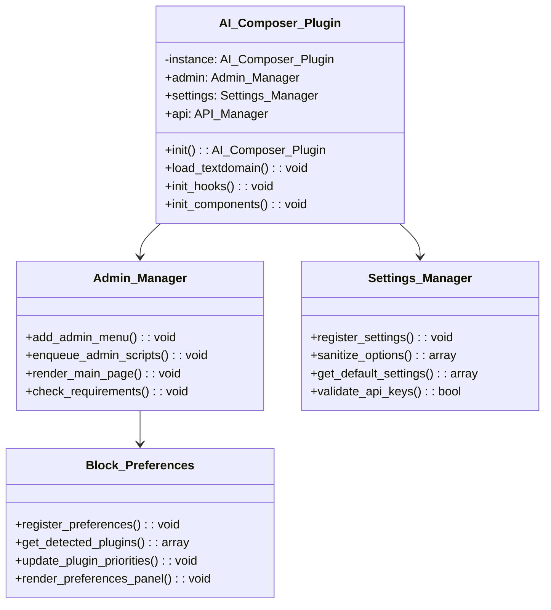
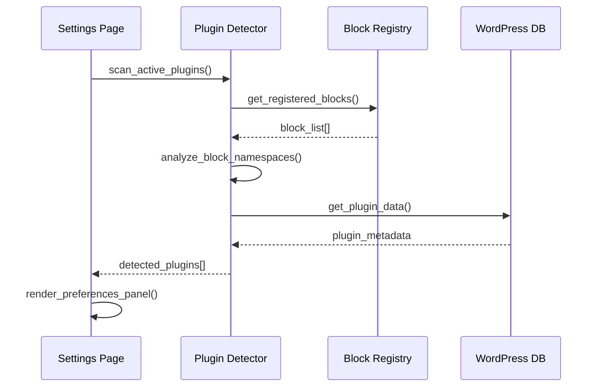

# AI Page Composer Plugin Scaffold & Settings Design

## Overview

This design document outlines the plugin scaffold and settings architecture for the AI Page Composer WordPress plugin. The plugin will provide a comprehensive settings interface for managing API keys, generation parameters, block preferences, and security configurations while following WordPress best practices for admin interface development.

## Architecture

### Plugin File Structure

The plugin follows the established template structure with AI-specific extensions:

```
ai-page-composer.php              # Main plugin file
inc/
├── core/
│   ├── plugin.php               # Main plugin class
│   ├── activator.php            # Activation handler
│   └── deactivator.php          # Deactivation handler
├── admin/
│   ├── admin-manager.php        # Admin interface manager
│   ├── settings-manager.php     # Settings management
│   └── block-preferences.php    # Block preferences handler
├── api/
│   ├── api-manager.php          # REST API endpoints
│   └── mvdb-manager.php         # Vector database integration
├── generators/
│   ├── blueprint-manager.php    # Content blueprints
│   ├── generation-manager.php   # AI content generation
│   └── assembly-manager.php     # Block assembly
├── utils/
│   ├── security-helper.php      # Security utilities
│   └── validation-helper.php    # Input validation
└── class-autoloader.php         # PSR-4 autoloader
assets/
├── css/
│   ├── admin.css               # Admin interface styles
│   └── style.css               # Frontend styles
├── js/
│   ├── admin.js                # Admin interface JavaScript
│   └── settings.js             # Settings page interactions
└── images/                     # Plugin assets
languages/                      # Translation files
```

### Core Plugin Class



## Admin Interface Design

### Menu Structure

The plugin adds a new admin menu item under "Content":

```php
add_submenu_page(
    'edit.php',                          // Parent slug (Content)
    __('AI Composer', 'ai-page-composer'),     // Page title
    __('AI Composer', 'ai-page-composer'),     // Menu title
    'manage_options',                    // Capability
    'ai-composer',                       // Menu slug
    [Admin_Manager::class, 'render_main_page']  // Callback
);
```

### Settings Page Layout

```mermaid
graph TB
    A[AI Composer Settings] --> B[API Configuration]
    A --> C[Generation Defaults]
    A --> D[Content Policies]
    A --> E[Block Preferences]
    A --> F[Cost Management]
    A --> G[Security Settings]
    
    B --> B1[OpenAI API Key]
    B --> B2[MVDB API Key]
    B --> B3[Image API Key]
    
    C --> C1[Default Mode: hybrid/grounded/generative]
    C --> C2[Alpha Weight: 0.0-1.0]
    C --> C3[K Value: retrieval count]
    C --> C4[Min Score: 0.0-1.0]
    
    D --> D1[Image Generation Policy]
    D --> D2[Internal Linking]
    D --> D3[Citation Requirements]
    D --> D4[License Filters]
    
    E --> E1[Plugin Detection]
    E --> E2[Priority Scoring]
    E --> E3[Section Mappings]
    
    F --> F1[Daily Budget Limit]
    F --> F2[Per-Run Limit]
    F --> F3[Token Caps]
    
    G --> G1[Nonce Settings]
    G --> G2[Capability Requirements]
    G --> G3[Input Validation Rules]
```



## Settings Schema

### API Configuration Settings

```php
$api_settings = [
    'openai_api_key' => [
        'type' => 'string',
        'sanitize_callback' => 'sanitize_text_field',
        'validate_callback' => 'validate_api_key',
        'default' => '',
        'required' => true
    ],
    'mvdb_api_key' => [
        'type' => 'string', 
        'sanitize_callback' => 'sanitize_text_field',
        'validate_callback' => 'validate_api_key',
        'default' => '',
        'required' => true
    ],
    'image_api_key' => [
        'type' => 'string',
        'sanitize_callback' => 'sanitize_text_field', 
        'validate_callback' => 'validate_api_key',
        'default' => '',
        'required' => false
    ]
];
```

### Generation Defaults Settings

```php
$generation_defaults = [
    'default_mode' => [
        'type' => 'string',
        'sanitize_callback' => 'sanitize_key',
        'validate_callback' => 'validate_generation_mode',
        'default' => 'hybrid',
        'options' => ['grounded', 'hybrid', 'generative']
    ],
    'alpha_weight' => [
        'type' => 'number',
        'sanitize_callback' => 'floatval',
        'validate_callback' => 'validate_alpha_range',
        'default' => 0.7,
        'min' => 0.0,
        'max' => 1.0,
        'step' => 0.1
    ],
    'k_value' => [
        'type' => 'integer',
        'sanitize_callback' => 'absint',
        'validate_callback' => 'validate_k_range',
        'default' => 10,
        'min' => 1,
        'max' => 50
    ],
    'min_score' => [
        'type' => 'number',
        'sanitize_callback' => 'floatval',
        'validate_callback' => 'validate_score_range',
        'default' => 0.5,
        'min' => 0.0,
        'max' => 1.0,
        'step' => 0.1
    ],
    'default_namespaces' => [
        'type' => 'array',
        'sanitize_callback' => 'sanitize_namespace_array',
        'validate_callback' => 'validate_namespaces',
        'default' => ['content'],
        'options' => ['content', 'products', 'docs', 'knowledge']
    ]
];
```

### Content Policy Settings

```php
$content_policies = [
    'image_generation_policy' => [
        'type' => 'string',
        'sanitize_callback' => 'sanitize_key',
        'default' => 'auto',
        'options' => ['always', 'auto', 'manual', 'never']
    ],
    'internal_linking_enabled' => [
        'type' => 'boolean',
        'sanitize_callback' => 'rest_sanitize_boolean',
        'default' => true
    ],
    'max_internal_links' => [
        'type' => 'integer',
        'sanitize_callback' => 'absint',
        'default' => 3,
        'min' => 0,
        'max' => 10
    ],
    'citation_required' => [
        'type' => 'boolean',
        'sanitize_callback' => 'rest_sanitize_boolean', 
        'default' => true
    ],
    'license_filters' => [
        'type' => 'array',
        'sanitize_callback' => 'sanitize_license_filters',
        'default' => ['CC-BY', 'CC-BY-SA', 'public-domain'],
        'options' => [
            'CC-BY' => 'Creative Commons Attribution',
            'CC-BY-SA' => 'Creative Commons Attribution-ShareAlike',
            'CC-BY-NC' => 'Creative Commons Attribution-NonCommercial',
            'public-domain' => 'Public Domain',
            'fair-use' => 'Fair Use',
            'commercial' => 'Commercial License'
        ]
    ]
];
```

### Block Preferences Settings

```php
$block_preferences = [
    'detection_enabled' => [
        'type' => 'boolean',
        'sanitize_callback' => 'rest_sanitize_boolean',
        'default' => true
    ],
    'plugin_priorities' => [
        'type' => 'object',
        'sanitize_callback' => 'sanitize_plugin_priorities',
        'default' => [
            'genesis_blocks' => 8,
            'kadence_blocks' => 8, 
            'stackable' => 7,
            'ultimate_addons' => 7,
            'blocksy' => 6,
            'core' => 5
        ]
    ],
    'section_mappings' => [
        'type' => 'object',
        'sanitize_callback' => 'sanitize_section_mappings',
        'default' => [
            'hero' => 'auto',
            'content' => 'auto',
            'testimonial' => 'auto',
            'pricing' => 'auto',
            'team' => 'auto',
            'faq' => 'auto',
            'cta' => 'auto'
        ]
    ],
    'custom_block_types' => [
        'type' => 'array',
        'sanitize_callback' => 'sanitize_custom_block_types',
        'default' => []
    ]
];
```

### Cost Management Settings

```php
$cost_management = [
    'daily_budget_usd' => [
        'type' => 'number',
        'sanitize_callback' => 'floatval',
        'validate_callback' => 'validate_budget_amount',
        'default' => 10.0,
        'min' => 0.01,
        'max' => 1000.0
    ],
    'per_run_limit_usd' => [
        'type' => 'number', 
        'sanitize_callback' => 'floatval',
        'validate_callback' => 'validate_per_run_limit',
        'default' => 2.0,
        'min' => 0.01,
        'max' => 100.0
    ],
    'token_limit_per_section' => [
        'type' => 'integer',
        'sanitize_callback' => 'absint',
        'validate_callback' => 'validate_token_limit',
        'default' => 1000,
        'min' => 100,
        'max' => 5000
    ],
    'cost_alerts_enabled' => [
        'type' => 'boolean',
        'sanitize_callback' => 'rest_sanitize_boolean',
        'default' => true
    ],
    'budget_reset_schedule' => [
        'type' => 'string',
        'sanitize_callback' => 'sanitize_key',
        'default' => 'daily',
        'options' => ['daily', 'weekly', 'monthly']
    ]
];
```

## Block Preferences System

### Plugin Detection Architecture



### Detected Block Plugins Structure

```php
$detected_plugins = [
    'genesis_blocks' => [
        'active' => true,
        'name' => 'Genesis Blocks',
        'version' => '1.2.3',
        'namespace' => 'genesis-blocks',
        'priority' => 8,
        'blocks_count' => 15,
        'supported_sections' => ['hero', 'testimonial', 'pricing', 'team'],
        'plugin_file' => 'genesis-blocks/genesis-blocks.php'
    ],
    'kadence_blocks' => [
        'active' => true,
        'name' => 'Kadence Blocks',
        'version' => '3.1.2',
        'namespace' => 'kadence',
        'priority' => 8,
        'blocks_count' => 25,
        'supported_sections' => ['hero', 'content', 'testimonial', 'tabs', 'accordion'],
        'plugin_file' => 'kadence-blocks/kadence-blocks.php'
    ],
    'stackable' => [
        'active' => false,
        'name' => 'Stackable',
        'version' => '3.0.1',
        'namespace' => 'ugb',
        'priority' => 7,
        'blocks_count' => 30,
        'supported_sections' => ['hero', 'feature', 'team'],
        'plugin_file' => 'stackable-ultimate-gutenberg-blocks/stackable.php'
    ]
];
```

### Priority Scoring System

```php
class Block_Preferences {
    
    private $priority_weights = [
        'user_preference' => 10,    // Highest priority
        'plugin_active' => 8,       // Plugin is active
        'block_availability' => 6,  // Block is registered
        'feature_support' => 4,     // Supports required features
        'plugin_rating' => 2,       // General plugin priority
        'core_fallback' => 1        // Core blocks as fallback
    ];
    
    public function calculate_block_priority($section_type, $plugin_key) {
        $score = 0;
        $plugin = $this->get_detected_plugin($plugin_key);
        $user_pref = $this->get_user_preference($section_type);
        
        // User explicit preference
        if ($user_pref === $plugin_key) {
            $score += $this->priority_weights['user_preference'];
        }
        
        // Plugin active status
        if ($plugin['active']) {
            $score += $this->priority_weights['plugin_active'];
        }
        
        // Block availability for section
        if (in_array($section_type, $plugin['supported_sections'])) {
            $score += $this->priority_weights['block_availability'];
        }
        
        // Feature support (advanced styling, patterns, etc.)
        if ($this->supports_advanced_features($plugin_key, $section_type)) {
            $score += $this->priority_weights['feature_support'];
        }
        
        // Plugin priority setting
        $score += $plugin['priority'] ?? $this->priority_weights['plugin_rating'];
        
        return $score;
    }
}
```

## Security Implementation

### Nonce Management

```php
class Security_Helper {
    
    const NONCE_ACTION = 'ai_composer_settings';
    const NONCE_NAME = 'ai_composer_nonce';
    
    public static function generate_nonce() {
        return wp_create_nonce(self::NONCE_ACTION);
    }
    
    public static function verify_nonce($nonce_value) {
        return wp_verify_nonce($nonce_value, self::NONCE_ACTION);
    }
    
    public static function nonce_field() {
        wp_nonce_field(self::NONCE_ACTION, self::NONCE_NAME);
    }
    
    public static function verify_request() {
        if (!isset($_POST[self::NONCE_NAME])) {
            wp_die(__('Security check failed. Please try again.', 'ai-page-composer'));
        }
        
        if (!self::verify_nonce($_POST[self::NONCE_NAME])) {
            wp_die(__('Security verification failed. Please try again.', 'ai-page-composer'));
        }
        
        if (!current_user_can('manage_options')) {
            wp_die(__('You do not have permission to perform this action.', 'ai-page-composer'));
        }
    }
}
```

### Input Sanitization Helpers

```php
class Validation_Helper {
    
    public static function sanitize_api_key($value) {
        // Remove whitespace and validate format
        $sanitized = trim(sanitize_text_field($value));
        
        // Basic API key format validation
        if (!empty($sanitized) && !preg_match('/^[a-zA-Z0-9_-]+$/', $sanitized)) {
            add_settings_error(
                'ai_composer_settings',
                'invalid_api_key',
                __('API key contains invalid characters.', 'ai-page-composer')
            );
            return '';
        }
        
        return $sanitized;
    }
    
    public static function validate_alpha_range($value) {
        $alpha = floatval($value);
        
        if ($alpha < 0.0 || $alpha > 1.0) {
            add_settings_error(
                'ai_composer_settings',
                'invalid_alpha',
                __('Alpha value must be between 0.0 and 1.0.', 'ai-page-composer')
            );
            return 0.7; // Default fallback
        }
        
        return $alpha;
    }
    
    public static function sanitize_namespace_array($value) {
        if (!is_array($value)) {
            return ['content']; // Default fallback
        }
        
        $allowed_namespaces = ['content', 'products', 'docs', 'knowledge'];
        $sanitized = [];
        
        foreach ($value as $namespace) {
            $clean_namespace = sanitize_key($namespace);
            if (in_array($clean_namespace, $allowed_namespaces)) {
                $sanitized[] = $clean_namespace;
            }
        }
        
        return empty($sanitized) ? ['content'] : $sanitized;
    }
    
    public static function sanitize_plugin_priorities($value) {
        if (!is_array($value)) {
            return [];
        }
        
        $sanitized = [];
        foreach ($value as $plugin => $priority) {
            $clean_plugin = sanitize_key($plugin);
            $clean_priority = absint($priority);
            
            // Ensure priority is within valid range (1-10)
            $clean_priority = max(1, min(10, $clean_priority));
            $sanitized[$clean_plugin] = $clean_priority;
        }
        
        return $sanitized;
    }
}
```

### Capability Checks

```php
class Admin_Manager {
    
    private function check_user_permissions() {
        if (!current_user_can('manage_options')) {
            wp_die(
                __('You do not have sufficient permissions to access this page.', 'ai-page-composer'),
                __('Insufficient Permissions', 'ai-page-composer'),
                ['response' => 403]
            );
        }
    }
    
    public function render_main_page() {
        $this->check_user_permissions();
        Security_Helper::verify_request();
        
        // Proceed with page rendering
        $this->render_settings_page();
    }
    
    private function ajax_check_permissions() {
        if (!current_user_can('manage_options')) {
            wp_send_json_error([
                'message' => __('Insufficient permissions for this action.', 'ai-page-composer')
            ], 403);
        }
        
        check_ajax_referer('ai_composer_ajax', 'nonce');
    }
}
```

## Settings Page Interface

### Main Settings Form

```html
<div class="wrap ai-composer-settings">
    <h1><?php esc_html_e('AI Page Composer Settings', 'ai-page-composer'); ?></h1>
    
    <?php settings_errors('ai_composer_settings'); ?>
    
    <form method="post" action="options.php" id="ai-composer-settings-form">
        <?php
        settings_fields('ai_composer_settings_group');
        Security_Helper::nonce_field();
        ?>
        
        <nav class="nav-tab-wrapper ai-composer-tabs">
            <a href="#api-config" class="nav-tab nav-tab-active" data-target="#api-config-panel">
                <?php esc_html_e('API Configuration', 'ai-page-composer'); ?>
            </a>
            <a href="#generation" class="nav-tab" data-target="#generation-panel">
                <?php esc_html_e('Generation Defaults', 'ai-page-composer'); ?>
            </a>
            <a href="#content-policy" class="nav-tab" data-target="#content-policy-panel">
                <?php esc_html_e('Content Policies', 'ai-page-composer'); ?>
            </a>
            <a href="#block-preferences" class="nav-tab" data-target="#block-preferences-panel">
                <?php esc_html_e('Block Preferences', 'ai-page-composer'); ?>
            </a>
            <a href="#cost-management" class="nav-tab" data-target="#cost-management-panel">
                <?php esc_html_e('Cost Management', 'ai-page-composer'); ?>
            </a>
        </nav>
        
        <div class="ai-composer-tab-content">
            <!-- Tab panels rendered here -->
        </div>
        
        <?php submit_button(__('Save Settings', 'ai-page-composer')); ?>
    </form>
</div>
```

### Block Preferences Panel

```php
public function render_block_preferences_panel() {
    $detected_plugins = $this->block_preferences->get_detected_plugins();
    $current_priorities = get_option('ai_composer_block_priorities', []);
    $section_mappings = get_option('ai_composer_section_mappings', []);
    ?>
    
    <div id="block-preferences-panel" class="ai-composer-panel">
        <h2><?php esc_html_e('Block Preferences', 'ai-page-composer'); ?></h2>
        <p class="description">
            <?php esc_html_e('Configure which block plugins to use for different content sections.', 'ai-page-composer'); ?>
        </p>
        
        <!-- Plugin Detection Status -->
        <div class="plugin-detection-status">
            <h3><?php esc_html_e('Detected Block Plugins', 'ai-page-composer'); ?></h3>
            <table class="wp-list-table widefat fixed striped">
                <thead>
                    <tr>
                        <th><?php esc_html_e('Plugin', 'ai-page-composer'); ?></th>
                        <th><?php esc_html_e('Status', 'ai-page-composer'); ?></th>
                        <th><?php esc_html_e('Version', 'ai-page-composer'); ?></th>
                        <th><?php esc_html_e('Blocks', 'ai-page-composer'); ?></th>
                        <th><?php esc_html_e('Priority', 'ai-page-composer'); ?></th>
                    </tr>
                </thead>
                <tbody>
                    <?php foreach ($detected_plugins as $key => $plugin): ?>
                    <tr class="<?php echo $plugin['active'] ? 'plugin-active' : 'plugin-inactive'; ?>">
                        <td>
                            <strong><?php echo esc_html($plugin['name']); ?></strong>
                            <br><small><?php echo esc_html($plugin['namespace']); ?></small>
                        </td>
                        <td>
                            <span class="status-indicator status-<?php echo $plugin['active'] ? 'active' : 'inactive'; ?>">
                                <?php echo $plugin['active'] ? 
                                    esc_html__('Active', 'ai-page-composer') : 
                                    esc_html__('Inactive', 'ai-page-composer'); ?>
                            </span>
                        </td>
                        <td><?php echo esc_html($plugin['version'] ?? 'Unknown'); ?></td>
                        <td><?php echo esc_html($plugin['blocks_count'] ?? 0); ?></td>
                        <td>
                            <?php if ($plugin['active']): ?>
                            <input type="range" 
                                   name="ai_composer_settings[plugin_priorities][<?php echo esc_attr($key); ?>]"
                                   value="<?php echo esc_attr($current_priorities[$key] ?? $plugin['priority']); ?>"
                                   min="1" max="10" step="1"
                                   class="priority-slider"
                                   data-plugin="<?php echo esc_attr($key); ?>">
                            <span class="priority-value"><?php echo esc_html($current_priorities[$key] ?? $plugin['priority']); ?></span>
                            <?php else: ?>
                            <span class="priority-disabled">—</span>
                            <?php endif; ?>
                        </td>
                    </tr>
                    <?php endforeach; ?>
                </tbody>
            </table>
        </div>
        
        <!-- Section Mapping Preferences -->
        <div class="section-mappings">
            <h3><?php esc_html_e('Section Block Preferences', 'ai-page-composer'); ?></h3>
            <p class="description">
                <?php esc_html_e('Choose preferred block plugins for each content section type.', 'ai-page-composer'); ?>
            </p>
            
            <table class="form-table">
                <?php 
                $section_types = [
                    'hero' => __('Hero Sections', 'ai-page-composer'),
                    'content' => __('Content Sections', 'ai-page-composer'),
                    'testimonial' => __('Testimonials', 'ai-page-composer'),
                    'pricing' => __('Pricing Tables', 'ai-page-composer'),
                    'team' => __('Team Members', 'ai-page-composer'),
                    'faq' => __('FAQ Sections', 'ai-page-composer'),
                    'cta' => __('Call to Action', 'ai-page-composer')
                ];
                
                foreach ($section_types as $section => $label): 
                ?>
                <tr>
                    <th scope="row">
                        <label for="section-<?php echo esc_attr($section); ?>">
                            <?php echo esc_html($label); ?>
                        </label>
                    </th>
                    <td>
                        <select name="ai_composer_settings[section_mappings][<?php echo esc_attr($section); ?>]" 
                                id="section-<?php echo esc_attr($section); ?>" 
                                class="regular-text">
                            <option value="auto" <?php selected($section_mappings[$section] ?? 'auto', 'auto'); ?>>
                                <?php esc_html_e('Auto (Best Available)', 'ai-page-composer'); ?>
                            </option>
                            <option value="core" <?php selected($section_mappings[$section] ?? 'auto', 'core'); ?>>
                                <?php esc_html_e('WordPress Core Blocks', 'ai-page-composer'); ?>
                            </option>
                            <?php foreach ($detected_plugins as $key => $plugin): ?>
                                <?php if ($plugin['active'] && in_array($section, $plugin['supported_sections'])): ?>
                                <option value="<?php echo esc_attr($key); ?>" 
                                        <?php selected($section_mappings[$section] ?? 'auto', $key); ?>>
                                    <?php echo esc_html($plugin['name']); ?>
                                </option>
                                <?php endif; ?>
                            <?php endforeach; ?>
                        </select>
                        <p class="description">
                            <?php printf(
                                esc_html__('Preferred plugin for %s. "Auto" uses highest priority available plugin.', 'ai-page-composer'),
                                strtolower($label)
                            ); ?>
                        </p>
                    </td>
                </tr>
                <?php endforeach; ?>
            </table>
        </div>
        
        <!-- Custom Block Types -->
        <div class="custom-block-types">
            <h3><?php esc_html_e('Custom Block Types', 'ai-page-composer'); ?></h3>
            <p class="description">
                <?php esc_html_e('Register additional block types for AI generation.', 'ai-page-composer'); ?>
            </p>
            
            <div class="custom-blocks-list">
                <div id="custom-blocks-container">
                    <!-- Dynamic custom block inputs -->
                </div>
                <button type="button" id="add-custom-block" class="button button-secondary">
                    <?php esc_html_e('Add Custom Block Type', 'ai-page-composer'); ?>
                </button>
            </div>
        </div>
    </div>
    
    <?php
}
```

## JavaScript Interface Enhancements

### Settings Page Interactions

```javascript
class AI_Composer_Settings {
    
    constructor() {
        this.bindEvents();
        this.initSliders();
        this.initTabSwitching();
    }
    
    bindEvents() {
        // Priority slider updates
        document.querySelectorAll('.priority-slider').forEach(slider => {
            slider.addEventListener('input', this.updatePriorityDisplay.bind(this));
        });
        
        // Plugin detection refresh
        document.getElementById('refresh-plugin-detection')?.addEventListener('click', 
            this.refreshPluginDetection.bind(this));
            
        // Custom block type management
        document.getElementById('add-custom-block')?.addEventListener('click',
            this.addCustomBlockType.bind(this));
            
        // Form validation
        document.getElementById('ai-composer-settings-form')?.addEventListener('submit',
            this.validateSettingsForm.bind(this));
    }
    
    updatePriorityDisplay(event) {
        const slider = event.target;
        const valueDisplay = slider.nextElementSibling;
        valueDisplay.textContent = slider.value;
        
        // Visual feedback for priority changes
        const row = slider.closest('tr');
        row.classList.add('priority-changed');
        setTimeout(() => row.classList.remove('priority-changed'), 300);
    }
    
    refreshPluginDetection() {
        const button = document.getElementById('refresh-plugin-detection');
        const originalText = button.textContent;
        
        button.textContent = 'Scanning...';
        button.disabled = true;
        
        fetch(ajaxurl, {
            method: 'POST',
            headers: {
                'Content-Type': 'application/x-www-form-urlencoded'
            },
            body: new URLSearchParams({
                action: 'ai_composer_refresh_plugins',
                nonce: aiComposerSettings.nonce
            })
        })
        .then(response => response.json())
        .then(data => {
            if (data.success) {
                location.reload(); // Refresh to show updated plugin list
            } else {
                this.showNotice('Failed to refresh plugin detection', 'error');
            }
        })
        .catch(error => {
            this.showNotice('Error refreshing plugins', 'error');
        })
        .finally(() => {
            button.textContent = originalText;
            button.disabled = false;
        });
    }
    
    addCustomBlockType() {
        const container = document.getElementById('custom-blocks-container');
        const index = container.children.length;
        
        const blockRow = document.createElement('div');
        blockRow.className = 'custom-block-row';
        blockRow.innerHTML = `
            <input type="text" 
                   name="ai_composer_settings[custom_block_types][${index}][name]"
                   placeholder="Block Name (e.g., product-showcase)"
                   class="regular-text">
            <input type="text"
                   name="ai_composer_settings[custom_block_types][${index}][namespace]" 
                   placeholder="Namespace (e.g., my-plugin)"
                   class="regular-text">
            <button type="button" class="button button-secondary remove-custom-block">
                Remove
            </button>
        `;
        
        container.appendChild(blockRow);
        
        // Bind remove event
        blockRow.querySelector('.remove-custom-block').addEventListener('click', () => {
            blockRow.remove();
        });
    }
    
    validateSettingsForm(event) {
        const form = event.target;
        let isValid = true;
        
        // Validate API keys
        const apiKeys = form.querySelectorAll('input[name*="api_key"]');
        apiKeys.forEach(input => {
            if (input.value && !this.validateApiKeyFormat(input.value)) {
                this.highlightError(input, 'Invalid API key format');
                isValid = false;
            }
        });
        
        // Validate numeric ranges
        const alphaInput = form.querySelector('input[name*="alpha_weight"]');
        if (alphaInput && (alphaInput.value < 0 || alphaInput.value > 1)) {
            this.highlightError(alphaInput, 'Alpha weight must be between 0 and 1');
            isValid = false;
        }
        
        // Validate budget amounts
        const budgetInputs = form.querySelectorAll('input[name*="budget"], input[name*="limit"]');
        budgetInputs.forEach(input => {
            if (input.value && parseFloat(input.value) <= 0) {
                this.highlightError(input, 'Budget amounts must be greater than 0');
                isValid = false;
            }
        });
        
        if (!isValid) {
            event.preventDefault();
            this.showNotice('Please correct the errors below', 'error');
        }
        
        return isValid;
    }
    
    validateApiKeyFormat(key) {
        // Basic API key validation - alphanumeric, hyphens, underscores
        return /^[a-zA-Z0-9_-]+$/.test(key.trim());
    }
    
    highlightError(input, message) {
        input.classList.add('error');
        
        // Remove existing error message
        const existingError = input.parentNode.querySelector('.field-error');
        if (existingError) {
            existingError.remove();
        }
        
        // Add error message
        const errorSpan = document.createElement('span');
        errorSpan.className = 'field-error';
        errorSpan.textContent = message;
        input.parentNode.appendChild(errorSpan);
        
        // Remove error styling after user starts typing
        input.addEventListener('input', () => {
            input.classList.remove('error');
            errorSpan.remove();
        }, { once: true });
    }
    
    showNotice(message, type = 'info') {
        const notice = document.createElement('div');
        notice.className = `notice notice-${type} is-dismissible`;
        notice.innerHTML = `<p>${message}</p>`;
        
        const wrap = document.querySelector('.wrap');
        wrap.insertBefore(notice, wrap.querySelector('form'));
        
        // Auto-dismiss after 5 seconds
        setTimeout(() => {
            notice.style.opacity = '0';
            setTimeout(() => notice.remove(), 300);
        }, 5000);
    }
}

// Initialize when DOM is ready
document.addEventListener('DOMContentLoaded', () => {
    new AI_Composer_Settings();
});
```

## Testing Strategy

### Acceptance Criteria Verification

1. **Plugin Activation Test**
   ```php
   public function test_plugin_activates_successfully() {
       // Verify plugin can be activated without errors
       $this->assertFalse(is_wp_error(activate_plugin('ai-page-composer/ai-page-composer.php')));
       
       // Verify database tables are created
       $this->assertTrue($this->table_exists('ai_composer_blueprints'));
       $this->assertTrue($this->table_exists('ai_composer_runs'));
       
       // Verify default options are set
       $options = get_option('ai_composer_settings');
       $this->assertIsArray($options);
       $this->assertArrayHasKey('generation_defaults', $options);
   }
   ```

2. **Settings Save & Reload Test**
   ```php
   public function test_settings_save_and_reload() {
       $test_settings = [
           'api_keys' => [
               'openai_api_key' => 'test_key_123',
               'mvdb_api_key' => 'mvdb_test_456'
           ],
           'generation_defaults' => [
               'default_mode' => 'hybrid',
               'alpha_weight' => 0.8,
               'k_value' => 15
           ]
       ];
       
       // Save settings
       update_option('ai_composer_settings', $test_settings);
       
       // Reload and verify
       $saved_settings = get_option('ai_composer_settings');
       $this->assertEquals($test_settings['api_keys']['openai_api_key'], 
                          $saved_settings['api_keys']['openai_api_key']);
       $this->assertEquals(0.8, $saved_settings['generation_defaults']['alpha_weight']);
   }
   ```

3. **Admin Page Rendering Test**
   ```php
   public function test_admin_page_renders() {
       // Simulate admin user
       wp_set_current_user($this->factory->user->create(['role' => 'administrator']));
       
       // Capture admin page output
       ob_start();
       $admin_manager = new Admin_Manager();
       $admin_manager->render_main_page();
       $output = ob_get_clean();
       
       // Verify key elements are present
       $this->assertStringContains('AI Page Composer Settings', $output);
       $this->assertStringContains('Block Preferences', $output);
       $this->assertStringContains('API Configuration', $output);
       $this->assertStringContains('id="block-preferences-panel"', $output);
   }
   ```

4. **Block Preferences Panel Test**
   ```php
   public function test_block_preferences_panel_functionality() {
       $block_preferences = new Block_Preferences();
       
       // Test plugin detection
       $detected = $block_preferences->get_detected_plugins();
       $this->assertIsArray($detected);
       
       // Test priority calculation
       $priority = $block_preferences->calculate_block_priority('hero', 'genesis_blocks');
       $this->assertIsInt($priority);
       $this->assertGreaterThan(0, $priority);
       
       // Test preferences panel rendering
       ob_start();
       $admin_manager = new Admin_Manager();
       $admin_manager->render_block_preferences_panel();
       $output = ob_get_clean();
       
       $this->assertStringContains('Detected Block Plugins', $output);
       $this->assertStringContains('Section Block Preferences', $output);
   }
   ```

The AI Page Composer plugin scaffold and settings system provides a comprehensive foundation for managing AI-powered content generation with robust security, user-friendly interfaces, and extensible block preference management.