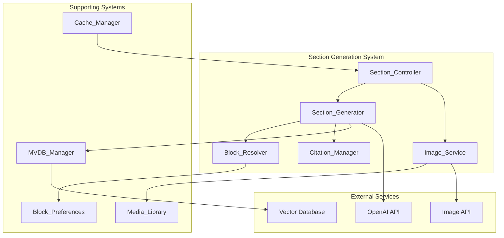
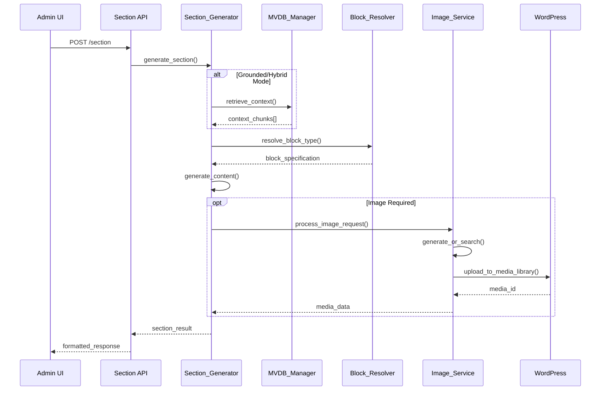

# Section Generation API Design

## Overview

This design implements comprehensive section generation endpoints for the AI Page Composer WordPress plugin. The system provides POST `/section` and POST `/image` endpoints that support three generation modes (Grounded/Hybrid/Generative), block-aware content generation with plugin detection, and integrated media management with licensing compliance.

## Technology Stack & Dependencies

### Backend Technologies
- **PHP**: 8.0+ with WordPress 6.0+ APIs
- **WordPress**: Gutenberg Block API, Media Library API, REST API
- **MySQL**: For caching retrieval results and cost tracking

### Frontend Technologies
- **JavaScript**: ES2020+ for admin interface interactions
- **React**: Via WordPress components for dynamic UI elements

### External APIs
- **OpenAI**: GPT-4 for content generation
- **MVDB**: Vector database for grounded content retrieval
- **Image Services**: DALL-E or Unsplash for media generation/search

## Architecture

### Component Architecture Overview



### Data Flow Architecture



## REST API Endpoints

### POST /ai-composer/v1/section

Generates content sections with block-aware output and citation management.

**Request Parameters:**

| Parameter | Type | Required | Description |
|-----------|------|----------|-------------|
| sectionId | string | Yes | Section identifier from outline |
| content_brief | string | Yes | Content generation brief |
| mode | string | No | Generation mode (grounded/hybrid/generative) |
| alpha | number | No | Hybrid mode alpha weight (0.0-1.0) |
| block_preferences | object | No | Block type preferences |
| image_requirements | object | No | Image generation settings |
| citation_settings | object | No | Citation configuration |

**Block Preferences Structure:**
```json
{
  "preferred_plugin": "kadence_blocks",
  "section_type": "hero",
  "fallback_blocks": ["core/cover", "core/group"],
  "custom_attributes": {}
}
```

**Image Requirements Structure:**
```json
{
  "policy": "required|optional|none",
  "style": "photographic|illustration|abstract",
  "alt_text_required": true,
  "license_compliance": ["CC-BY", "public-domain"]
}
```

**Response Format:**
```json
{
  "sectionId": "hero-1",
  "content": {
    "html": "<div class=\"wp-block-kadence-rowlayout\">...</div>",
    "json": {
      "blockName": "kadence/rowlayout",
      "attrs": {
        "uniqueID": "hero-123",
        "backgroundImg": [{"url": "...", "id": 456}]
      },
      "innerBlocks": []
    }
  },
  "blockType": {
    "name": "kadence/rowlayout",
    "plugin": "kadence_blocks",
    "namespace": "kadence",
    "fallback_used": false
  },
  "citations": [
    {
      "id": "cite-1",
      "text": "According to industry research...",
      "source": "https://example.com/research",
      "type": "inline",
      "mvdb_chunk_id": "chunk-abc123"
    }
  ],
  "mediaId": 456,
  "media": {
    "id": 456,
    "url": "https://site.com/wp-content/uploads/hero-bg.jpg",
    "alt": "Modern office workspace with laptops",
    "license": "CC-BY-4.0",
    "attribution": "Photo by John Doe"
  },
  "generation_metadata": {
    "mode": "hybrid",
    "alpha": 0.7,
    "word_count": 285,
    "token_count": 420,
    "cost_usd": 0.012,
    "processing_time_ms": 3250,
    "cache_hit": false
  }
}
```

### POST /ai-composer/v1/image

Generates or searches for images with WordPress Media Library integration.

**Request Parameters:**

| Parameter | Type | Required | Description |
|-----------|------|----------|-------------|
| prompt | string | Yes | Image description/search query |
| style | string | No | Image style preference |
| source | string | No | Generation source (generate/search/upload) |
| alt_text | string | No | Custom alt text |
| license_filter | array | No | Acceptable license types |
| dimensions | object | No | Image size requirements |

**Response Format:**
```json
{
  "mediaId": 789,
  "url": "https://site.com/wp-content/uploads/generated-image.jpg",
  "alt": "Professional team collaboration in modern office",
  "license": "Generated Content",
  "attribution": "AI Generated via DALL-E",
  "dimensions": {
    "width": 1920,
    "height": 1080
  },
  "file_size": 245760,
  "metadata": {
    "source": "generated",
    "prompt": "team collaboration modern office",
    "style": "photographic",
    "cost_usd": 0.04,
    "generation_time_ms": 12000
  }
}
```

## Implementation Details

### Section Controller

```php
<?php
namespace AIPageComposer\API;

class Section_Controller extends WP_REST_Controller {
    
    protected $namespace = 'ai-composer/v1';
    protected $rest_base = 'section';
    
    private $section_generator;
    private $image_service;
    private $cache_manager;
    
    public function __construct() {
        $this->section_generator = new Section_Generator();
        $this->image_service = new Image_Service();
        $this->cache_manager = new Cache_Manager();
    }
    
    public function register_routes() {
        register_rest_route($this->namespace, '/' . $this->rest_base, [
            'methods' => WP_REST_Server::CREATABLE,
            'callback' => [$this, 'generate_section'],
            'permission_callback' => [$this, 'check_permissions'],
            'args' => $this->get_section_args()
        ]);
        
        register_rest_route($this->namespace, '/image', [
            'methods' => WP_REST_Server::CREATABLE,
            'callback' => [$this, 'process_image'],
            'permission_callback' => [$this, 'check_permissions'],
            'args' => $this->get_image_args()
        ]);
    }
    
    public function generate_section(WP_REST_Request $request) {
        try {
            $params = $this->extract_section_parameters($request);
            
            // Check cache first
            $cache_key = $this->generate_cache_key($params);
            $cached_result = $this->cache_manager->get($cache_key);
            
            if ($cached_result) {
                $cached_result['generation_metadata']['cache_hit'] = true;
                return rest_ensure_response($cached_result);
            }
            
            // Generate section content
            $result = $this->section_generator->generate($params);
            
            // Cache the result
            $this->cache_manager->set($cache_key, $result, 3600); // 1 hour
            
            // Track costs
            $this->track_generation_cost($result['generation_metadata']['cost_usd']);
            
            $result['generation_metadata']['cache_hit'] = false;
            return rest_ensure_response($result);
            
        } catch (Exception $e) {
            return new WP_Error(
                'section_generation_failed',
                $e->getMessage(),
                ['status' => 500]
            );
        }
    }
    
    public function process_image(WP_REST_Request $request) {
        try {
            $params = $this->extract_image_parameters($request);
            
            $result = $this->image_service->process_image_request($params);
            
            // Track image generation costs
            if (isset($result['metadata']['cost_usd'])) {
                $this->track_generation_cost($result['metadata']['cost_usd']);
            }
            
            return rest_ensure_response($result);
            
        } catch (Exception $e) {
            return new WP_Error(
                'image_processing_failed',
                $e->getMessage(),
                ['status' => 500]
            );
        }
    }
    
    private function extract_section_parameters(WP_REST_Request $request) {
        return [
            'sectionId' => sanitize_text_field($request->get_param('sectionId')),
            'content_brief' => sanitize_textarea_field($request->get_param('content_brief')),
            'mode' => sanitize_key($request->get_param('mode') ?: 'hybrid'),
            'alpha' => floatval($request->get_param('alpha') ?: 0.7),
            'block_preferences' => $this->sanitize_block_preferences($request->get_param('block_preferences')),
            'image_requirements' => $this->sanitize_image_requirements($request->get_param('image_requirements')),
            'citation_settings' => $this->sanitize_citation_settings($request->get_param('citation_settings'))
        ];
    }
    
    private function generate_cache_key($params) {
        $cache_data = [
            'sectionId' => $params['sectionId'],
            'content_brief' => $params['content_brief'],
            'mode' => $params['mode'],
            'alpha' => $params['alpha'],
            'block_preferences' => $params['block_preferences']
        ];
        
        return 'ai_section_' . hash('sha256', serialize($cache_data));
    }
    
    private function track_generation_cost($cost) {
        $daily_costs = get_option('ai_composer_daily_costs', 0.0);
        $monthly_costs = get_option('ai_composer_monthly_costs', 0.0);
        
        update_option('ai_composer_daily_costs', $daily_costs + $cost);
        update_option('ai_composer_monthly_costs', $monthly_costs + $cost);
        
        // Log cost tracking
        global $wpdb;
        $wpdb->insert(
            $wpdb->prefix . 'ai_composer_cost_log',
            [
                'user_id' => get_current_user_id(),
                'cost_usd' => $cost,
                'operation_type' => 'section_generation',
                'timestamp' => current_time('mysql')
            ],
            ['%d', '%f', '%s', '%s']
        );
    }
    
    public function check_permissions() {
        return current_user_can('edit_posts');
    }
}
```

### Section Generator

```php
<?php
namespace AIPageComposer\API;

class Section_Generator {
    
    private $mvdb_manager;
    private $block_resolver;
    private $citation_manager;
    private $ai_client;
    
    public function __construct() {
        $this->mvdb_manager = new MVDB_Manager();
        $this->block_resolver = new Block_Resolver();
        $this->citation_manager = new Citation_Manager();
        $this->ai_client = new AI_Service_Client();
    }
    
    public function generate($params) {
        $start_time = microtime(true);
        
        // Resolve block type first
        $block_specification = $this->block_resolver->resolve_block_type($params['block_preferences']);
        
        // Get context for grounded/hybrid modes
        $context_chunks = [];
        if (in_array($params['mode'], ['grounded', 'hybrid'])) {
            $context_chunks = $this->retrieve_context($params);
        }
        
        // Generate content
        $content_result = $this->generate_content($params, $context_chunks, $block_specification);
        
        // Process citations
        $citations = $this->citation_manager->extract_and_format_citations(
            $content_result['content'],
            $context_chunks
        );
        
        // Handle image requirements
        $media_data = null;
        if ($this->should_include_image($params['image_requirements'], $block_specification)) {
            $media_data = $this->process_image_for_section($params, $block_specification);
        }
        
        // Build response
        $processing_time = (microtime(true) - $start_time) * 1000;
        
        return [
            'sectionId' => $params['sectionId'],
            'content' => [
                'html' => $content_result['html'],
                'json' => $content_result['block_json']
            ],
            'blockType' => [
                'name' => $block_specification['block_name'],
                'plugin' => $block_specification['plugin'],
                'namespace' => $block_specification['namespace'],
                'fallback_used' => $block_specification['fallback_used']
            ],
            'citations' => $citations,
            'mediaId' => $media_data['id'] ?? null,
            'media' => $media_data,
            'generation_metadata' => [
                'mode' => $params['mode'],
                'alpha' => $params['alpha'],
                'word_count' => str_word_count(strip_tags($content_result['html'])),
                'token_count' => $content_result['token_count'],
                'cost_usd' => $content_result['cost_usd'],
                'processing_time_ms' => round($processing_time),
                'cache_hit' => false
            ]
        ];
    }
    
    private function retrieve_context($params) {
        try {
            return $this->mvdb_manager->retrieve([
                'sectionId' => $params['sectionId'],
                'query' => $params['content_brief'],
                'k' => 10,
                'min_score' => 0.5
            ]);
        } catch (Exception $e) {
            error_log('[AI Composer] Context retrieval failed: ' . $e->getMessage());
            return [];
        }
    }
    
    private function generate_content($params, $context_chunks, $block_specification) {
        // Build generation prompt
        $prompt = $this->build_generation_prompt($params, $context_chunks, $block_specification);
        
        // Call AI service
        $ai_response = $this->ai_client->generate_content([
            'prompt' => $prompt,
            'mode' => $params['mode'],
            'alpha' => $params['alpha'],
            'block_spec' => $block_specification
        ]);
        
        // Convert to block format
        $block_json = $this->convert_to_block_format($ai_response['content'], $block_specification);
        $html = $this->render_block_html($block_json);
        
        return [
            'content' => $ai_response['content'],
            'html' => $html,
            'block_json' => $block_json,
            'token_count' => $ai_response['token_count'],
            'cost_usd' => $ai_response['cost_usd']
        ];
    }
    
    private function build_generation_prompt($params, $context_chunks, $block_specification) {
        $prompt = "Generate content for a {$block_specification['section_type']} section using {$block_specification['block_name']} block.\n\n";
        $prompt .= "Content Brief: {$params['content_brief']}\n\n";
        
        if (!empty($context_chunks)) {
            $prompt .= "Relevant Context:\n";
            foreach (array_slice($context_chunks, 0, 5) as $chunk) {
                $prompt .= "- " . wp_trim_words($chunk['text'], 50) . "\n";
            }
            $prompt .= "\n";
        }
        
        $prompt .= "Block Requirements:\n";
        $prompt .= "- Block Type: {$block_specification['block_name']}\n";
        $prompt .= "- Plugin: {$block_specification['plugin']}\n";
        $prompt .= "- Section Type: {$block_specification['section_type']}\n";
        
        if (!empty($block_specification['required_attributes'])) {
            $prompt .= "- Required Attributes: " . implode(', ', $block_specification['required_attributes']) . "\n";
        }
        
        $prompt .= "\nGenerate structured content suitable for this block type with proper HTML markup.";
        
        return $prompt;
    }
    
    private function convert_to_block_format($content, $block_specification) {
        // Convert generated content to Gutenberg block JSON format
        $block_data = [
            'blockName' => $block_specification['block_name'],
            'attrs' => [
                'uniqueID' => $this->generate_unique_id(),
            ],
            'innerBlocks' => []
        ];
        
        // Apply block-specific attributes based on plugin
        switch ($block_specification['plugin']) {
            case 'kadence_blocks':
                $block_data['attrs'] = array_merge($block_data['attrs'], 
                    $this->get_kadence_attributes($content, $block_specification));
                break;
                
            case 'genesis_blocks':
                $block_data['attrs'] = array_merge($block_data['attrs'], 
                    $this->get_genesis_attributes($content, $block_specification));
                break;
                
            case 'core':
                $block_data['attrs'] = array_merge($block_data['attrs'], 
                    $this->get_core_attributes($content, $block_specification));
                break;
        }
        
        return $block_data;
    }
    
    private function get_kadence_attributes($content, $block_specification) {
        $attributes = [];
        
        if ($block_specification['section_type'] === 'hero') {
            $attributes = [
                'bgColor' => '#f8f9fa',
                'padding' => ['80', '20', '80', '20'],
                'tabletPadding' => ['60', '15', '60', '15'],
                'mobilePadding' => ['40', '10', '40', '10'],
                'minHeight' => 500,
                'verticalAlignment' => 'center'
            ];
        }
        
        return $attributes;
    }
    
    private function render_block_html($block_json) {
        // Use WordPress block rendering system
        return render_block($block_json);
    }
    
    private function should_include_image($image_requirements, $block_specification) {
        if (!$image_requirements) return false;
        
        $policy = $image_requirements['policy'] ?? 'optional';
        
        if ($policy === 'none') return false;
        if ($policy === 'required') return true;
        
        // For 'optional', check if block type commonly uses images
        $image_friendly_blocks = [
            'hero', 'feature', 'testimonial', 'team', 'gallery', 'media_text'
        ];
        
        return in_array($block_specification['section_type'], $image_friendly_blocks);
    }
    
    private function process_image_for_section($params, $block_specification) {
        $image_service = new Image_Service();
        
        $image_params = [
            'prompt' => $this->generate_image_prompt($params['content_brief'], $block_specification),
            'style' => $params['image_requirements']['style'] ?? 'photographic',
            'dimensions' => $this->get_image_dimensions_for_block($block_specification),
            'alt_text_required' => true,
            'license_filter' => $params['image_requirements']['license_compliance'] ?? []
        ];
        
        return $image_service->process_image_request($image_params);
    }
    
    private function generate_image_prompt($content_brief, $block_specification) {
        $base_prompt = wp_trim_words($content_brief, 15);
        
        // Add style modifiers based on section type
        $style_modifiers = [
            'hero' => 'professional, high-quality, modern',
            'testimonial' => 'professional headshot, clean background',
            'team' => 'professional team photo, corporate environment',
            'feature' => 'clean, minimal, focused on concept'
        ];
        
        $modifier = $style_modifiers[$block_specification['section_type']] ?? 'professional, clean';
        
        return $base_prompt . ', ' . $modifier;
    }
    
    private function get_image_dimensions_for_block($block_specification) {
        // Return appropriate dimensions based on block type and section
        $dimension_map = [
            'hero' => ['width' => 1920, 'height' => 1080],
            'testimonial' => ['width' => 400, 'height' => 400],
            'team' => ['width' => 600, 'height' => 800],
            'feature' => ['width' => 800, 'height' => 600]
        ];
        
        return $dimension_map[$block_specification['section_type']] ?? ['width' => 1200, 'height' => 800];
    }
    
    private function generate_unique_id() {
        return 'ai-gen-' . bin2hex(random_bytes(8));
    }
}
```

### Block Resolver

```php
<?php
namespace AIPageComposer\API;

class Block_Resolver {
    
    private $block_preferences;
    private $detected_plugins;
    
    public function __construct() {
        $this->block_preferences = new \AIPageComposer\Admin\Block_Preferences();
        $this->detected_plugins = $this->block_preferences->get_detected_plugins();
    }
    
    public function resolve_block_type($preferences) {
        $section_type = $preferences['section_type'] ?? 'content';
        $preferred_plugin = $preferences['preferred_plugin'] ?? 'auto';
        
        // Get available blocks for section type
        $available_blocks = $this->get_available_blocks_for_section($section_type);
        
        if ($preferred_plugin === 'auto') {
            // Use highest priority available plugin
            $selected_block = $this->select_best_available_block($available_blocks, $section_type);
        } else {
            // Try to use preferred plugin
            $selected_block = $this->select_preferred_block($available_blocks, $preferred_plugin, $section_type);
        }
        
        // Add block-specific configuration
        $selected_block['required_attributes'] = $this->get_required_attributes($selected_block);
        $selected_block['section_type'] = $section_type;
        
        return $selected_block;
    }
    
    private function get_available_blocks_for_section($section_type) {
        $block_mappings = [
            'hero' => [
                'kadence_blocks' => [
                    'block_name' => 'kadence/rowlayout',
                    'priority' => 9,
                    'features' => ['background_image', 'overlay', 'padding_control']
                ],
                'genesis_blocks' => [
                    'block_name' => 'genesis-blocks/gb-container',
                    'priority' => 8,
                    'features' => ['background_color', 'padding_control']
                ],
                'core' => [
                    'block_name' => 'core/cover',
                    'priority' => 6,
                    'features' => ['background_image', 'overlay']
                ]
            ],
            'testimonial' => [
                'kadence_blocks' => [
                    'block_name' => 'kadence/testimonials',
                    'priority' => 9,
                    'features' => ['star_rating', 'author_image', 'custom_styling']
                ],
                'genesis_blocks' => [
                    'block_name' => 'genesis-blocks/gb-testimonial',
                    'priority' => 8,
                    'features' => ['author_image', 'custom_styling']
                ],
                'core' => [
                    'block_name' => 'core/quote',
                    'priority' => 5,
                    'features' => ['basic_quote']
                ]
            ],
            'content' => [
                'core' => [
                    'block_name' => 'core/group',
                    'priority' => 8,
                    'features' => ['grouping', 'background_color']
                ]
            ]
        ];
        
        return $block_mappings[$section_type] ?? $block_mappings['content'];
    }
    
    private function select_best_available_block($available_blocks, $section_type) {
        $best_block = null;
        $highest_priority = 0;
        
        foreach ($available_blocks as $plugin => $block_info) {
            // Check if plugin is active
            if (!$this->is_plugin_active($plugin)) {
                continue;
            }
            
            $total_priority = $block_info['priority'];
            
            // Boost priority based on plugin settings
            if (isset($this->detected_plugins[$plugin])) {
                $total_priority += $this->detected_plugins[$plugin]['priority'] ?? 0;
            }
            
            if ($total_priority > $highest_priority) {
                $highest_priority = $total_priority;
                $best_block = array_merge($block_info, [
                    'plugin' => $plugin,
                    'namespace' => $this->get_plugin_namespace($plugin),
                    'fallback_used' => false
                ]);
            }
        }
        
        // If no suitable block found, use core fallback
        if (!$best_block) {
            $best_block = [
                'block_name' => 'core/group',
                'plugin' => 'core',
                'namespace' => 'core',
                'priority' => 1,
                'features' => ['grouping'],
                'fallback_used' => true
            ];
        }
        
        return $best_block;
    }
    
    private function select_preferred_block($available_blocks, $preferred_plugin, $section_type) {
        // Try preferred plugin first
        if (isset($available_blocks[$preferred_plugin]) && $this->is_plugin_active($preferred_plugin)) {
            $block_info = $available_blocks[$preferred_plugin];
            return array_merge($block_info, [
                'plugin' => $preferred_plugin,
                'namespace' => $this->get_plugin_namespace($preferred_plugin),
                'fallback_used' => false
            ]);
        }
        
        // Fall back to best available
        $fallback = $this->select_best_available_block($available_blocks, $section_type);
        $fallback['fallback_used'] = true;
        
        return $fallback;
    }
    
    private function is_plugin_active($plugin) {
        if ($plugin === 'core') return true;
        
        return isset($this->detected_plugins[$plugin]) && 
               $this->detected_plugins[$plugin]['active'];
    }
    
    private function get_plugin_namespace($plugin) {
        $namespace_map = [
            'kadence_blocks' => 'kadence',
            'genesis_blocks' => 'genesis-blocks',
            'stackable' => 'ugb',
            'ultimate_addons' => 'uagb',
            'blocksy' => 'blocksy',
            'core' => 'core'
        ];
        
        return $namespace_map[$plugin] ?? $plugin;
    }
    
    private function get_required_attributes($block_specification) {
        $plugin = $block_specification['plugin'];
        $block_name = $block_specification['block_name'];
        
        // Define required attributes per block type
        $attribute_map = [
            'kadence/rowlayout' => ['uniqueID', 'columns', 'padding'],
            'kadence/testimonials' => ['uniqueID', 'layout', 'displayTitle'],
            'genesis-blocks/gb-container' => ['containerPaddingTop', 'containerPaddingBottom'],
            'core/cover' => ['url', 'dimRatio'],
            'core/group' => ['backgroundColor'],
            'core/quote' => ['value']
        ];
        
        return $attribute_map[$block_name] ?? ['uniqueID'];
    }
}
```

### Image Service

```php
<?php
namespace AIPageComposer\API;

class Image_Service {
    
    private $settings_manager;
    private $image_generators;
    
    public function __construct() {
        $this->settings_manager = new \AIPageComposer\Admin\Settings_Manager();
        $this->image_generators = [
            'dalle' => new DALL_E_Generator(),
            'unsplash' => new Unsplash_Search(),
            'stock' => new Stock_Photo_Search()
        ];
    }
    
    public function process_image_request($params) {
        $source = $params['source'] ?? $this->determine_best_source($params);
        
        switch ($source) {
            case 'generate':
                return $this->generate_image($params);
                
            case 'search':
                return $this->search_existing_image($params);
                
            case 'upload':
                return $this->handle_upload($params);
                
            default:
                throw new Exception('Invalid image source specified');
        }
    }
    
    private function generate_image($params) {
        $settings = $this->settings_manager->get_all_settings();
        $image_api_key = $settings['api_settings']['image_api_key'] ?? '';
        
        if (empty($image_api_key)) {
            throw new Exception('Image API key not configured');
        }
        
        $generator = $this->image_generators['dalle'];
        $generated_image = $generator->generate([
            'prompt' => $params['prompt'],
            'style' => $params['style'] ?? 'photographic',
            'dimensions' => $params['dimensions'] ?? ['width' => 1024, 'height' => 1024]
        ]);
        
        // Upload to WordPress Media Library
        $media_data = $this->upload_to_media_library(
            $generated_image['image_data'],
            $generated_image['filename'],
            $params
        );
        
        // Add generation metadata
        $media_data['metadata'] = [
            'source' => 'generated',
            'prompt' => $params['prompt'],
            'style' => $params['style'] ?? 'photographic',
            'cost_usd' => $generated_image['cost_usd'],
            'generation_time_ms' => $generated_image['generation_time_ms']
        ];
        
        return $media_data;
    }
    
    private function search_existing_image($params) {
        $license_filter = $params['license_filter'] ?? ['CC-BY', 'CC-BY-SA', 'public-domain'];
        
        // Try Unsplash first for free stock photos
        if (in_array('CC-BY', $license_filter) || in_array('public-domain', $license_filter)) {
            $searcher = $this->image_generators['unsplash'];
            $found_image = $searcher->search([
                'query' => $params['prompt'],
                'dimensions' => $params['dimensions'] ?? null
            ]);
            
            if ($found_image) {
                return $this->process_found_image($found_image, $params);
            }
        }
        
        // Fallback to other stock photo services
        $searcher = $this->image_generators['stock'];
        $found_image = $searcher->search([
            'query' => $params['prompt'],
            'license_filter' => $license_filter
        ]);
        
        if ($found_image) {
            return $this->process_found_image($found_image, $params);
        }
        
        throw new Exception('No suitable images found matching criteria');
    }
    
    private function process_found_image($found_image, $params) {
        // Download image
        $image_data = file_get_contents($found_image['url']);
        if (!$image_data) {
            throw new Exception('Failed to download found image');
        }
        
        // Upload to Media Library
        $media_data = $this->upload_to_media_library(
            $image_data,
            $found_image['filename'],
            $params
        );
        
        // Add search metadata
        $media_data['metadata'] = [
            'source' => 'search',
            'original_url' => $found_image['url'],
            'search_query' => $params['prompt'],
            'cost_usd' => 0.0,
            'generation_time_ms' => 0
        ];
        
        return $media_data;
    }
    
    private function upload_to_media_library($image_data, $filename, $params) {
        require_once(ABSPATH . 'wp-admin/includes/image.php');
        require_once(ABSPATH . 'wp-admin/includes/file.php');
        require_once(ABSPATH . 'wp-admin/includes/media.php');
        
        // Create temporary file
        $temp_file = wp_tempnam($filename);
        file_put_contents($temp_file, $image_data);
        
        // Prepare file array for wp_handle_sideload
        $file_array = [
            'name' => $filename,
            'tmp_name' => $temp_file
        ];
        
        // Upload to media library
        $upload_result = wp_handle_sideload($file_array, ['test_form' => false]);
        
        if (isset($upload_result['error'])) {
            unlink($temp_file);
            throw new Exception('Failed to upload image: ' . $upload_result['error']);
        }
        
        // Create attachment post
        $attachment_data = [
            'post_title' => $this->generate_image_title($params),
            'post_content' => '',
            'post_status' => 'inherit',
            'post_mime_type' => $upload_result['type']
        ];
        
        $attachment_id = wp_insert_attachment($attachment_data, $upload_result['file']);
        
        if (is_wp_error($attachment_id)) {
            throw new Exception('Failed to create media attachment');
        }
        
        // Generate attachment metadata
        $attachment_metadata = wp_generate_attachment_metadata($attachment_id, $upload_result['file']);
        wp_update_attachment_metadata($attachment_id, $attachment_metadata);
        
        // Set alt text
        $alt_text = $params['alt_text'] ?? $this->generate_alt_text($params['prompt']);
        update_post_meta($attachment_id, '_wp_attachment_image_alt', $alt_text);
        
        // Set license metadata
        $this->set_license_metadata($attachment_id, $params);
        
        // Clean up
        unlink($temp_file);
        
        return [
            'id' => $attachment_id,
            'url' => wp_get_attachment_url($attachment_id),
            'alt' => $alt_text,
            'license' => $this->get_license_info($params),
            'attribution' => $this->get_attribution_info($params),
            'dimensions' => [
                'width' => $attachment_metadata['width'] ?? 0,
                'height' => $attachment_metadata['height'] ?? 0
            ],
            'file_size' => filesize($upload_result['file'])
        ];
    }
    
    private function generate_image_title($params) {
        $base_title = wp_trim_words($params['prompt'], 5);
        return ucwords($base_title) . ' - AI Generated';
    }
    
    private function generate_alt_text($prompt) {
        // Create descriptive alt text from prompt
        $alt_words = explode(' ', $prompt);
        $filtered_words = array_filter($alt_words, function($word) {
            return strlen($word) > 2 && !in_array(strtolower($word), ['the', 'and', 'with', 'for']);
        });
        
        return ucfirst(implode(' ', array_slice($filtered_words, 0, 8)));
    }
    
    private function set_license_metadata($attachment_id, $params) {
        $license_info = $this->get_license_info($params);
        
        update_post_meta($attachment_id, '_ai_composer_license', $license_info['type']);
        update_post_meta($attachment_id, '_ai_composer_attribution', $license_info['attribution']);
        update_post_meta($attachment_id, '_ai_composer_source', $params['source'] ?? 'generated');
        
        if (isset($params['prompt'])) {
            update_post_meta($attachment_id, '_ai_composer_prompt', sanitize_text_field($params['prompt']));
        }
    }
    
    private function get_license_info($params) {
        $source = $params['source'] ?? 'generated';
        
        switch ($source) {
            case 'generated':
                return [
                    'type' => 'Generated Content',
                    'attribution' => 'AI Generated via DALL-E'
                ];
                
            case 'search':
                return [
                    'type' => $params['found_license'] ?? 'CC-BY',
                    'attribution' => $params['found_attribution'] ?? 'Stock Photo'
                ];
                
            default:
                return [
                    'type' => 'Unknown',
                    'attribution' => ''
                ];
        }
    }
    
    private function get_attribution_info($params) {
        $license_info = $this->get_license_info($params);
        return $license_info['attribution'];
    }
    
    private function determine_best_source($params) {
        $settings = $this->settings_manager->get_all_settings();
        $image_policy = $settings['content_policies']['image_generation_policy'] ?? 'auto';
        
        switch ($image_policy) {
            case 'always':
                return 'generate';
                
            case 'never':
                return 'search';
                
            case 'auto':
                // Use generation for custom/specific requests, search for generic
                $prompt_words = str_word_count($params['prompt']);
                return $prompt_words > 5 ? 'generate' : 'search';
                
            default:
                return 'search';
        }
    }
}
```

### Citation Manager

```php
<?php
namespace AIPageComposer\API;

class Citation_Manager {
    
    public function extract_and_format_citations($content, $context_chunks) {
        $citations = [];
        
        // Extract citation markers from content
        $citation_pattern = '/\[cite:(\d+)\]/';
        preg_match_all($citation_pattern, $content, $matches, PREG_SET_ORDER);
        
        foreach ($matches as $match) {
            $citation_id = $match[1];
            $chunk_index = intval($citation_id) - 1;
            
            if (isset($context_chunks[$chunk_index])) {
                $chunk = $context_chunks[$chunk_index];
                
                $citations[] = [
                    'id' => 'cite-' . $citation_id,
                    'text' => $this->extract_citation_text($content, $match[0]),
                    'source' => $chunk['metadata']['source_url'] ?? '',
                    'type' => 'inline',
                    'mvdb_chunk_id' => $chunk['id'],
                    'score' => $chunk['score'],
                    'context' => wp_trim_words($chunk['text'], 20)
                ];
            }
        }
        
        return $citations;
    }
    
    private function extract_citation_text($content, $citation_marker) {
        // Find the sentence containing the citation marker
        $sentences = preg_split('/[.!?]+/', $content);
        
        foreach ($sentences as $sentence) {
            if (strpos($sentence, $citation_marker) !== false) {
                return trim(str_replace($citation_marker, '', $sentence));
            }
        }
        
        return '';
    }
    
    public function format_citations_for_display($citations) {
        $formatted = [];
        
        foreach ($citations as $citation) {
            $formatted[] = [
                'text' => $citation['text'],
                'source' => $this->format_source_url($citation['source']),
                'reliability_score' => $citation['score']
            ];
        }
        
        return $formatted;
    }
    
    private function format_source_url($url) {
        if (empty($url)) return 'Internal Knowledge Base';
        
        $parsed = parse_url($url);
        return isset($parsed['host']) ? $parsed['host'] : $url;
    }
}
```

## Testing Strategy

### Unit Tests for Section Generation

```php
<?php
class Test_Section_Controller extends WP_UnitTestCase {
    
    private $section_controller;
    private $admin_user_id;
    
    public function setUp(): void {
        parent::setUp();
        
        $this->section_controller = new Section_Controller();
        $this->admin_user_id = $this->factory->user->create(['role' => 'administrator']);
        wp_set_current_user($this->admin_user_id);
    }
    
    public function test_section_generation_success() {
        $request = new WP_REST_Request('POST', '/ai-composer/v1/section');
        $request->set_param('sectionId', 'hero-1');
        $request->set_param('content_brief', 'Create a hero section about sustainable technology solutions');
        $request->set_param('mode', 'hybrid');
        $request->set_param('alpha', 0.7);
        $request->set_param('block_preferences', [
            'section_type' => 'hero',
            'preferred_plugin' => 'auto'
        ]);
        
        $response = $this->section_controller->generate_section($request);
        
        $this->assertInstanceOf('WP_REST_Response', $response);
        
        $data = $response->get_data();
        $this->assertArrayHasKey('sectionId', $data);
        $this->assertArrayHasKey('content', $data);
        $this->assertArrayHasKey('blockType', $data);
        $this->assertArrayHasKey('citations', $data);
        $this->assertArrayHasKey('generation_metadata', $data);
        
        // Verify content structure
        $this->assertArrayHasKey('html', $data['content']);
        $this->assertArrayHasKey('json', $data['content']);
        
        // Verify block type information
        $this->assertArrayHasKey('name', $data['blockType']);
        $this->assertArrayHasKey('plugin', $data['blockType']);
        $this->assertArrayHasKey('fallback_used', $data['blockType']);
        
        // Verify generation metadata
        $this->assertEquals('hybrid', $data['generation_metadata']['mode']);
        $this->assertIsNumeric($data['generation_metadata']['cost_usd']);
        $this->assertIsInt($data['generation_metadata']['processing_time_ms']);
    }
    
    public function test_image_generation_success() {
        $request = new WP_REST_Request('POST', '/ai-composer/v1/image');
        $request->set_param('prompt', 'modern office workspace with laptops');
        $request->set_param('style', 'photographic');
        $request->set_param('alt_text', 'Modern office workspace');
        
        $response = $this->section_controller->process_image($request);
        
        $this->assertInstanceOf('WP_REST_Response', $response);
        
        $data = $response->get_data();
        $this->assertArrayHasKey('mediaId', $data);
        $this->assertArrayHasKey('url', $data);
        $this->assertArrayHasKey('alt', $data);
        $this->assertArrayHasKey('license', $data);
        $this->assertArrayHasKey('metadata', $data);
        
        // Verify media was uploaded to WordPress
        $this->assertTrue(is_numeric($data['mediaId']));
        $this->assertStringContains('wp-content/uploads', $data['url']);
        
        // Verify alt text was set
        $this->assertNotEmpty($data['alt']);
        
        // Verify license information
        $this->assertNotEmpty($data['license']);
    }
    
    public function test_block_resolver_functionality() {
        $block_resolver = new Block_Resolver();
        
        $preferences = [
            'section_type' => 'hero',
            'preferred_plugin' => 'kadence_blocks'
        ];
        
        $resolved_block = $block_resolver->resolve_block_type($preferences);
        
        $this->assertArrayHasKey('block_name', $resolved_block);
        $this->assertArrayHasKey('plugin', $resolved_block);
        $this->assertArrayHasKey('namespace', $resolved_block);
        $this->assertArrayHasKey('section_type', $resolved_block);
        $this->assertArrayHasKey('required_attributes', $resolved_block);
        
        // Verify hero section gets appropriate block
        $this->assertEquals('hero', $resolved_block['section_type']);
        $this->assertContains($resolved_block['plugin'], ['kadence_blocks', 'genesis_blocks', 'core']);
    }
    
    public function test_citation_extraction() {
        $citation_manager = new Citation_Manager();
        
        $content = 'According to research [cite:1], sustainable technology adoption is increasing. Recent studies show [cite:2] significant improvements.';
        
        $context_chunks = [
            [
                'id' => 'chunk-1',
                'text' => 'Research indicates growing adoption of sustainable technology solutions...',
                'score' => 0.85,
                'metadata' => ['source_url' => 'https://example.com/research']
            ],
            [
                'id' => 'chunk-2', 
                'text' => 'Studies demonstrate measurable improvements in efficiency...',
                'score' => 0.78,
                'metadata' => ['source_url' => 'https://example.com/studies']
            ]
        ];
        
        $citations = $citation_manager->extract_and_format_citations($content, $context_chunks);
        
        $this->assertCount(2, $citations);
        
        foreach ($citations as $citation) {
            $this->assertArrayHasKey('id', $citation);
            $this->assertArrayHasKey('text', $citation);
            $this->assertArrayHasKey('source', $citation);
            $this->assertArrayHasKey('mvdb_chunk_id', $citation);
            $this->assertArrayHasKey('score', $citation);
        }
    }
    
    public function test_cost_tracking() {
        // Reset costs
        update_option('ai_composer_daily_costs', 0.0);
        update_option('ai_composer_monthly_costs', 0.0);
        
        $request = new WP_REST_Request('POST', '/ai-composer/v1/section');
        $request->set_param('sectionId', 'test-section');
        $request->set_param('content_brief', 'Test content brief');
        
        // Mock a response that includes cost
        add_filter('ai_composer_mock_generation_cost', function() {
            return 0.05;
        });
        
        $response = $this->section_controller->generate_section($request);
        
        // Verify costs were tracked
        $daily_costs = get_option('ai_composer_daily_costs', 0.0);
        $monthly_costs = get_option('ai_composer_monthly_costs', 0.0);
        
        $this->assertGreaterThan(0, $daily_costs);
        $this->assertGreaterThan(0, $monthly_costs);
        $this->assertEquals($daily_costs, $monthly_costs); // Should be same for single operation
    }
}
```

### Integration Tests

```php
<?php
class Test_Section_Generation_Integration extends WP_UnitTestCase {
    
    public function test_end_to_end_section_generation() {
        // Create a test blueprint
        $blueprint_id = $this->create_test_blueprint();
        
        // Generate outline
        $outline_request = new WP_REST_Request('POST', '/ai-composer/v1/outline');
        $outline_request->set_param('blueprint_id', $blueprint_id);
        $outline_request->set_param('brief', 'Create content about sustainable technology');
        
        $outline_controller = new Outline_Controller();
        $outline_response = $outline_controller->generate_outline($outline_request);
        $outline_data = $outline_response->get_data();
        
        // Generate section from outline
        $section_request = new WP_REST_Request('POST', '/ai-composer/v1/section');
        $section_request->set_param('sectionId', $outline_data['sections'][0]['id']);
        $section_request->set_param('content_brief', $outline_data['sections'][0]['heading']);
        $section_request->set_param('block_preferences', $outline_data['sections'][0]['block_preference']);
        
        $section_controller = new Section_Controller();
        $section_response = $section_controller->generate_section($section_request);
        $section_data = $section_response->get_data();
        
        // Verify section matches outline specifications
        $this->assertEquals($outline_data['sections'][0]['id'], $section_data['sectionId']);
        $this->assertEquals($outline_data['sections'][0]['block_preference']['preferred_plugin'], 
                           $section_data['blockType']['plugin']);
        
        // Verify content was generated
        $this->assertNotEmpty($section_data['content']['html']);
        $this->assertNotEmpty($section_data['content']['json']);
        
        // Verify block structure is valid
        $this->assertArrayHasKey('blockName', $section_data['content']['json']);
        $this->assertArrayHasKey('attrs', $section_data['content']['json']);
    }
    
    private function create_test_blueprint() {
        $blueprint_data = [
            'post_title' => 'Test Blueprint',
            'post_type' => 'ai_blueprint',
            'post_status' => 'publish',
            'meta_input' => [
                '_ai_blueprint_schema' => [
                    'sections' => [
                        [
                            'id' => 'hero-1',
                            'type' => 'hero',
                            'heading' => 'Sustainable Technology Solutions',
                            'word_target' => 200,
                            'media_policy' => 'optional',
                            'block_preferences' => [
                                'preferred_plugin' => 'auto',
                                'section_type' => 'hero'
                            ]
                        ]
                    ],
                    'global_settings' => [
                        'generation_mode' => 'hybrid',
                        'hybrid_alpha' => 0.7
                    ]
                ]
            ]
        ];
        
        return wp_insert_post($blueprint_data);
    }
}
```

The Section Generation API provides a comprehensive solution for AI-powered content creation with full WordPress integration, block-aware output, citation management, and media handling while maintaining cost tracking and performance optimization through intelligent caching.